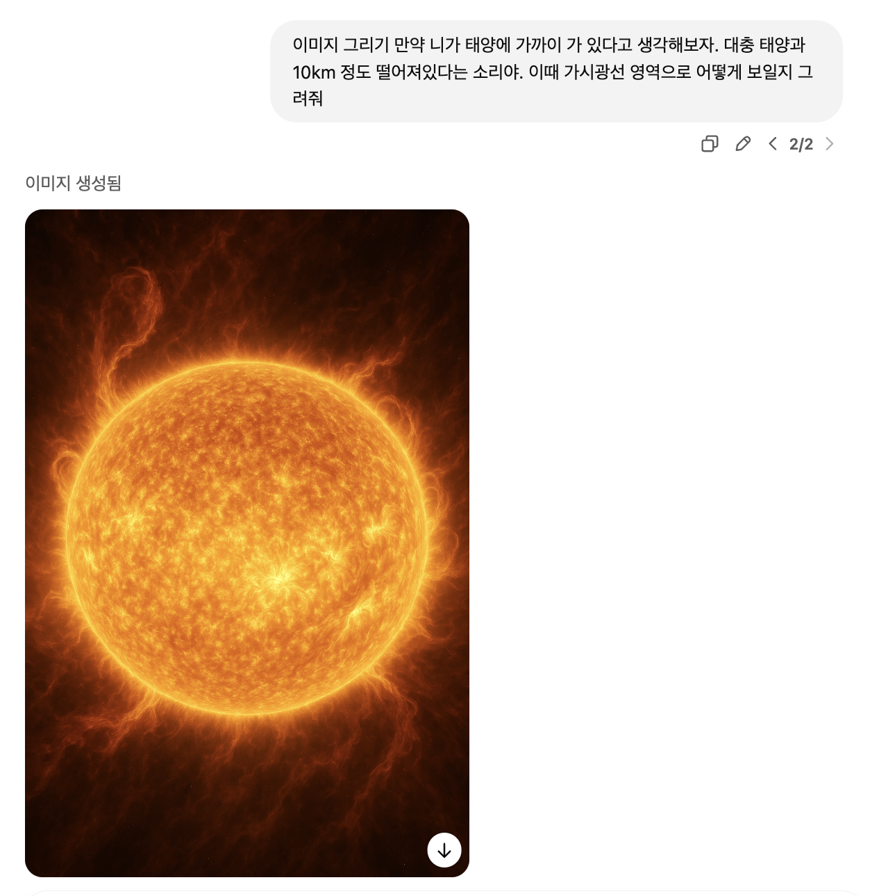

구텐베르크의 활판 인쇄술이 단순히 책을 찍어내는 기술을 넘어 지식의 민주화를 이루고 계급적 괴리를 줄이는 데 큰 기여를 했다. 중세에 고가의 사치품이었던 책이 활판 인쇄술로 인해 일반 대중에게 보급되며 사회적 변화를 일으켰고, 종교 개혁에도 직접적인 영향을 미쳤다는 이야기는 기술이 역사와 문화에 얼마나 큰 힘을 발휘할 수 있는지 잘 보여준다.

또한 다큐멘터리에서도 다양한 내용이 나타났는데 수업시간에 다뤘던 활자 인쇄부터 디지털과 현실의 경계를 허물어버리는 프린터의 발전까지 이루어지면서 ‘기술’의 발전에 따라서 사람들의 일하는 방식이 변화하는 것과 디자인으로 이어지는 사회문화적 임팩트를 중심적으로 보며 굉장히 흥미롭다고 느꼈다.

이제 또 한번의 변곡점을 겪고있는 사회에서, 시각 디자인의 역사와 현주소를 곱씹어보며 앞으로의 기술이 인간의 창작 행위에 어떤 근본적 변화를 불러올 지에 대해 상상하게 된다. 과거 활판 인쇄술이 인간의 사고와 지식 전달 방식을 혁신한 것처럼, 오늘날 많은 디지털 제품들은 창작의 영역에 스며들어 전통적인 디자인 작업의 경계를 허물고 있다. 이 글에서는 미래 기술의 변화에 따라서 변화할 시각 디자인과 인간이 준비해야할 능력에 대해서 작성해보려고 한다.

우리는 지금까지 혁신에서는 ‘생산성’이라는 측도를 사용하고 있었다. 똑같은 작업에 대해 걸리는 속도와 공수를 정형화하여 비교하는 것이다. 과거부터 지금까지의 모든 영역은 생산성을 혁신하는 방향으로 진행해왔다. 예를 들어 필사하기, 활자찍기, 디지털 프린팅 등은 같은 가치를 주지만 그 방식을 효율적으로 만들어 이제는 굉장히 빠른 속도로 수정하고 추가하고 복사할 수 있게 되었다.

하지만 생산성의 혁신은 그 한계가 있다. 과거의 1일 짜리 작업을 10분으로 줄어들 순 있는데 10분이 1초로 줄어들기는 굉장히 어렵다. 그리고 현재의 기술은 디지털까지 진화하면서 생산성이라는 측면에서 거의 상방한계선까지 도달할 가능성이 크다. 실제로 여러 소프트웨어을 통해 과거에 비해 생산성이라는 측면은 놀라울 정도로 정도로 발전되었기 때문이다.

그럼 앞으로의 기술에게 우리는 어떤 혁신을 바라야 하는가? 더 이상의 혁신은 없는 것인가? 아니다. 아예 패러다임 자체를 다르게 생각해야할 것이다. 모든 ‘생산’이라는 과정 뒤에는 ‘설계’라는 과정이 들어간다. 설계라는 것은 디자이너의 의도를 담거나, 우리가 저번 시간에 논의했던 ‘디자인의 정의’와도 크게 관련이 있는 것이다. 현재의 AI가 가장 잘하고 있는 것은 이것이다. 인간의 고유 영역이었던 ‘설계’라는 영역까지 혁신을 주고있기 때문에 생산성의 혁신이 아닌 설계적 혁신이라는 측면에서 인간에게 도움을 주고 있다.

AI는 인간의 추상적인 의도를 받으면 구현까지 할 수 있도록 설계를 도와줄 수 있다. 이렇게 되면 기술의 민주화라는 키워드가 등장할 수 밖에 없다. ‘설계의 기술’을 AI에게 맡기고 조금 더 추상적인 개념들을 이용하여 작품을 만들어내는 것이다. 이렇게되면 전문적인 설계 지식을 AI에게 전가할 수 있기 때문에 누구나 기술을 원하는 대로 사용하고 원하는 결과물을 만들어낼 수 있다. 기존의 방식이었던 클라이언트의 요구사항을 추상적인 개념을 전문가에게 요구하는 방식이 클라이언트가 AI를 활용해 직접 변경하는 방법으로 일부 변경되면서 사회적인 소통 방식이 완전히 변화할 수도 있겠다.

이렇게 AI가 디자인에 참여함으로써 ‘창작자’의 정체성에 대한 근본적인 의문이 제기 되기도 한다. 그러나 나는 이렇게 주장하고 싶다. ‘창작자’의 정체성이 혼란이 오는 이유는 아직까지 ‘기술은 생산성의 혁신’이라는 패러다임에서 벗어나지 못한 것이다. 패러다임을 다르게 바라보고 척도를 다르게 바라본다면 기술을 이용한다는 측면에서 바라본다면 창작자의 정체성은 그대로이다.

또한 현재의 구조상으로는 AI가 만능이 아니다. AI는 통계적인 내용을 내뱉는 소프트웨어라고 하는 이야기를 들어본 적 있을 것이다. AI는 ‘압축과 일반화를 굉장히 잘하는 기계’에 가깝다. 그래서 특정한 “Insightful”한 일들을 하기 힘들다. 데이터가 쌓이지 않은 최신의 기법을 사용하지 못하고, 데이터가 공개되지 않은 specific한 것들을 할 수 없다. 또한 많이 이야기되고 잘 발견되는 것들은 다룰 수 있지만 소수의 데이터가 있는 것은 아예 무시를 해버린다.

당연하겠지만 태양에서 10km 떨어진 사진은 저것이 아니다. 왜냐하면 태양에서 10km 정도 떨어진 사진은 기술적인 문제로 아직까지 인류가 찍어본 적이 없기 때문이다. 앞으로도 찍기 힘들 것이다. 이처럼 long tail data에 존재하는 Insightful한 내용들을 담아야 이런 그림을 제대로 그릴 수 있다. 이것은 현재 AI가 가진 구조적 한계로 기계는 설계를 도와주는 것이지 설계를 대신할 수 있는 사람은 아니다.

디자인이라는 행위는 단순히 미적 표현이나 효율성 있는 결과물을 만드는 것 이상의 의미가 있다. 인간의 의도를 담아 과학적 진실, 사회적 맥락, 문화적 배경, 인간의 정서적 욕구와 같은 복합적 요소를 이해하고 반영하는 작업이 바로 디자인이다. AI는 현재 데이터를 통해 학습한 범위 내에서만 새로운 조합을 만들어낼 뿐, 인간의 환경과 문화적 맥락을 깊이 이해하고 창의적으로 재구성하는 것에 있어서는 아직 인간 디자이너의 능력을 온전히 따라가지 못한다.

결국, 기술의 발전은 디자이너를 없애는 방향이 아니라 디자이너의 역할을 재정의하는 방향으로 나아갈 가능성이 크다. 미래의 디자이너는 더 이상 단순히 구현하는 사람이 아니라, 인간이 가진 창의적 사고와 감수성을 극대화해 이를 AI와 같은 미래기술과 결합하고, 더 높은 차원의 디자인 가치를 창출하는 방향으로 진화할 것이다. 이런 관점에서 기술은 위협이 아닌 동반자로 바라보아야 한다.

앞으로의 사회는 기술의 발전과 인간의 창의성이 결합해 더욱 풍성한 디자인 환경을 만들어낼 것이다. 중요한 것은 우리가 기술을 어떻게 활용할지, 그리고 이를 통해 인간이 가진 창의성을 어떻게 더욱 강화할지 고민하고 준비하는 자세이며, 이에 따른 사회적 변화를 받아들일 준비를 하는 것이다.
