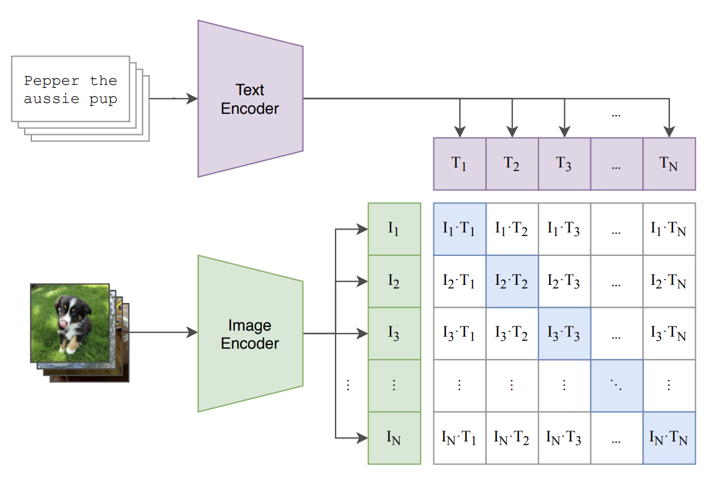
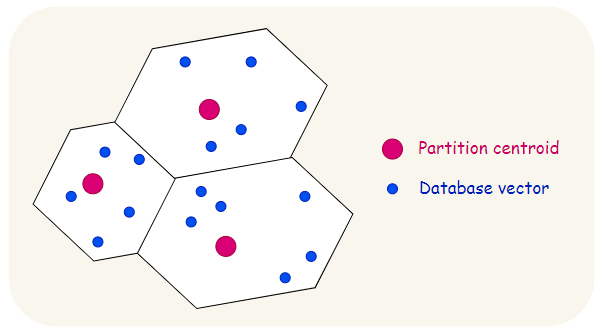
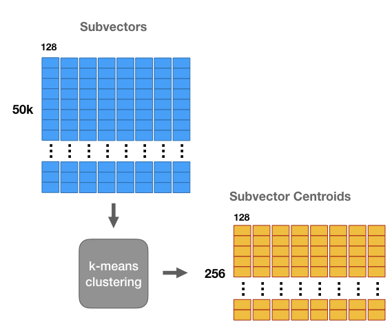
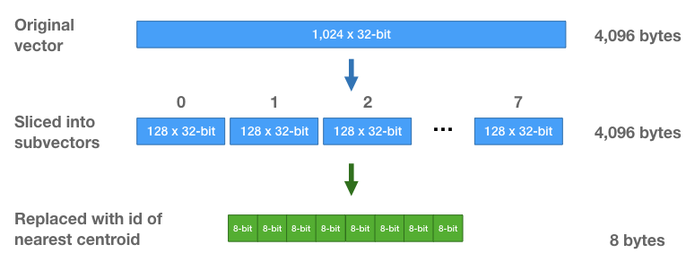
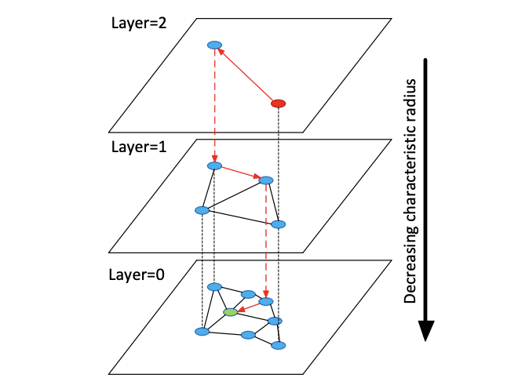

광고 레퍼런스를 빠르게 찾아보기 위해, 내부에 쌓여 있는 다양한 마케팅 에셋들을 효율적으로 검색할 수 있는 도구를 설계하고 개발했다. 마케팅 에셋은 보통 이미지와 텍스트가 함께 섞여 있는 형태인데, 텍스트는 역인덱스를 사용하면 쉽게 검색할 수 있지만 이미지의 내용을 함께 검색하는 문제는 훨씬 복잡했다.

이 글에서는 이러한 문제를 해결하기 위해 광고 에셋을 벡터로 표현하고, 그 벡터들을 기반으로 저지연 근접 탐색 시스템을 구축했던 과정, 그리고 이를 서비스 수준까지 끌어올리기 위해 어떤 성능 개선을 했는지 공유하려고 한다.

# 이미지 검색 문제의 이해

## Exact Match
전통적으로 우리가 생각하는 검색은 "exact matching"이다. 글에서 정확한 글자들을 매칭하여 이에 적합한 데이터들을 탐색하는 것이다. 예를 들어 검색어가 "happy"라면 기대되는 검색값은 다음과 같다.

- **happy** birthday
- **happy** day
- **happy** dog

이런 문제를 해결할 수 있는 잘 알려진 방법은 **Inverted Index**(역인덱스)이다. Tokenizer를 통해서 글을 적절한 토큰 단위로 나누고 "토큰에서 문서로"의 인덱스를 만드는 것이다. 이를 통해서 시스템을 잘 구성하면 $O(1)$만에 문서를 파악하여 굉장히 빠르게 문서들을 탐색할 수 있다.

> 텍스트 검색의 자세한 내용은 추후 시간이 된다면 [[Designing a Text Search Engine]]에 작성하려고 한다.

다만 역인덱스는 "100%" 같은 exact match만을 찾을 수 있다. 쿼리에 오타가 있거나 조금이라도 다르다면 검색되지 않을 것이다.

## Nearest Match

이미지를 검색할 때에는 이러한 Exact Match의 방법을 사용하기 힘들다. 이를 표현하는 단어는 Unique하지 않기 때문이다. 예를 들어 다음과 같다.

다음을 표현하는 단어는 다음과 같다.

- 개
- 시바견
- 귀여운 강아지
- 도지

여기서 하나의 인사이트를 얻을 수 있는데 이미지 검색 문제는 **가장 비슷한 무엇인가**를 찾는 Nearest Match의 문제라는 것이다. 텍스트로 바꿔보면 다음과 같은 문제이다. "개"라는 쿼리가 들어왔을때 기대하는 검색 결과는 다음과 같다.

- 시바견이 귀여운 이유
- 이탈리안 그레이하운드는 얼마나 빠를까?
- 강아지 발톱 깎는 방법

"개"라는 단어가 들어가지 않았지만, 우리가 인식하는 "개"라는 의미적인 맥락과 굉장히 비슷한 주제들이 검색되어야한다.

# Nearest Match 접근 방법

이미지 검색은 근본적으로 의미적으로 비슷한 것(semantic similarity) 을 찾아야 하는 문제다. 즉, “**이 이미지와 비슷한 의미의 다른 이미지 나 텍스트**”를 효율적으로 찾는 시스템을 만들어야 한다.

현대적인 방법에서 핵심은 크게 두 단계로 나눌 수 있다.

1. 이미지(혹은 텍스트)를 의미 공간에 임베딩하는 표현 학습
2. 고차원 벡터 공간에서 저지연으로 근사 검색을 수행하는 인덱싱

## 의미 공간에 임베딩하기 (Representation)

이미지를 비교하려면 먼저, 사람이 인식하는 “의미”를 컴퓨터가 수치로 표현할 수 있어야 한다. 이 역할을 하는 것이 바로 임베딩 모델(embedding model)이다.

대표적인 모델 중 하나가 **CLIP(Contrastive Language–Image Pretraining)**[^1]이다. CLIP은 이미지 인코더와 텍스트 인코더를 각각 학습시키면서, "같은 의미를 가지는 이미지와 문장은 벡터 공간상에서 서로 가깝게” 되도록 만든다.

(참고: CLIP은 대규모 이미지-텍스트 쌍을 사용해 비전 인코더, 텍스트 인코더 쌍를 대조학습으로 “같은 의미 = 가까운 벡터”가 되도록 학습했다. 추후 기회가 된다면 학습에 대해 자세하게 다뤄봐도 좋겠다.)

결국 이 모델을 통해 우리는 모든 이미지를 “하나의 숫자 벡터”로 표현할 수 있다. CLIP을 기준으로 이렇게 만들어지는 임베딩은 768차원의 벡터다.

이 과정을 통해
> “시바견 사진”과 “귀여운 개”라는 텍스트는 비슷한 의미를 공유하므로, 두 벡터의 유사도가 높아진다.

이제 바뀐 문제는 “주어진 벡터와 가장 비슷한 벡터를 N개 찾는 것” — 즉, 벡터 근접 탐색 문제다.

## 고차원 벡터 공간에서의 근접 탐색 (Indexing)

예를 들어 CLIP의 임베딩은 768차원이고, 각 차원이 8바이트 float이라면 하나의 임베딩은 약 6KB 정도 된다. 100만 개의 임베딩을 저장하면 단순히 6GB 메모리가 필요하다.

이 벡터들 사이의 유사도를 계산하려면 모든 쿼리마다 100만 번의 코사인 유사도를 계산해야 한다. CPU로 brute-force하면 거의 실시간 검색은 불가능하다.

이를 위한 탐색 알고리즘이 많이 연구가 되어있는데 각자의 장단점을 짧게 살펴보자면 다음과 같다. 간단히 어떤 컨셉인지도 정리해보자.

| 방법                           | 특징           | 장점               | 단점          |
| ---------------------------- | ------------ | ---------------- | ----------- |
| Brute-force (Flat Index)     | 모든 벡터를 직접 비교 | 정확함              | 매우 느림       |
| Quantization (e.g., IVF, PQ) | 벡터를 압축하고 그룹화 | 메모리 절약, 빠름       | 근사값 오차 존재   |
| Graph-based (HNSW)           | 그래프 탐색 기반 근사 | 검색 속도 빠르고 정확도 높음 | 인덱스 빌드 비용 큼 |

실무적으로 사용하려면 고려사항들이 많으므로 어떻게 만들어지는 지 자세하게 알아보자.

### FLAT 방식
FLAT은 인덱스가 따로 없기 때문에 가장 단순하다.
새로운 데이터가 들어오면, 그 임베딩 벡터를 단순히 리스트에 append 하면 된다.
인덱스를 재구성할 필요도 없고, 실시간으로 검색 대상에 추가할 수 있다.

이 단순함 덕분에 실시간성은 뛰어나지만, 데이터가 늘어날수록 검색 속도는 선형적으로 느려진다. 벡터가 수십만 개 이상 쌓이면 매 쿼리마다 모든 벡터를 비교해야 하기 때문에 CPU 부하가 급격히 올라간다. GPU를 이용한 병렬 연산으로 이를 보완할 수 있지만, GPU 메모리에 모든 벡터를 올려두기엔 메모리 비용이 너무 크다.

### IVF(Inverted File) 방식
벡터 공간을 여러 개의 클러스터(centroid)로 나눈 뒤, 검색 시 가까운 클러스터만 탐색하는 방식이다. 즉, 전체를 보지 않고 유사한 지역(local region)만 보게 함으로써 속도를 높이는 방식이다.

**원리**
1. KMeans 등을 사용해 전체 벡터를 nlist개의 클러스터로 나눈다.
2. 각 벡터는 가장 가까운 클러스터의 centroid에 매핑된다.
3. 검색 시 쿼리 벡터를 centroid 중 하나에 할당하고, 그 클러스터 내부의 벡터들만 비교한다.

_이미지 출처: [Similarity Search with IVFPQ](https://towardsdatascience.com/similarity-search-with-ivfpq-9c6348fd4db3)_

**업데이트 전략**
두 가지 시나리오가 있다.

1. 온라인 업데이트 (Online Update)
새로운 임베딩을 추가할 때, 현재 학습된 centroid 중 가장 가까운 곳을 찾아 그 리스트에 삽입한다. 이 경우 빠르게 추가할 수는 있지만, 클러스터 간 데이터 불균형이 점점 심해지고, centroid가 최신 데이터 분포를 반영하지 못한다. 시간이 지나면 검색 품질이 점점 나빠진다.

2. 오프라인 리빌드 (Offline Rebuild)
일정 주기(예: 하루/주 단위)로 전체 데이터셋을 다시 클러스터링하여 centroid를 재계산한다. 이렇게 하면 품질은 유지되지만, 인덱스를 다시 만드는 데 시간이 많이 든다. 데이터가 수백만 개 이상이면 수 분~수십 분이 걸리며, 이 동안 검색 서비스에 영향을 줄 수도 있다.

해당 두 업데이트 방법을 잘 이용하여 “온라인 업데이트 + 주기적 리빌드” 전략을 균형있게 맞춰 운영한다.

### PQ(Product Quantization) 방식
PQ는 고차원 벡터를 여러 개의 저차원 sub-vector로 분리하고, 각 sub-space에 대해 KMeans로 생성한 코드북(codebook)의 centroid index로 벡터를 표현하는 기술이다.[^2]

**원리**
- d차원 벡터를 m개의 부분으로 분할한다.
- 각 부분공간마다 KMeans를 적용해 k개의 대표 벡터(코드북)를 만든다.
- 실제 데이터는 원본 벡터 대신, 각 부분의 코드북의 인덱스로 저장한다.
- 검색 시에는 lookup table을 이용해 거리 계산을 근사한다.

예를 들어 768차원 벡터를 8개의 sub-vector로 나누면
- 각각의 96차원 sub-vector → 256개 centroid 중 하나의 인덱스
- 원본 벡터 대신, 8개의 숫자만 저장
→ 메모리는 크게 줄고, 검색 속도는 훨씬 빨라짐

이미지 출처: [Chris McCormick](https://mccormickml.com/2017/10/13/product-quantizer-tutorial-part-1/)

즉, PQ는 “근사값으로 벡터를 표현하는 압축 기법”이다.

**업데이트 전략**
PQ(Product Quantization)는 벡터 자체를 압축하여 저장하기 때문에 업데이트가 조금 더 까다롭다. 새로운 데이터가 들어올 때마다, PQ 코드북(codebook)을 다시 학습하지 않으면 새로운 벡터의 양자화가 기존 벡터와 일관되지 않게 된다.

이를 해결하기 위해 보통은 codebook을 고정(freeze) 하고, 새로운 벡터는 기존 codebook을 사용해서 압축한 뒤 추가한다. 이 경우 검색 일관성은 유지되지만, 장기적으로 codebook이 오래된 데이터 분포를 반영하지 못하게 된다. 결국 일정 주기로 PQ 전체를 재학습해야 한다.

### HNSW 방식 (Hierarchical Navigable Small World)
HNSW는 그래프 기반 ANN(Approximate Nearest Neighbor) 알고리즘으로, 벡터들을 계층적 그래프(Hierarchical Graph) 구조로 연결해 빠르게 근접한 이웃을 탐색하는 방식이다.[^3]

**원리**
* 벡터를 여러 레벨(Level)의 그래프에 삽입한다.
  상위 레벨일수록 노드 수가 적고 연결은 길게(멀리) 연결되며,
  하위 레벨일수록 노드 수가 많고 더 촘촘하게 연결된다.
* 검색 시에는 가장 높은 레벨에서 시작해 그리디하게 가까운 노드를 따라 내려오며 탐색 범위를 점점 좁혀간다.
* 최하위 레벨에서는 탐색 파라미터(예: efSearch)에 따라 주변 노드들을 탐색하면서 근접 이웃 후보를 수집한다.
* 전체 구조는 “멀리 이동하기 쉬운 얕은 그래프 + 정밀 탐색용의 촘촘한 그래프” 조합으로 구성된다.

즉, HNSW는 **멀리 이동하며 전역 탐색 → 가까이 좁혀서 지역 탐색**이라는 구조로 고차원 벡터에서도 빠른 근사 검색이 가능하다.

이 두 가지를 조합해 **logarithmic-level 탐색 성능**을 구현한다.

*이미지 출처: Yu. A. Malkov, D. A. Yashunin (HNSW 논문)*

**업데이트 전략**
HNSW는 PQ와 달리 **삽입 비용이 비교적 낮고 실시간 업데이트에 강한 구조**를 갖는다.

새로운 벡터가 들어오면 다음 과정을 수행한다:
1. 새 벡터를 처음에는 상위 레벨 후보로 랜덤하게 배치한다.
   (삽입 레벨은 확률적으로 결정됨)
2. 상위 레벨부터 시작해 가장 가까운 entry point를 찾아 내려오며 “best candidate”를 찾는다.
3. 해당 레벨에서 efConstruction 파라미터에 따라 근접 노드들을 선택해 새 노드를 연결한다.
4. 이 과정을 모든 레벨에서 반복하며 그래프를 점차 확장한다.

즉, HNSW는 **그래프를 동적으로 확장하면서 노드 연결을 자동으로 조정**하므로 새로운 벡터가 들어올 때마다 인덱스 전체를 재학습할 필요가 없다.

다만 다음과 같은 trade-off가 존재한다:
* 삽입 비용이 O(log N) 수준이지만, efConstruction이 클수록 부담 증가
* 오래된 그래프는 노드 연결이 suboptimal해질 수 있음
* 특정 분포가 변화하면 그래프의 연결 구조가 비효율적으로 될 가능성 있음

이런 문제를 해결하기 위해 몇몇 시스템에서는 일정 기간마다 HNSW를 재구축하거나 오래된 shard를 재생성(compaction)하는 전략을 사용한다.[^4]

# 다음 글에서 다룰 내용
여기까지 벡터 검색의 기본 개념과 대표적인 알고리즘들(IVF, PQ, HNSW 등)에 대해 정리해보았다. 물론 업계에는 이 외에도 다양한 알고리즘들이 존재하고, 각 방식마다 장단점과 운영 전략이 다르다. 만약 벡터 검색 알고리즘 자체를 더 깊이 파고들고 싶다면 FAISS, ScaNN, DiskANN, LSH 등도 함께 살펴보면 큰 도움이 될 것이다.

하지만 이번 시리즈에서 내가 다루고 싶은 핵심은 “알고리즘을 선택하고 끝나는 문제”가 아니라, 이 알고리즘들을 바탕으로 "실제 서비스에서 돌아가는 벡터 검색 백엔드를 어떻게 설계할 것인가?"이다.

다음 글에서는 내가 이미지 검색 시스템을 만들면서 실제로 고민했던 문제들, 그리고 그 과정에서 배운 설계 포인트들을 함께 공유해보려고 한다.

[^1]: https://arxiv.org/abs/2103.00020

[^2]: https://mccormickml.com/2017/10/13/product-quantizer-tutorial-part-1/

[^3]: https://arxiv.org/abs/1603.09320

[^4]: https://arxiv.org/abs/2407.07871
