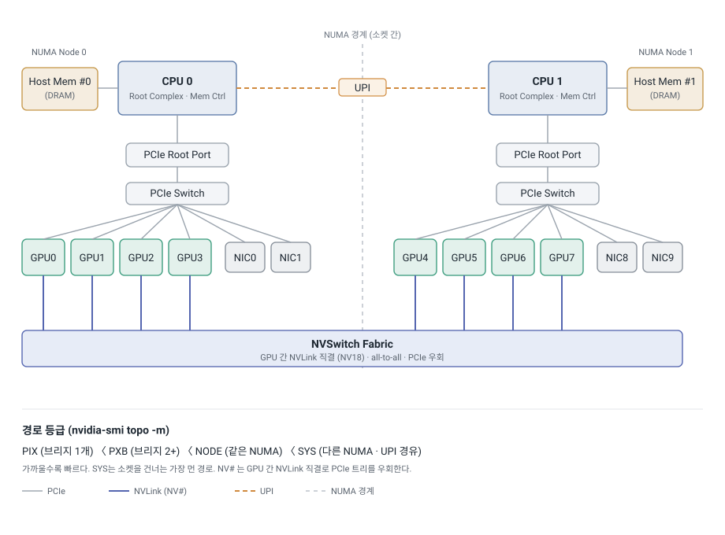
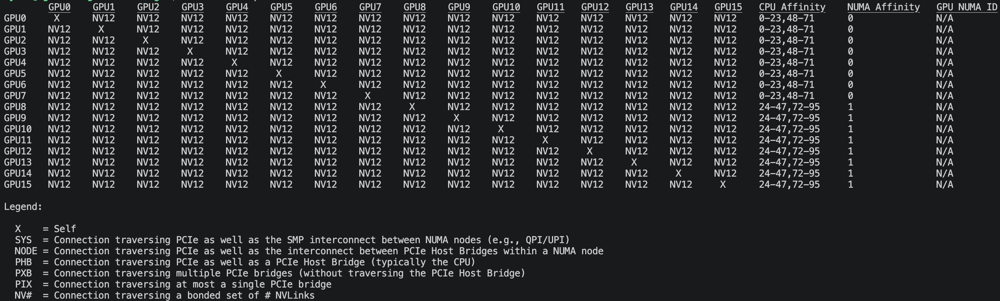
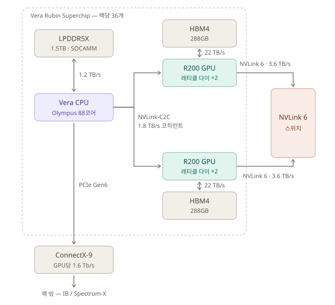
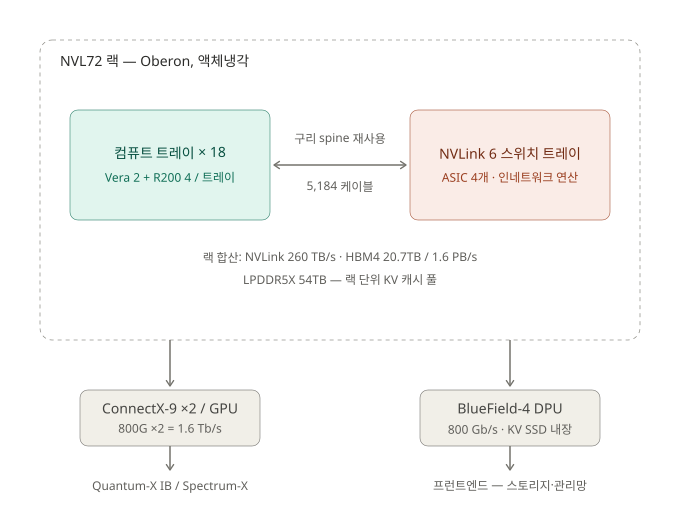
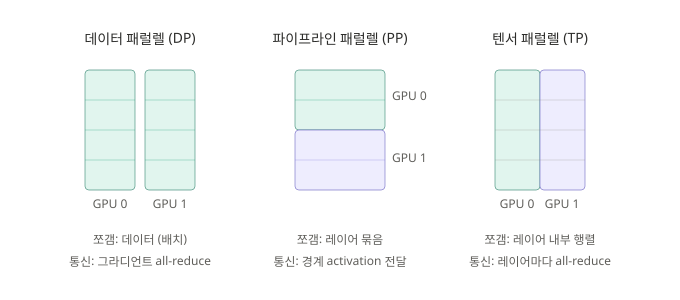
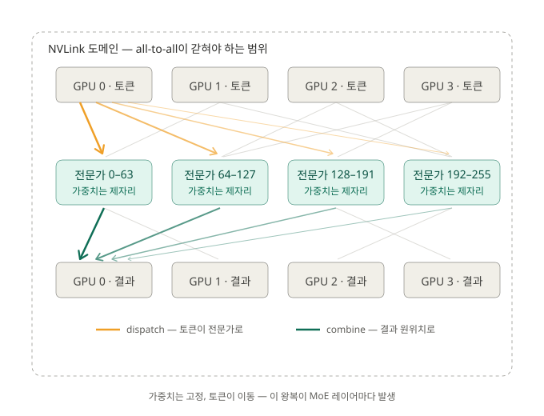

# GPU 서버 아키텍처: H100 서버 구조부터 Vera Rubin 패브릭까지

이 글은 GPU 서버의 연결 구조를 본다. 지금 쓰는 H100 세대 서버가 어떻게 구성되는지(Part I), 2026년 하반기 Vera Rubin이 그 구성을 어떻게 재편하는지(Part II), 그 재편이 왜 필요한지(Part III).

> 이 분석은 **NVIDIA** 플랫폼 기준이다. Part I은 H100 세대 듀얼 소켓 서버(HGX 계열), Part II는 Vera Rubin 플랫폼을 다룬다. Rubin 수치는 NVIDIA 발표(GTC 2025, CES 2026)와 SemiAnalysis 분석 기준이며, 2026년 하반기 출하 전까지 바뀔 수 있다.

---

## Part I. H100 세대 GPU 서버

*지금의 GPU 서버는 어떻게 구성되나.*

### 서버 안의 GPU

GPU 서버 한 대(예: HPE XD670)는 듀얼 CPU를 중심에 두고, GPU와 NIC을 PCIe로 매단 구조다. 이 구조를 이해하는 출발점은 CPU 칩 안에 들어 있는 두 인터페이스다.

PCIe Root Complex는 CPU 코어와 PCIe 버스를 잇는 인터페이스로, CPU 칩 내부에 있다. 그 아래 PCIe Root Port는 PCIe 버스가 시작되는 논리적 경계점이다. 부팅 시 BIOS가 각 Root Port 단위로 PCI Bus 번호를 부여하고, 포트들은 서로 독립적이다. Memory Controller도 CPU 칩 안에 있으며 CPU 코어와 DRAM을 전용 버스로 잇는다. 이 DRAM이 CPU가 쓰는 일반 시스템 메모리, 곧 Host Memory다.

GPU와 NIC은 이 Root Complex 아래 PCIe 트리에 매달린 주변장치다. 그래서 어떤 장치가 어느 CPU에 붙어 있느냐가 성능에 직접 영향을 준다. 그 영향을 설명하는 개념이 NUMA다.

### NUMA: 메모리 접근에 거리가 있다

NUMA(Non-Uniform Memory Access)는 멀티 프로세서 시스템에서 CPU가 메모리에 접근하는 경로와 시간이 메모리의 물리적 위치에 따라 달라지는 구조를 말한다.

핵심은 지역성이다. CPU#0은 자기 Memory Controller에 직결된 Host Memory#0에 가장 빠르게 접근한다. CPU#1에 붙은 Host Memory#1에도 접근할 수 있지만, 그러려면 소켓 사이를 잇는 UPI를 거쳐야 한다. 이 경로는 대역폭이 줄고 레이턴시가 는다.

PCIe 장치도 같은 영향을 받는다. GPU나 NIC이 어느 CPU의 Root Complex에 연결됐는지에 따라 그 장치의 NUMA Node가 정해진다. 다른 NUMA Node의 자원에 접근하면 UPI를 건너야 하고 성능이 떨어진다. 여기서 NUMA Node는 CPU 소켓 하나와 거기 직결된 모든 것, 즉 CPU 코어·캐시·메모리 컨트롤러·호스트 메모리·Root Complex·그 아래 PCIe 장치를 묶은 단위다. 결국 통신 시 거치는 홉(hop) 수가 성능을 정한다.

데이터 패스를 홉 수로 나열하면 차이가 분명하다.

```
CPU - Host Memory (Local)   CPU#0 Core → Memory Controller → Host Memory#0
CPU - Host Memory (Remote)  CPU#0 Core → UPI → Memory Controller → Host Memory#1
PCIe 장치 - Host Memory      GPU·NIC → PCIe Switch → Root Port → Root Complex
                            → Memory Controller → DRAM
```

Remote 경로에 끼어든 UPI 한 단계가 곧 NUMA 페널티다.

### 서버 내 연결: PCIe, NVLink, NVSwitch

서버 안 구성요소를 잇는 통로는 셋이고, 각자 맡는 트래픽이 다르다.

**PCIe**는 CPU가 서버 내 장치를 인식하고 제어하는 기본 통로다. GPU, NIC, NVMe가 전부 PCIe로 연결돼 인식된다. Host Memory와 GPU Memory 사이의 데이터 이동도 기본적으로 PCIe를 탄다. CPU가 모든 장치를 감지하고 제어하는 필수 경로다.

**NVLink**는 GPU 사이를 잇는 GPU 전용 고속 통로다. 같은 서버 안 GPU끼리 데이터를 주고받을 때 PCIe를 거치지 않고 NVLink로 더 빠르게 통신한다. 세대별 대역폭은 이렇다.

| 세대 | 아키텍처 | GPU당 총 대역폭 | 최대 링크 수 | 링크당 대역폭 |
|------|---------|----------------|------------|-------------|
| Gen 4 | Hopper | 900 GB/s | 18 | 50 GB/s |
| Gen 5 | Blackwell | 1,800 GB/s | 18 | 100 GB/s |
| Gen 6 | Rubin | 3,600 GB/s | 36 | 100 GB/s |

**NVSwitch**는 여러 NVLink를 스위치로 묶어 어느 GPU 쌍이든 고속으로 통신하도록 서버 안에 패브릭을 구성한다. NVLink가 점대점 링크라면 NVSwitch는 그 링크들을 교차 연결하는 허브다.


*듀얼 CPU·PCIe 트리·GPU·NVLink·NIC 구성과 NUMA 경계(UPI).*

### NUMA Locality 읽기

GPU와 NIC 사이의 연결 수준을 NUMA 지역성과 홉 기준으로 분류한 라벨이 있다. 이걸 읽으면 서버 안 디바이스 토폴로지를 파악하고, 워크로드에서 어떤 GPU에 어떤 NIC을 붙일지 판단할 수 있다.

| 라벨 | 의미 | 예시 |
|------|------|------|
| PIX | PCIe bridge 하나를 지나는 경로 (동일 PCIe Switch 하위) | GPU0 ~ NIC0 |
| PXB | PCIe bridge 둘 이상을 지나는 경로 (동일 Switch, Host Bridge 경유) | GPU0 ~ NIC1 |
| NODE | 동일 NUMA 노드 내, Host Bridge(Root Complex)를 지나는 경로 | GPU1 ~ NIC3 |
| SYS | 다른 NUMA Node를 지나는 경로, UPI 경유 | GPU2 ~ NIC4 |
| NV# | NVLink # 개로 직접 연결, PCIe 우회 | GPU0 ~ GPU1 |

위에서 아래로 갈수록 홉이 늘고 느려진다. PIX가 가장 가깝고, SYS는 소켓을 건너는 가장 먼 경로다. NV#는 PCIe 트리 바깥의 NVLink 직결이라 별도 등급이다.

이 라벨을 실제로 보는 명령이 `nvidia-smi topo -m`이다. 8-GPU 서버의 출력을 줄이면 이런 모양이다.



GPU끼리는 전부 NV18, 즉 NVLink 18개를 본딩한 경로로 균일하게 연결돼 있다. 반면 GPU와 NIC 사이는 PIX·PXB·NODE·SYS로 거리가 제각각이다. CPU Affinity와 NUMA 열을 보면 GPU0~3이 NUMA 0(CPU 코어 0-55), GPU4~7이 NUMA 1(56-111)에 속한다. 그래서 GPU0의 트래픽을 내보낼 NIC을 고를 때는 같은 NUMA 0에 있으면서 PIX로 붙은 NIC0을 잡아야 SYS를 건너는 손해를 피한다. 이 매칭을 잘못 잡으면 매 통신이 UPI를 건너며 대역폭을 깎아먹는다.

이 H100 세대 서버는 세 전제 위에 서 있다. CPU가 토폴로지의 중심이고, GPU·NIC은 PCIe 트리에 매달린 주변장치다. Host Memory와 GPU Memory 사이의 기본 통로는 PCIe다. 성능 분기점은 소켓 간 NUMA 경계(UPI)이고, `topo -m`의 PIX/PXB/NODE/SYS가 그걸 표현한다. Vera Rubin은 이 세 전제를 모두 건드린다.

---

## Part II. Vera Rubin: 서버에서 랙으로

*같은 시스템을 NVLink 패브릭으로 다시 짜면 무엇이 달라지나.*

### 단위가 서버에서 랙으로 바뀐다

Vera Rubin에서 "서버 한 대"라는 단위는 트레이와 랙으로 올라간다. 구성요소를 작은 것부터 쌓으면 이렇다.

- **Superchip**: Vera CPU 1개 + R200 GPU 2개를 한 패키지에 NVLink-C2C로 묶은 단위
- **컴퓨트 트레이**: Superchip 2개 (Vera 2 + R200 4)
- **랙(NVL72)**: 컴퓨트 트레이 18개 = Superchip 36개 = GPU 패키지 72개 = 레티클 다이 144개

주요 사양은 다음과 같다.

| 구성요소 | 사양 |
|---|---|
| Vera CPU | 커스텀 ARM "Olympus" 88코어 / SMT-X 176스레드 |
| Vera 메모리 | LPDDR5X (SOCAMM) 최대 1.5TB, 1.2 TB/s |
| R200 GPU | 레티클 한계 다이 2개, NVFP4 50 PFLOPS |
| GPU 메모리 | HBM4 288GB, ~22 TB/s |
| 랙 합산 | NVFP4 추론 3.6 EFLOPS / 학습 2.5 EFLOPS, HBM4 20.7TB (1.6 PB/s) |

네이밍은 주의할 점이 있다. GB200 NVL72와 VR200의 GPU 패키지 수는 72개로 같다. Rubin 세대부터 NVL 숫자를 패키지가 아니라 레티클 다이 기준으로 세겠다고 GTC25에서 발표했다가, CES 2026에서 다시 NVL72 명칭을 썼다. 자료마다 NVL144와 NVL72가 섞여 나오므로 "다이 144 = 패키지 72"로 환산해 읽으면 된다.

### 링크가 목적별로 분화된다

H100 세대의 PCIe 트리는 제어와 데이터가 한 통로를 공유했다. Rubin은 통로를 역할별로 나눈다.

| 링크 | 연결 | 대역폭 | 역할 |
|---|---|---|---|
| 메모리 버스 | Vera ↔ LPDDR5X | 1.2 TB/s | CPU 로컬 메모리 |
| NVLink-C2C (2세대) | Vera ↔ R200 | 1.8 TB/s | 코히런트, 단일 주소 공간 |
| HBM4 | R200 온패키지 | ~22 TB/s | GPU 로컬 메모리 |
| NVLink 6 | GPU ↔ GPU (랙 내) | GPU당 3.6 TB/s 양방향 | Scale-up 패브릭 |
| PCIe Gen6 | Vera ↔ ConnectX-9 | x16 기준 ~128 GB/s | NIC/스토리지 attach |
| CX9 → IB/Ethernet | 랙 ↔ 랙 | GPU당 1.6 Tb/s | Scale-out |


*Vera CPU와 R200 GPU를 묶는 NVLink-C2C, HBM4, NVLink 6의 연결 관계.*

몇 개는 따로 볼 값이 있다.

**메모리 버스**는 DDR5 대신 모바일 계열 LPDDR5X를 SOCAMM 모듈로 채택했다. 이유는 전력이다. LPDDR5X 서브시스템 전체가 30W 미만인 데 비해 DDR5 등가 구성은 100W를 넘는다(NVIDIA 공개 수치).

**NVLink-C2C**는 Part I에서 PCIe가 맡던 CPU↔GPU 본선을 대체하는 지점이다. 1.8 TB/s 코히런트 링크로, Grace 세대(900GB/s)의 2배, PCIe Gen6의 약 7배다. CPU의 LPDDR5X와 GPU의 HBM4가 하나의 코히런트 주소 공간으로 묶인다. 그래서 KV 캐시를 CPU측 대용량 DRAM에 두고 필요할 때 스트리밍하는 식의 활용이 열린다.

**HBM4**는 GPU 패키지당 288GB, 약 22 TB/s다. 링크라기보다 패키지 내 배선에 가깝다. 한 가지 주의할 점은 HBM이 GPU별 로컬 메모리라는 것이다. GPU0은 GPU5의 HBM을 자기 메모리처럼 읽을 수 없고 NVLink를 타야 한다(3.6 TB/s). 자기 HBM(22 TB/s)과 이 NVLink 사이의 격차가 GPU 스케일의 NUMA 지역성이다.

**NVLink 6**는 scale-up 패브릭이다. GPU의 NVLink 6 칩렛에 커스텀 400G SerDes 36개가 들어가 GPU당 양방향 3.6 TB/s를 낸다. 랙 안 72개 패키지(144 다이)가 전부 all-to-all로 연결되고, 합산 대역폭은 260 TB/s다.

**PCIe Gen6**는 사라지지 않았다. Rubin은 GPU가 Vera와 C2C로 붙고, Vera가 PCIe Gen6 레인으로 ConnectX-9에 연결된다(SemiAnalysis). PCIe의 역할이 "CPU↔GPU 본선"에서 "NIC·스토리지 attach"로 축소됐다고 보면 정확하다.

### 랙 레벨 구조

랙은 컴퓨트 트레이 18개(트레이당 Vera 2 + R200 4)와 NVLink 6 스위치 트레이로 구성된다. 케이블리스 모듈러 트레이 설계로 부품 교체와 NVLink 무중단 유지보수 같은 RAS를 강화했고, 전체가 액체냉각이다.


*컴퓨트 트레이·스위치 트레이·구리 spine으로 GPU 72개가 한 NVLink 도메인을 이룬다.*

랙 등뼈를 따라 GPU와 스위치를 직결하는 수동 구리 케이블이 5,184개 들어간다. 리타이머·트랜시버 없는 순수 구리선이다. 구리를 쓰는 이유는 거리에 있다. 랙 내 1~2m는 구리로 충분하고, 광으로 가면 링크마다 트랜시버가 붙어 전력·비용·고장률이 급증한다. 그래서 설계 원칙이 갈린다. scale-up은 구리, scale-out은 광이다. 구리가 닿는 거리가 곧 NVLink 도메인의 물리적 한계가 된다.

NVLink 6의 핵심 설계 제약은 Blackwell Oberon 랙 spine의 재사용이었다. 같은 도체 수로 대역폭을 2배 내려고 케이블이 아니라 양 끝 SerDes 속도를 2배(400G)로 올렸다. 랙 인프라와 공급망을 유지한 채 세대를 전환한 것이다.

스위치 트레이도 단순 패스스루가 아니다. 트레이당 NVLink ASIC 4개(NVL72 세대의 2개에서 증가), 트레이당 28.8 TB/s를 처리한다. 여기에 트레이당 FP8 14.4 TFLOPS의 인네트워크 연산이 들어가, all-reduce 같은 집합 연산 일부를 GPU 대신 스위치에서 한 번에 처리한다(NVLink SHARP 계열). 스위치를 연산 노드로 봐야 하는 이유다.

랙 바깥 통신(scale-out)은 두 갈래로 나뉜다. ConnectX-9는 GPU당 800G ×2 = 1.6 Tb/s로 랙 간 백엔드(학습 트래픽)를 Quantum-X InfiniBand나 Spectrum-X Ethernet으로 잇는다. BlueField-4(800 Gb/s DPU)는 Vera CPU와 짝지어 프런트엔드(스토리지·관리·서빙 인입)를 맡고 KV 캐시용 SSD를 내장한다. 망 자체가 백엔드와 프런트엔드로 분리된다. SuperPOD은 NVL72 랙 8개에 co-packaged optics 스위치를 더한 단위다.

### H100 세대와의 비교

| 항목 | H100 세대 (x86 듀얼 소켓 HGX) | Vera Rubin |
|---|---|---|
| 토폴로지 중심 | CPU + PCIe 트리 | NVLink 패브릭 |
| CPU↔GPU 본선 | PCIe (Gen5 x16, ~50GB/s 실효) | NVLink-C2C 1.8 TB/s 코히런트 |
| 메모리 모델 | Host/GPU 분리, cudaMemcpy | 단일 코히런트 주소 공간 |
| NUMA 경계 | 소켓 간 (UPI) | NVLink 도메인 안 vs 밖 |
| NVLink 도메인 | GPU 8개 (서버 1대) | GPU 72개 (랙 1대) |
| PCIe 역할 | 제어 + 데이터 본선 | NIC/스토리지 attach |
| 단위 | 서버 (노드) | 트레이 / 랙 |

지역성 개념 자체는 그대로 살아 있다. Superchip마다 LPDDR과 HBM을 가지므로 Rubin은 사실상 NUMA node 36개짜리 시스템이고, remote 접근 페널티를 UPI 대신 NVLink 패브릭이 흡수한다. Part I에서 익힌 `nvidia-smi topo -m` 읽기는 여전히 유효하다. 라벨 체계가 소켓 기준에서 NVLink 도메인 기준으로 바뀔 뿐이다.

---

## Part III. 왜 랙 전체가 한 도메인이어야 하나

*NVLink 도메인을 8에서 72로 키우는 이유는 어디에 있나.*

NVIDIA는 Rubin을 "MoE 모델에 필수적인 GPU 간 통신"이라는 문구로 설명한다. 그 배경은 모델을 여러 GPU에 나누는 병렬화 기법의 통신 구조에서 나온다.

### Dense 모델 분할: DP, PP, TP

모델이 GPU 한 장에 안 들어가거나 한 장으로는 느릴 때 쓰는 분할 전략이 셋이다. 기준 예시로 모든 레이어가 `Y = X·W`인 4-레이어 모델을 GPU 2장에 나눈다고 하자. 세 기법의 차이는 절단 방향이고, 수학적 결과는 같다.


*같은 모델을 세 방향으로 자른다: 데이터(DP), 레이어 묶음(PP), 레이어 내부 행렬(TP).*

**DP(Data Parallel)는 데이터를 자른다.** 두 GPU가 가중치 W 전체를 복제해 갖고, 배치를 나눠 맡는다(GPU0: 샘플 1~512, GPU1: 513~1024). Forward와 Backward는 각자 독립 수행하므로 그 동안 통신이 없다. 단 각 GPU의 그라디언트가 자기 샘플 기준이라 서로 다르므로, `(grad₀ + grad₁) / 2`로 평균(all-reduce)낸 뒤 같은 값으로 업데이트해야 두 복제본이 어긋나지 않는다. 합쳐지는 것은 그라디언트이고 시점은 스텝당 1회다. 레이어 N의 그라디언트는 Backward가 레이어 N-1을 계산하는 동안 전송할 수 있어서, 통신을 연산 뒤에 숨길 수 있다(overlap). DP가 느린 링크(IB)로도 충분한 이유다. 전제는 모델이 GPU 한 장에 적재 가능해야 한다는 것이다.

**PP(Pipeline Parallel)는 레이어 묶음을 자른다.** GPU0이 레이어 1~2, GPU1이 레이어 3~4를 맡는다. Forward에서 GPU0이 `h = L2(L1(X))`를 계산해 h 텐서를 GPU1로 넘기고, GPU1이 `Y = L4(L3(h))`를 수행한다. Backward는 역방향으로 ∂L/∂h를 넘긴다. 합치는 연산은 없고 점대점 액티베이션 전달뿐이라 통신 부담이 가장 작다. 약점은 전달 직후 앞 GPU가 노는 구간(bubble)이고, 마이크로배치로 파이프라인을 채워 완화한다.

**TP(Tensor Parallel)는 레이어 내부 행렬을 자른다.** 한 레이어의 W 자체를 쪼갠다.

```
Y = X·W = [X_A | X_B] · [W_A]  =  X_A·W_A + X_B·W_B
                        [W_B]
```

GPU0이 `X_A·W_A`, GPU1이 `X_B·W_B`를 계산한다. 각 결과는 부분합이라 Y와 shape은 같지만 절반의 기여분이고, 단독으로는 틀린 값이다. 실제 Y는 두 부분합을 원소별로 더해야(all-reduce sum) 나온다. 합산이 끝나기 전에는 다음 레이어의 입력이 존재하지 않는다. 이 통신은 레이어마다 발생하고 숨길 수 없다. 임계 경로에 그대로 놓인다.

세 기법을 가르는 기준은 "합치기가 어느 단위를 막느냐"다.

| 기법 | 합쳐지는 것 | 못 합치면 막히는 단위 | 결과 |
|---|---|---|---|
| DP | 그라디언트 평균 (스텝 끝 1회) | 다음 **스텝** | overlap 가능 → IB로 충분 |
| PP | 없음 (액티베이션 전달) | 다음 GPU의 시작 | 통신량 최소, 대신 bubble |
| TP | 부분합 덧셈 (레이어마다) | 다음 **레이어** | 숨길 수 없음 → 최고속 링크 필수 |

통신 요구는 TP ≫ PP > DP 순이다. 그래서 실전 3D 배치는 통신 부담이 큰 축일수록 빠른 링크에 올린다. TP는 NVLink 안(전통적으로 8 GPU), PP는 인접 노드 간, DP는 최외곽 IB에 배정한다.

### EP: 분할 기법이 아니라 MoE가 강제하는 배치

EP(Expert Parallel)는 위 세 기법과 층위가 다르다. DP·PP·TP는 dense 모델이라는 같은 대상을 세 방향으로 자르는 시스템 레벨 전략이다. EP는 모델 구조 변경(MoE)이 먼저 일어난 결과다. MoE는 FFN을 전문가 N개로 복제하고 라우터가 토큰마다 top-k개만 활성화하는 설계이고, EP는 그 독립적인 전문가들을 GPU에 분산 배치하는 방식이다. dense 모델에는 자를 전문가가 없으므로 EP가 성립하지 않는다.

통신의 성격도 다르다. DP·TP의 all-reduce는 모든 GPU가 같은 값을 갖기 위한 수학적 합산이다. EP의 all-to-all은 합산이 아니라 라우팅이다. 토큰을 해당 전문가에게 배달하고 회수하는 물류에 가깝다.

전문가 256개를 GPU 4장에 64개씩 배치한 경우(EP=4)로 동작을 보면 세 단계다. **Dispatch(배달)** 단계에서, attention을 마친 토큰이 MoE 레이어에 도착하면 라우터가 전문가를 배정한다(예: 137번 전문가의 가중치는 GPU2의 HBM에 있다). 이때 수 GB의 가중치 대신 KB 단위의 토큰 액티베이션이 GPU2로 이동한다. 가중치는 고정이고 토큰이 움직인다는 것이 EP가 성립하는 전제다. **Expert 연산** 단계에서 도착한 토큰을 해당 GPU의 전문가 가중치로 처리한다. **Combine(회수)** 단계에서 처리된 토큰을 원래 GPU로 되돌린다. 다음 attention 레이어가 시퀀스 순서를 요구하기 때문이다.


*라우터가 토큰을 전문가 GPU로 흩뿌리고(dispatch), 처리 후 원래 GPU로 회수한다(combine). 모든 GPU 쌍 사이에 트래픽이 흐른다.*

모든 GPU가 동시에 배달과 회수를 수행하므로 모든 쌍 사이에 트래픽이 생긴다. 이것이 all-to-all이고, MoE 레이어마다 왕복 두 번이 발생한다. 이 통신은 두 가지 면에서 까다롭다. GPU별 토큰 수가 라우터 출력에 따라 매 배치 바뀌므로 불규칙하고(토큰 쏠림이 나면 핫스팟이 생긴다), dispatch가 끝나야 expert 연산이, combine이 끝나야 다음 레이어가 시작되므로 TP처럼 임계 경로에 놓여 숨길 수 없다. 게다가 메시지가 GPU 쌍 단위로 잘게 쪼개져, 대역폭뿐 아니라 링크 레이턴시와 메시지 오버헤드에도 민감하다.

### NVLink 도메인 크기와 EP

여기서 도메인 크기가 왜 중요한지 드러난다. Dense의 랙 내 통신(TP)은 약 8 GPU에서 한계효용이 떨어진다. 행렬 조각이 작아지면서 연산 효율이 하락하기 때문이다. DP는 overlap이 되니 IB로 충분하다. dense 워크로드에게 72-GPU 도메인은 과투자인 셈이다.

EP는 다르다. 통신 성격은 TP급(임계 경로)인데, degree는 8에서 멈추지 않고 전문가 수만큼 확장을 요구한다. 도메인이 넓을수록 끝까지 이득이다. H100 세대는 NVLink 도메인이 8 GPU여서, EP를 그 이상으로 확장하면 즉시 IB로 추락했다. GB200과 VR200은 랙 전체 72 GPU가 한 도메인이라, EP=72까지 all-to-all 전체가 3.6 TB/s 패브릭 위에서 처리된다.

NVLink 도메인 로드맵이 8 → 72 → 576(Rubin Ultra)으로 가는 건 "TP급 통신을 72-way로"라는 EP의 요구에 맞춘 설계다. MoE 전용 하드웨어가 아니라, MoE를 타깃으로 한 범용 패브릭 확장이다.

---

## 마무리

Part I에서 본 `nvidia-smi topo -m`의 PIX/PXB/SYS는 H100 서버에서 GPU와 NIC을 어떻게 짝지을지 판단하는 도구였다. Vera Rubin에서 그 판단의 단위는 소켓에서 NVLink 도메인으로 올라가지만, "가까운 자원을 쓰고 먼 경로를 피한다"는 원칙은 그대로다. 다음은 이 패브릭 위에서 실제 학습·추론 워크로드를 어떻게 배치하는지, 통신과 연산을 어떻게 겹치는지로 이어진다.

---

## References

- [Inside the NVIDIA Rubin Platform: Six New Chips, One AI Supercomputer](https://developer.nvidia.com/blog/inside-the-nvidia-rubin-platform-six-new-chips-one-ai-supercomputer/): Vera Rubin 플랫폼 구성, Superchip, NVLink 6, 랙 구조.
- [NVIDIA Rubin 플랫폼 (NVIDIA Korea Blog)](https://blogs.nvidia.co.kr/blog/rubin-platform-ai-supercomputer/): Rubin 개요(한국어).
- [NVIDIA NVLink and NVSwitch Supercharge Large Language Model Inference](https://www.nvidia.com/en-us/data-center/nvlink/): NVLink·NVSwitch 역할과 세대별 대역폭.
- [3세대 NVIDIA NVSwitch를 통한 멀티-GPU 인터커넥트 업그레이드](https://developer.nvidia.com/blog/upgrading-multi-gpu-interconnectivity-with-the-third-generation-nvidia-nvswitch/): NVSwitch 패브릭.
- [nvidia-smi topo -m 문서 (NVIDIA System Management Interface)](https://docs.nvidia.com/deploy/nvidia-smi/index.html): PIX/PXB/NODE/SYS/NV# 라벨 정의.
- SemiAnalysis, Vera Rubin 플랫폼 분석: PCIe Gen6 attach 구조, SerDes 사양.
- Intel Xeon Scalable, PCIe Root Complex / IIO 문서: 듀얼 소켓 NUMA·PCIe 트리 구조.