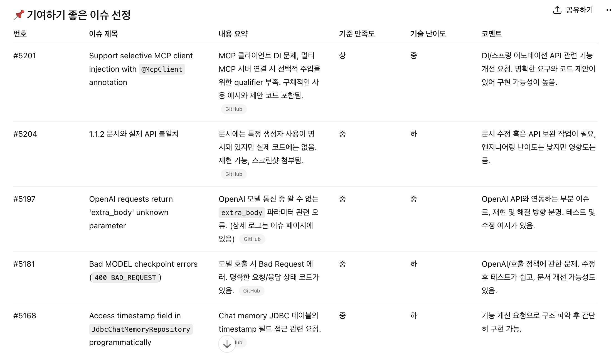
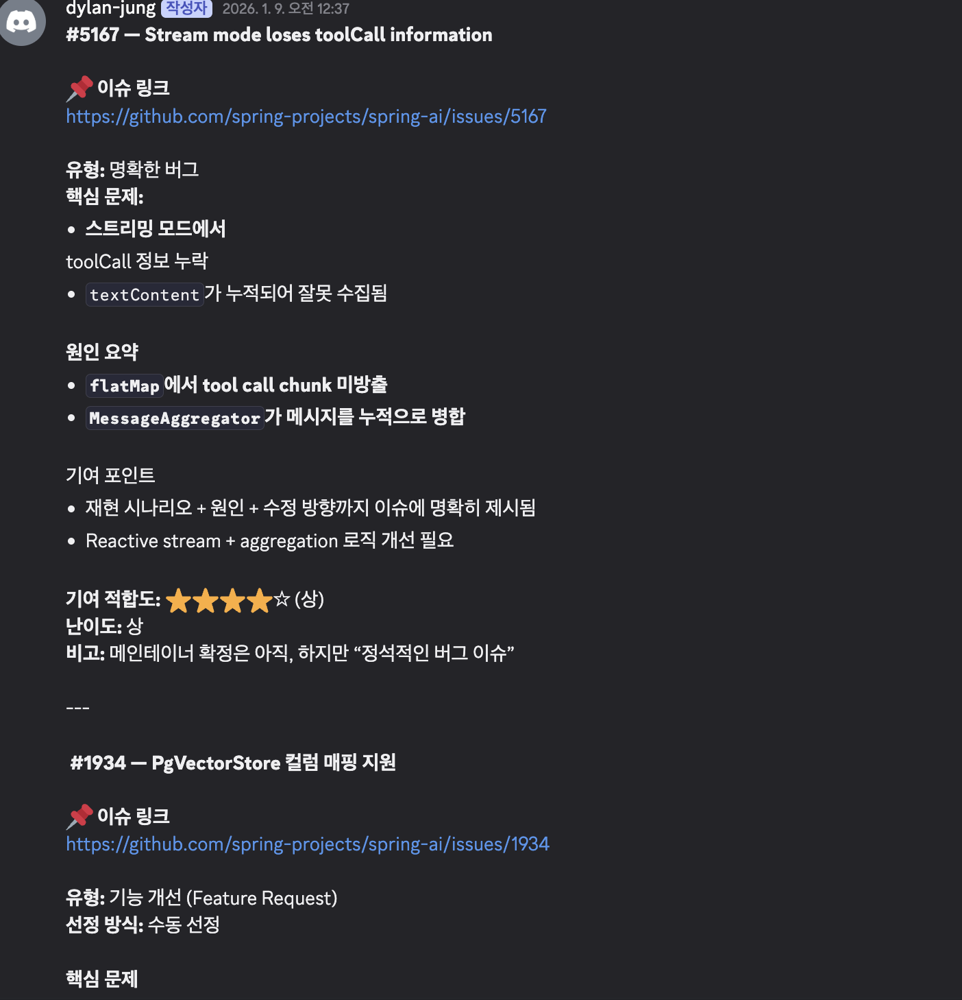
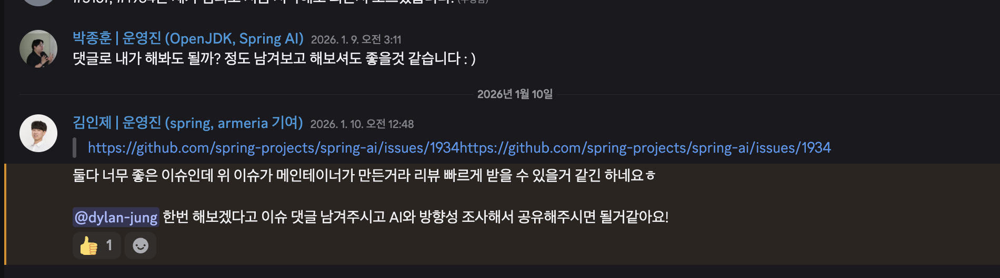
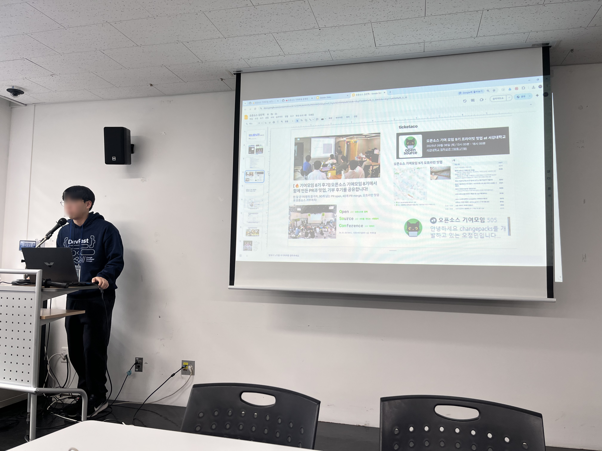
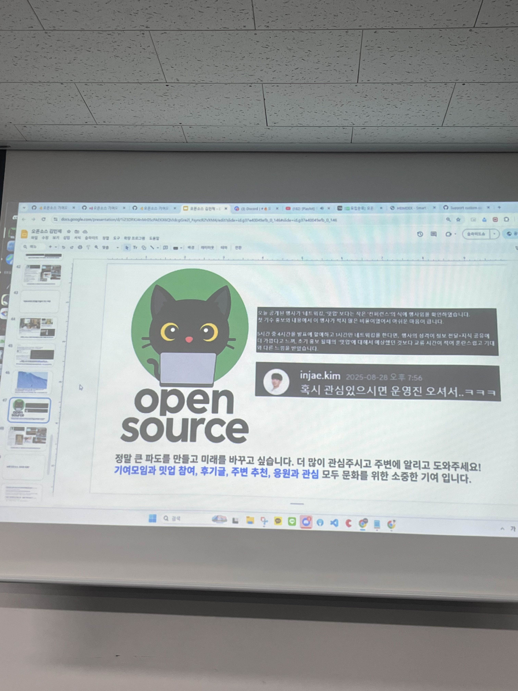
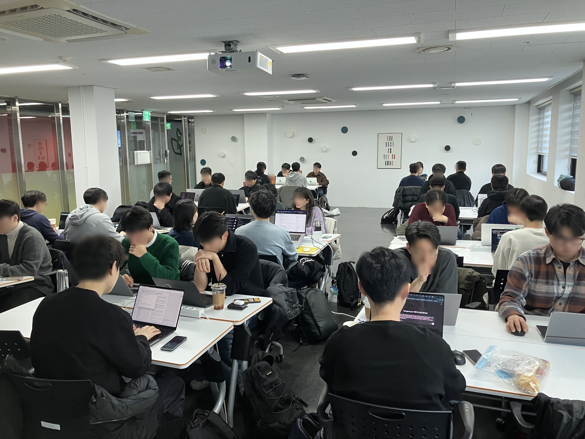
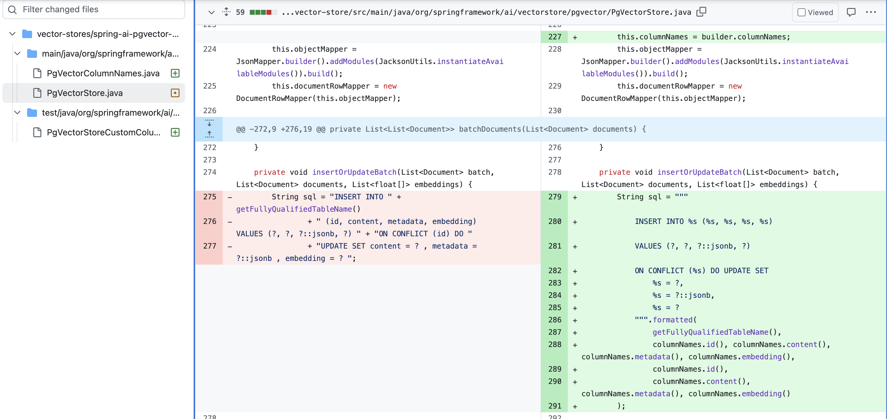

# 들어가며

오픈소스 기여, 많은 개발자들이 한 번쯤 도전해보고 싶어 하지만 막상 시작하려면 어디서부터 손을 대야 할지 막막한 것이 사실이다. 나 역시 그랬다. 평소 사용하던 오픈소스 라이브러리에서 불편한 점을 발견하면 "이거 고쳐보면 좋을 텐데..."라는 생각은 했지만, 실제로 기여하는 것은 완전히 다른 문제였다.

그러던 중 개발자 행사 플랫폼에서 **"오픈소스 기여모임 10기"** 모집 공고를 발견했고, 좋은 기회라고 생각해 참여하게 되었다. 이 글에서는 오픈소스 기여모임에 참여하면서 경험한 전체 과정과, 실제로 Spring AI 프로젝트에 기여하기까지의 여정을 공유하려고 한다.

결론부터 말하자면, **오픈소스 기여는 생각보다 어렵지 않았다.** 체계적인 프로세스와 적절한 가이드만 있다면 누구나 충분히 도전할 수 있다는 것을 깨달았다.

# 기여할 이슈 찾기: 가장 중요한 첫 단계

오픈소스 기여에서 가장 중요하면서도 어려운 부분은 바로 **"무엇을 기여할 것인가"**를 결정하는 것이다. 프로젝트를 선택하고, 적절한 이슈를 찾고, 내가 실제로 해결할 수 있는 문제인지 판단하는 과정이 필요하다.

과거에는 이런 탐색 과정이 정말 막막했다. 하지만 기여모임에서 제공하는 **AI 기반 이슈 탐색 방법론**을 활용하니 훨씬 수월하게 접근할 수 있었다. 운영진이 공유해준 [오픈소스 기여 가이드](https://medium.com/opensource-contributors/%EC%98%A4%ED%94%88%EC%86%8C%EC%8A%A4%EC%9D%98-%ED%8C%90%EB%8F%84%EB%A5%BC-%EB%B0%94%EA%BF%80-ai%EB%A1%9C-%EC%98%A4%ED%94%88%EC%86%8C%EC%8A%A4-%EA%B8%B0%EC%97%AC-%EC%99%84%EB%B2%BD-%EA%B0%80%EC%9D%B4%EB%93%9C%EC%99%80-%ED%94%84%EB%A1%AC%ED%94%84%ED%8A%B8-%EA%B3%B5%EC%9C%A0-2db85bf736b8)는 이 과정에 큰 도움이 되었다.

## 프로젝트 선정: Spring AI를 선택한 이유

처음에는 **Langchain4J**와 **Spring AI** 두 프로젝트를 후보로 고려했다. 두 프로젝트 모두 AI 생태계에서 빠르게 성장하고 있는 Java 기반 프레임워크다. Python 중심의 AI 생태계를 Java 진영으로 가져오는 작업은 쉽지 않은 일이고, 그만큼 기여할 여지도 많다고 판단했다.

나는 AI 관련 프로젝트를 진행하면서 어느 정도 도메인 지식을 쌓은 상태였기 때문에, 이 분야의 오픈소스에 기여하는 것이 상대적으로 수월할 것 같았다. Langchain4J를 먼저 살펴봤지만 마땅히 기여하고 싶은 이슈를 찾지 못했고, 결국 **Spring AI**를 선택했다. 마침 취업 준비를 하면서 Java와 Spring 생태계에 대한 이해를 깊게 할 필요도 있었기에 일석이조였다.

## 이슈 탐색: AI의 도움과 한계

첫 번째 시도는 AI 프롬프트를 활용한 이슈 탐색이었다. ChatGPT에게 Spring AI 프로젝트의 적절한 기여 이슈를 추천해달라고 요청했다.

하지만 결과는 기대에 미치지 못했다:
- 이미 누군가 Pull Request를 제출한 이슈
- 메인테이너의 의사결정이 필요한 정책적 이슈
- 재현 방법이 명확하지 않은 버그 리포트

*(이 경험을 통해 나도 앞으로 이슈를 작성할 때 재현 방법을 친절하게 문서화해야겠다는 교훈을 얻었다.)*

AI의 추천이 완벽하지 않다는 것을 깨닫고, 좀 더 전통적인 방법으로 접근했다. **오래된 이슈부터 살펴보는 것**이다. GitHub의 라벨 필터링 기능을 활용해 `pgvector` 관련 이슈만 추려냈고, 그중 몇 가지 유망한 후보를 찾을 수 있었다.

## 운영진의 피드백: 새벽에도 이어진 열정

후보 이슈들을 정리한 후, AI를 활용해 각 이슈의 난이도와 적합성을 평가하여 Discord에 공유했다.

놀라웠던 것은 **새벽 시간임에도 불구하고** 박종훈님, 김인제님을 비롯한 운영진들이 빠르게 피드백을 주셨다는 점이다. 500명이 넘는 참가자들의 질문과 이슈를 검토하면서도 이렇게 신속하게 답변해주시는 모습에 정말 감사했다.

## 최종 선택: PgVectorStore 컬럼 매핑 이슈

운영진의 조언을 바탕으로 최종적으로 선택한 이슈는 다음과 같다:

**[Support custom column names in PgVectorStore](https://github.com/spring-projects/spring-ai/issues/1934)**

이 이슈를 선택한 근거는 명확했다:

1. **오래 방치된 이슈**: 메인테이너도 중요하다고 생각하지만 우선순위에 밀려 해결되지 않은 상태
2. **메인테이너가 직접 작성한 이슈**: 프로젝트 방향성과 부합하며, 승인 가능성이 높음
3. **실무 경험 보유**: 나는 실제로 pgvector를 사용한 경험이 있어 문제의 맥락을 이해하고 있었음

# 기여 과정: 오프라인 모임에서 PR 제출까지

## 오프라인 모임: 집중과 협업의 시간

본격적인 기여 작업은 오프라인 모임에서 진행되었다. 행사는 간단한 오프닝과 운영진 소개로 시작했다.

이후에는 각자 선택한 이슈에 집중하는 시간이 주어졌다. 막히는 부분이 있으면 언제든지 운영진에게 질문할 수 있었고, 실시간으로 피드백을 받을 수 있었다.

중간에는 네트워킹 세션도 있어서 다른 참가자들과 경험을 공유하고 인사이트를 나눌 수 있었다.

## 구현: 생각보다 큰 변경사항

내가 맡은 이슈의 핵심 내용은 다음과 같다:

> 현재 `PgVectorStore`는 데이터베이스 스키마에서 특정 컬럼명(`id`, `content`, `metadata`, `embedding`)을 강제한다. 하지만 실무에서는 DBA가 다른 네이밍 컨벤션을 사용하거나 기존 스키마를 그대로 활용해야 하는 경우가 많다.
>
> ORM 프레임워크처럼 컬럼명 매핑을 지원하여, `PgVectorStore`가 기존 데이터베이스 스키마에 적응할 수 있도록 해야 한다.

처음에는 "하드코딩된 컬럼명만 변수로 바꾸면 되겠네?"라고 생각했다. 하지만 막상 코드를 뜯어보니 **생각보다 훨씬 많은 부분을 수정해야 했다.**

- `PgVectorColumnNames`라는 새로운 클래스 추가
- SQL 쿼리 빌더 전반에 걸친 하드코딩 제거
- 테스트 코드 업데이트
- 설정 클래스 추가

## 전략적 접근: Partial Implementation

코드를 작성하면서 가장 고민되었던 부분은 **"이렇게 큰 변경사항을 메인테이너가 받아들일까?"**였다. 자칫하면 며칠 동안 작업한 PR이 거부될 수도 있었다.

이 고민을 운영진에게 공유했더니, 아주 좋은 조언을 받았다:

> "일단 **부분 구현(partial implementation)**만 올려서 메인테이너의 반응을 확인해보세요. 방향성이 맞다면 그때 전체를 완성하면 됩니다."

이 조언에 따라 핵심 기능만 구현한 PR을 제출했다:

**[Add support for custom column names in PgVectorStore](https://github.com/spring-projects/spring-ai/pull/5216)**

아직까지 PR이 승인되지 않았고 open 상태이지만 추후 진행사항이 있으면 따로 공유하려고 한다.

# 마치며: 오픈소스 기여는 생각보다 가깝다

오픈소스 기여모임 10기에 참여하면서 가장 크게 느낀 점은 **"오픈소스 기여는 생각보다 어렵지 않다"**는 것이다. 물론 기술적인 역량도 중요하지만, 그보다 더 중요한 것은:

- 적절한 이슈를 찾는 **탐색 능력**
- 메인테이너와 소통하는 **커뮤니케이션**
- 작게 시작하고 점진적으로 개선하는 **전략적 사고**

특히 **김인제님**을 비롯한 운영진들의 헌신에 깊은 감사를 드린다. 본업으로 바쁘실 텐데도 새벽과 이른 아침에 참가자들의 이슈를 검토하고 피드백을 주시는 모습이 정말 인상 깊었다.

이번 경험을 통해 오픈소스 생태계에 기여하는 것이 얼마나 보람찬 일인지 깨달았다. 다양한 배경을 가진 개발자들을 만나고, 실무에서 사용하는 기술의 내부를 깊이 이해하고, 전 세계 개발자들이 사용하는 코드에 내 이름을 남길 수 있다는 것은 특별한 경험이었다.

다음 기회가 된다면 이번에는 **운영진으로 참여**해서 다른 개발자들의 첫 오픈소스 기여를 돕고 싶다. 내가 받은 도움을 다시 커뮤니티에 돌려주는 것, 그것이 오픈소스 정신의 핵심이 아닐까.