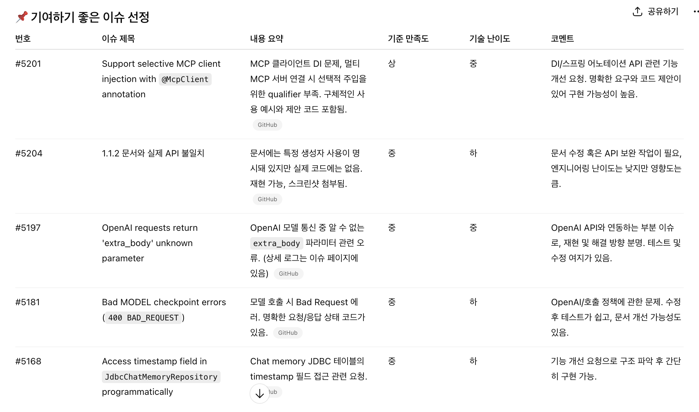
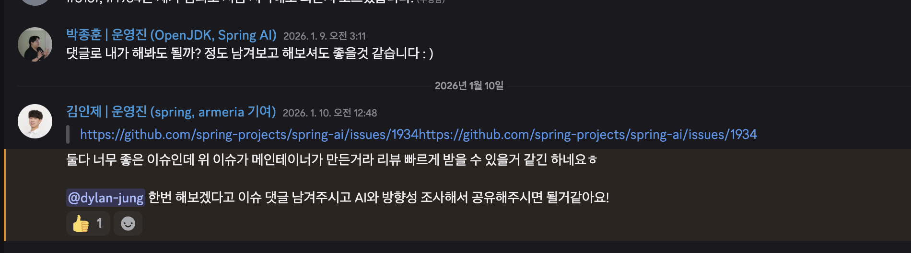
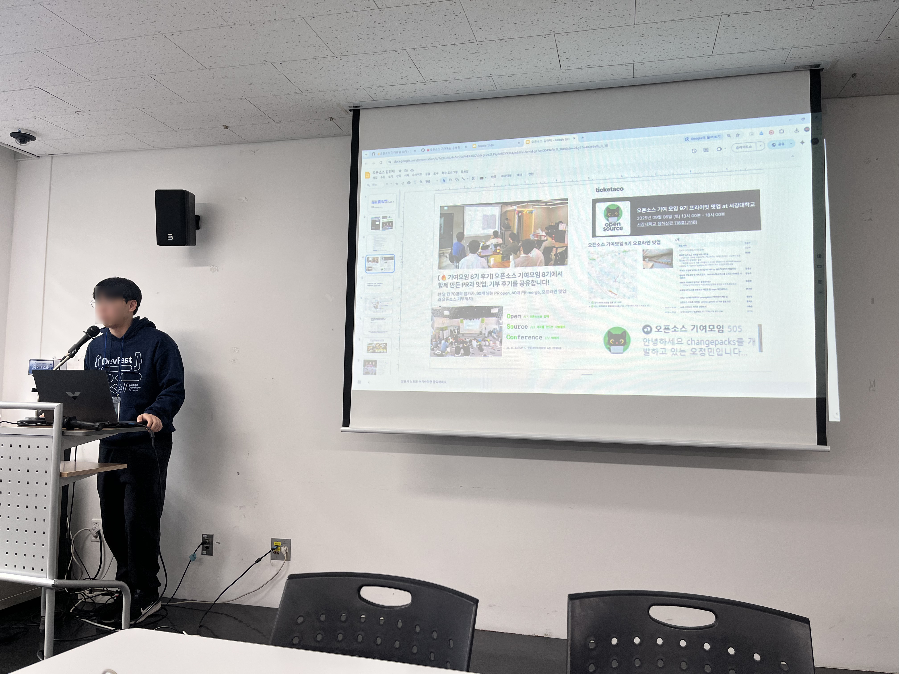
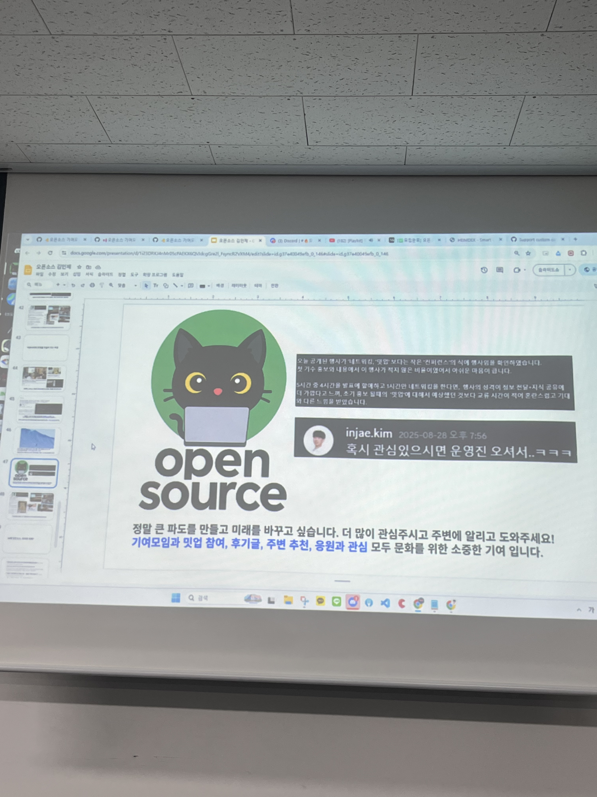
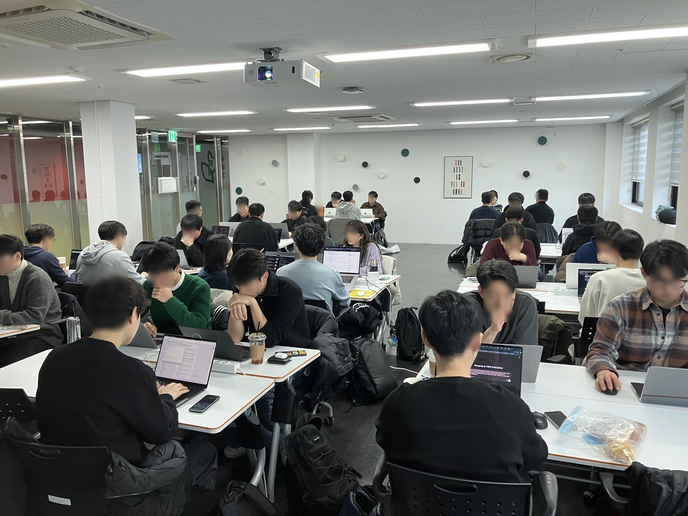
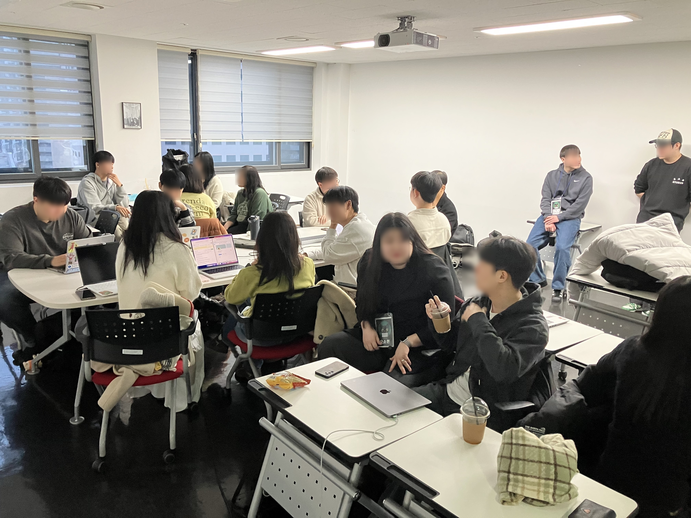
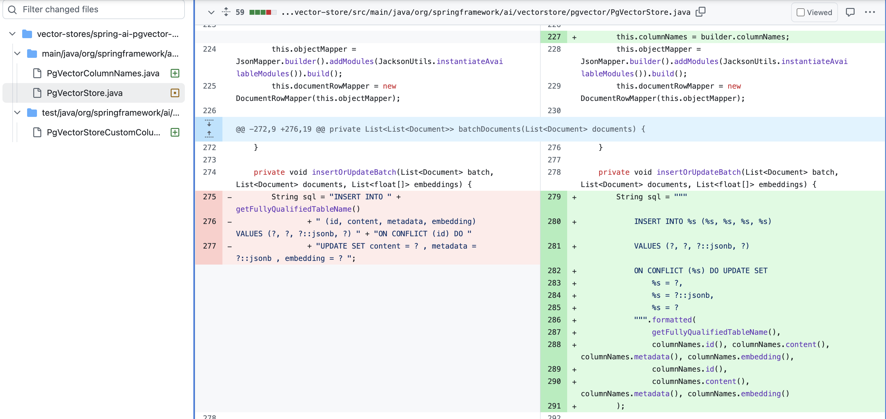

# 들어가며

오픈소스 기여모임은 개발자들이 함께 모여 실제 오픈소스 프로젝트에 PR을 제출하는 것을 목표로 하는 커뮤니티 프로그램이다. 10기에 참가자로 참여했고, 이 글은 그 경험에 대한 리뷰다.

# 이슈 탐색

오픈소스 기여에서 가장 어려운 건 코드 작성이 아니라 "뭘 할지 정하는 것"이다. 프로그램에서는 운영진이 공유한 [이슈 탐색 가이드](https://medium.com/opensource-contributors/%EC%98%A4%ED%94%88%EC%86%8C%EC%8A%A4%EC%9D%98-%ED%8C%90%EB%8F%84%EB%A5%BC-%EB%B0%94%EA%BF%80-ai%EB%A1%9C-%EC%98%A4%ED%94%88%EC%86%8C%EC%8A%A4-%EA%B8%B0%EC%97%AC-%EC%99%84%EB%B2%BD-%EA%B0%80%EC%9D%B4%EB%93%9C%EC%99%80-%ED%94%84%EB%A1%AC%ED%94%84%ED%8A%B8-%EA%B3%B5%EC%9C%A0-2db85bf736b8)를 통해 이 과정을 안내한다.

## 프로젝트 선정: Spring AI를 선택한 이유

처음에는 **Langchain4J**와 **Spring AI** 두 프로젝트를 후보로 고려했다. 두 프로젝트 모두 AI 생태계에서 빠르게 성장하고 있는 Java 기반 프레임워크다. Python 중심의 AI 생태계를 Java 진영으로 가져오는 작업은 쉽지 않은 일이고, 그만큼 기여할 여지도 많다고 판단했다.

AI 관련 프로젝트를 진행하면서 도메인 지식을 쌓은 상태였기 때문에, 이 분야의 오픈소스에 기여하는 것이 상대적으로 수월할 것 같았다. Langchain4J를 먼저 살펴봤지만 적절한 이슈를 찾지 못했고, 결국 **Spring AI**를 선택했다.

## AI 기반 이슈 탐색

프로그램에서 권장하는 방법 중 하나가 ChatGPT를 활용한 이슈 탐색이다. 실제로 해봤는데, 추천받은 이슈 대부분이 이미 PR이 올라간 것이거나, 재현 방법이 불명확하거나, 메인테이너의 정책적 결정이 필요한 것들이었다.

결국 GitHub에서 라벨 필터링으로 `pgvector` 관련 이슈를 직접 찾는 게 더 효율적이었다.

## 운영진 피드백

후보 이슈들을 정리해서 Discord에 공유하면 운영진이 피드백을 준다. 박종훈님, 김인제님을 비롯한 운영진들이 500명 넘는 참가자를 관리하면서도 새벽 시간에 빠르게 답변을 주셨는데, 이 부분은 정말 감사했다.

## 최종 선택

최종적으로 선택한 이슈는 [Support custom column names in PgVectorStore](https://github.com/spring-projects/spring-ai/issues/1934)다.

- 메인테이너가 직접 올린 이슈라 방향성이 명확했다
- 오래 방치되어 있어 경쟁이 적었다
- pgvector를 실제로 써본 경험이 있어 맥락을 이해하고 있었다

# 기여 과정

## 오프라인 모임

본격적인 기여 작업은 오프라인 모임에서 진행했다. 오프라인 참여 없이도 기여는 가능하다.

각자 선택한 이슈에 집중하는 시간이 주어지고, 막히는 부분은 운영진에게 바로 질문할 수 있었다. 중간에 네트워킹 세션도 있어서 다른 참가자들과 경험을 나눌 수 있었다.

## 구현

이슈의 핵심은 `PgVectorStore`가 컬럼명(`id`, `content`, `metadata`, `embedding`)을 하드코딩하고 있어, 실무에서 다른 네이밍 컨벤션이나 기존 스키마를 쓸 수 없다는 점이었다.

처음에는 단순히 변수로 바꾸면 될 줄 알았는데, 실제로는 변경 범위가 꽤 넓었다.

- `PgVectorColumnNames` 클래스 추가
- SQL 쿼리 전반의 하드코딩 제거
- 테스트 코드 및 설정 클래스 추가

변경사항이 커지면서 PR이 거부될 수 있다는 고민이 있었는데, 운영진이 **부분 구현(partial implementation)**으로 먼저 올려서 메인테이너 반응을 확인하라는 조언을 해줬다. 이 전략이 실질적으로 도움이 됐다.

핵심 기능만 구현한 [PR](https://github.com/spring-projects/spring-ai/pull/5216)을 제출했고, 현재 open 상태다.

# 총평

오픈소스 기여모임은 "첫 PR을 제출하는 데까지의 허들을 낮춰주는 프로그램"으로서 잘 작동한다. 이슈 선정부터 PR 작성까지의 가이드가 체계적이고, 운영진 피드백도 빠르다.

특히 **김인제님**을 비롯한 운영진들에게 감사하다. 본업이 있으실 텐데도 새벽과 이른 아침에 참가자들의 이슈를 검토하고 피드백을 주셨다.

오픈소스 기여를 처음 시도하려는 사람에게는 혼자 삽질하는 것보다 이런 커뮤니티를 통해 시작하는 쪽이 효율적이다.