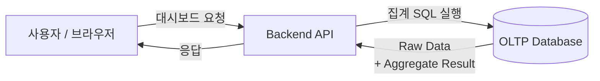
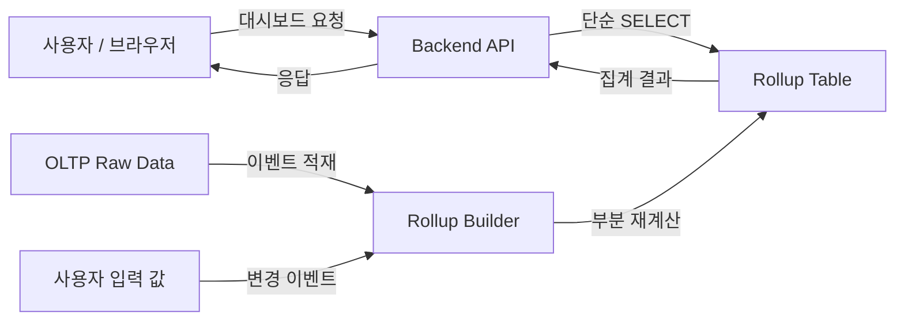

서비스를 운영하다 보면 데이터는 자연스럽게 쌓인다. 문제는 그 시점이 생각보다 빨리 온다는 것이다. 특히나 포인트 로그, 로그, 커머스, 광고 데이터처럼 시간·아이템·상태 기준으로 잘게 나뉘는 데이터를 다루다 보면 어느 순간부터 **집계 자체가 시스템의 병목**이 된다.

우리가 운영하던 서비스도 그 지점을 지나고 있었다. 이 글은 대시보드 응답 시간이 점점 느려지는 상황에서, 여러 선택지를 검토한 끝에 **Rollup Table 기반 집계 구조**를 선택하게 된 과정을 정리한 기록이다.

# 문제: 집계는 무거운 연산이다.

초기 대시보드는 전형적인 구조다.

- PostgreSQL 단일 DB
- 요청 시점에 SQL로 집계
- GROUP BY date, item_id

데이터가 많지 않을 때는 문제가 없다. 쿼리도 단순했고, 응답 속도도 충분히 빨랐다.

내가 문제를 겪었던 것은
- 판매·광고 데이터를 집계해 보여주는 B2B 대시보드
- 채널 수가 많고(판매 + 광고), 고객사별 데이터 편차가 큼
- 일간 판매 이벤트: 10만 row 이상
- 쿼리 패턴: `GROUP BY date, company_id`

특정 고객사의 데이터가 급증하면서, 대시보드 집계 조회 p99 지연 시간이 **10초 이상**으로 튀기 시작했다. 대시보드에서 API가 느린 것은 그렇게 중요하지 않은 경우가 많다. 그러나 이번에는 쿼리가 느린 것이 **비즈니스적으로 악영향**을 미쳤기 때문에 이 문제를 꼭 해결해야했다.

# 이 문제를 복잡하게 만든 핵심 조건
집계와 조인이 이렇게 많이 들어간 경우에는 상당히 무거운 단순히 인덱스를 추가하거나 쿼리를 조금 더 다듬는 수준으로 이 문제를 장기적으로 해결하기 어렵다고 판단했다. 보통은 이러한 경우에는 한 번 기록된 내용은 다시 "변하지 않는다"는 가정하에 로그 기반 DB를 쓰는 것으로 해결이 가능하다. 그러나 이번에는 **중요한 제약조건이 있었다**.

## 사용자 수기 입력 값이 집계에 포함돼 있었다
계산되는 지표에는 원가, 수수료, 배달비 값들이 포함돼 있었다. 그러나 이 값들은 대시보드의 모든 값이 **외부에서 수집된(크롤링) 내용에서 알 수 있는 값이 아니다**. 사용자가 직접 입력하거나 수정한다. 그리고 이 값이 바뀌면 과거 데이터까지 포함해 ROAS 같은 지표가 즉시 바뀌어야 했다. 즉, 아주 오래된 내용도 값을 변경 가능해야한다.

이 문제는 처음부터

> 부분 재계산이 가능하면서 조회는 항상 빨라야 하는 구조

를 요구하고 있었다.

# 옵션 1: PostgreSQL Materialized View

가장 먼저 떠올린 선택지는 PostgreSQL의 Materialized View였다. 기존에 프로젝트에서 Postgres를 사용하기도 했었고 이러한 캐싱을 하기에 가장 적합한 방법 중 하나이기 때문이다.

아이디어 자체는 단순했다.

* 자주 쓰는 집계를 미리 계산해두고
* 조회할 때는 결과만 읽는다

처음에는 꽤 합리적으로 보였다.

* 기존 DB를 그대로 쓸 수 있고
* 별도 인프라가 필요 없고
* SQL만으로 구현 가능했다

하지만 실제 요구사항에 대입해보니 문제가 있었다.

사용자 입력 값은
특정 하루, 특정 row 하나에만 영향을 주는 구조가 아니었다.

사용자 입력은 계속해서 바뀌고

입력 하나가 바뀌면,

* 여러 날짜
* 여러 지표

의 결과가 동시에 바뀌었다.

결국 Materialized View를 갱신해야 하는 범위가
생각보다 훨씬 넓어졌고,
부분적으로 갱신하기도 쉽지 않았다.

`REFRESH MATERIALIZED VIEW CONCURRENTLY`를 사용해도
락은 줄일 수 있었지만,
계산 비용 자체가 사라지는 건 아니었다.

결국 이 선택지는
**조회 시점의 비용을 갱신 시점으로 옮겼을 뿐**이라는 결론에 도달했다.

---

# 옵션 2: OLAP 시스템 도입

다음으로는 OLAP 시스템 도입을 검토했다.

이론적으로는 가장 강력한 선택지였다.

* 대규모 데이터에서도 안정적인 성능
* 복잡한 집계에도 예측 가능한 응답 시간
* OLTP와 완전히 분리된 조회 구조

하지만 이 문제에 그대로 적용하기에는 몇 가지 걸림돌이 있었다.

가장 큰 문제는,
대시보드 지표에 포함된 사용자 입력 값들이
OLAP의 자연스러운 입력 형태가 아니라는 점이었다.

이 값들은 이벤트 기반 fact 테이블에서 나오지 않았고,
시점도 불규칙했다.

이를 즉시 반영하려면,

* 재적재
* 재집계
* 보정 로직

이 필요했고,
결국 OLAP 위에 **다시 한 번 서빙 레이어를 얹어야 하는 구조**가 되었다.

여기에 더해,
소규모 스타트업에서 OLAP을 운영하는 비용도 무시하기 어려웠다.

* 파이프라인 관리
* 배치 실패 대응
* 백필과 재처리
* 모니터링

이 문제는 ad-hoc 분석이 거의 없고,
정해진 지표를 빠르게 보여주는 게 핵심이었다.

OLAP이 제공하는 유연성이
실제 사용자 가치로 충분히 이어지지 않는 상황에서,
운영 복잡도는 과한 비용처럼 느껴졌다.

# 최종 선택: Rollup Table

결국 선택한 방식은 **Rollup Table 기반 집계 구조**였다.

아이디어는 단순하지만,
이 문제의 제약 조건에는 가장 잘 맞았다.

* 대시보드에 필요한 지표를
* 자주 조회되는 기준으로 미리 계산해 저장하고
* 변경이 생기면 영향을 받는 범위만 다시 계산한다

조회는 빠르게,
갱신은 부분적으로,
운영은 최대한 단순하게 가져가는 구조였다.

---

# Rollup Table 설계 방향

Rollup Table을 단순한 캐시로 만들고 싶지는 않았다.
그래서 몇 가지 원칙을 명확히 했다.

* 대시보드 조회는 항상 Rollup Table만 본다
* 부분 재계산 단위를 명확히 정의한다
* 갱신은 항상 같은 결과를 보장하도록 만든다
* “즉시 반영”의 기준을 사용자 체감 기준으로 정의한다

Rollup Table에는
원본 이벤트 기반 지표와 사용자 입력 기반 지표를 함께 저장했다.

이렇게 함으로써,

* 사용자 입력 변경 시
* OLAP이나 별도 보정 레이어 없이
* 필요한 범위만 다시 계산할 수 있었다

필요한 범위는 company id와 기간별로 잡았다
그리고 롤업의 방향은 daily로 잡았다.

갱신은 비동기 작업으로 처리했고,
같은 범위가 여러 번 실행되더라도
결과가 달라지지 않도록 idempotent하게 구성했다.

## 결과

Rollup Table 기반 구조로 전환한 이후,

* 대시보드 p99 응답 시간은 **10초 이상에서 1초 미만**으로 줄었고
* 조회 쿼리는 훨씬 단순해졌으며
* 사용자 입력 변경도 빠르게 반영할 수 있게 되었다

추가적인 인프라 도입 없이,
기존 시스템 구조 안에서 문제를 해결할 수 있었다.

# 정리하며

이 경험을 통해 다시 한 번 느낀 점은 단순하다.

* 항상 더 강력한 아키텍처가 정답은 아니다
* 중요한 것은

  * 실제 사용자 행동
  * 팀의 운영 역량
  * 감당 가능한 복잡도

우리는 ad-hoc 분석 유연성을 일부 포기하는 대신,
**대시보드라는 제품 요구사항에 가장 잘 맞는 서빙 레이어**를 선택했다.

Rollup Table은 범용적인 해법은 아니지만,
이 문제의 조건 안에서는 가장 현실적인 선택이었다.