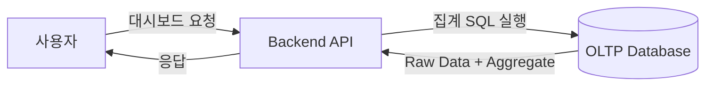
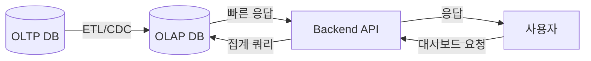
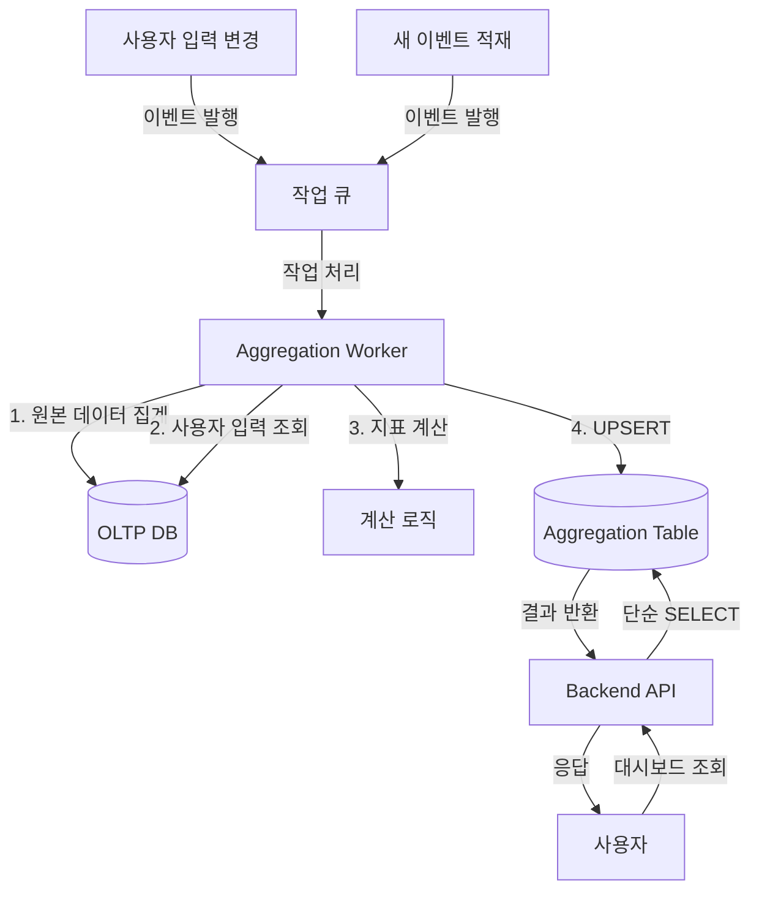

# 인트로

서비스를 운영하다 보면 데이터는 자연스럽게 쌓인다. 특히 포인트 로그, 커머스, 광고 데이터처럼 시간·아이템·상태 기준으로 잘게 나뉘는 데이터를 다루다 보면 어느 순간부터 **집계 자체가 병목**이 된다.

이 글에서는 대시보드 성능 문제의 일반적인 해결책들을 먼저 살펴보고, 그 다음 내가 마주한 특이한 케이스와 그 해결 과정을 공유하려 한다.

---

# 1부: 대시보드의 일반적인 문제와 해법

## 문제: GROUP BY의 오버헤드

초기 대시보드는 대부분 이런 구조로 시작한다:

- PostgreSQL 단일 DB
- 요청 시점에 SQL로 집계
- `GROUP BY date, item_id`



데이터가 적을 때는 문제가 없다. 하지만 데이터가 수십만 건 이상 쌓이면 상황이 달라진다.

```sql
SELECT 
  date, 
  item_id, 
  SUM(sales) as total_sales,
  COUNT(*) as event_count
FROM events
WHERE date BETWEEN '2025-01-01' AND '2025-12-31'
GROUP BY date, item_id;
```

이런 쿼리가 처음에는 100ms 안에 끝나던 것이, 어느 순간부터 **5초, 10초, 심지어 타임아웃**까지 발생하기 시작한다.

인덱스를 추가해도, 쿼리를 최적화해도 근본적인 한계가 있다. **집계 연산 자체가 무거운 작업**이기 때문이다.

### 왜 GROUP BY는 느린가?

GROUP BY 연산은 다음과 같은 과정을 거친다:

1. **전체 데이터 스캔**: WHERE 조건에 맞는 모든 row를 읽는다
2. **정렬 또는 해싱**: 그룹핑 키 기준으로 데이터를 정렬하거나 해시 테이블을 만든다
3. **집계 계산**: 각 그룹별로 SUM, COUNT 등을 계산한다

데이터가 100만 건이라면, 매번 100만 건을 읽고 처리해야 한다. 인덱스가 있어도 집계 자체의 비용은 줄어들지 않는다.

## 해결의 핵심: 캐싱

이 문제를 해결하는 핵심은 **"한 번 기록된 데이터는 변하지 않는다"**는 특성을 활용하는 것이다.

매번 같은 계산을 반복하는 대신, **미리 계산해두고 저장**하면 된다. 이것이 바로 캐싱의 본질이다.

대시보드 최적화에서 사용되는 주요 캐싱 전략은 크게 세 가지다:

1. **Materialized View**: RDBMS 내장 기능으로 쿼리 결과를 물리적으로 저장
2. **OLAP 시스템**: 분석 전용 데이터베이스로 데이터를 복제
3. **Application-level Cache**: Redis, Memcached 등 인메모리 캐시

각각의 방법을 깊이 있게 살펴보자.

---

## 해법 1: Materialized View

### 개념

Materialized View(이하 MV)는 PostgreSQL, Oracle 등 대부분의 RDBMS에서 제공하는 기능이다. 복잡한 쿼리 결과를 **물리적인 테이블처럼 저장**해둔다.

```sql
CREATE MATERIALIZED VIEW daily_sales_summary AS
SELECT 
  date, 
  item_id, 
  SUM(sales) as total_sales,
  COUNT(*) as order_count
FROM events
GROUP BY date, item_id;

-- 인덱스도 추가 가능
CREATE INDEX idx_daily_sales_date ON daily_sales_summary(date);
```

조회할 때는 이 뷰를 읽기만 하면 된다:

```sql
SELECT * FROM daily_sales_summary
WHERE date BETWEEN '2025-01-01' AND '2025-12-31';
```

집계 연산이 전혀 없다. 이미 계산된 결과를 읽기만 하니 **매우 빠르다**.

### 갱신 전략

MV의 핵심 과제는 **언제, 어떻게 갱신할 것인가**이다.

#### 1) 전체 갱신 (REFRESH MATERIALIZED VIEW)

```sql
REFRESH MATERIALIZED VIEW daily_sales_summary;
```

**장점:**
- 구현이 단순하다
- 데이터 일관성이 보장된다

**단점:**
- 갱신 중에는 뷰를 읽을 수 없다 (락 발생)
- 전체를 다시 계산하므로 시간이 오래 걸린다

#### 2) 동시성 갱신 (REFRESH CONCURRENTLY)

```sql
REFRESH MATERIALIZED VIEW CONCURRENTLY daily_sales_summary;
```

**장점:**
- 갱신 중에도 조회 가능
- 서비스 중단 없이 갱신할 수 있다

**단점:**
- UNIQUE 인덱스가 필수
- 여전히 전체 재계산 비용이 크다

#### 3) 증분 갱신 (Incremental Refresh)

PostgreSQL은 기본적으로 증분 갱신을 지원하지 않는다. 직접 구현해야 한다:

```sql
-- 새로운 데이터만 집계해서 UPSERT
INSERT INTO daily_sales_summary (date, item_id, total_sales, order_count)
SELECT 
  date, 
  item_id, 
  SUM(sales), 
  COUNT(*)
FROM events
WHERE date = CURRENT_DATE  -- 오늘 데이터만
GROUP BY date, item_id
ON CONFLICT (date, item_id)
DO UPDATE SET
  total_sales = EXCLUDED.total_sales,
  order_count = EXCLUDED.order_count;
```

**장점:**
- 변경된 부분만 갱신하므로 빠르다
- 실시간에 가까운 갱신이 가능하다

**단점:**
- 직접 로직을 구현해야 한다
- 복잡한 집계에는 적용하기 어렵다

### 적합한 경우

MV는 다음 조건에서 잘 작동한다:

- **조회 패턴이 예측 가능**하고 자주 반복된다
- **데이터 변경이 배치성**이다 (예: 하루에 한 번)
- **기존 DB 인프라**를 그대로 사용하고 싶다
- **운영 복잡도**를 최소화하고 싶다

### 한계

- 복잡한 증분 갱신 로직은 직접 구현해야 한다
- 갱신 비용 자체는 사라지지 않는다
- 실시간성이 중요한 경우 부적합하다

---

## 해법 2: OLAP 시스템

### 개념

OLAP(Online Analytical Processing)은 **분석 전용 데이터베이스**다. OLTP(트랜잭션 처리)와 완전히 분리되어, 대규모 데이터 집계에 최적화되어 있다.

대표적인 OLAP 시스템:
- **ClickHouse**: 컬럼 기반 저장, 초당 수억 건 처리
- **Apache Druid**: 실시간 스트리밍 집계
- **BigQuery**: Google의 서버리스 데이터 웨어하우스
- **Snowflake**: 클라우드 네이티브 데이터 웨어하우스



### 왜 OLAP은 빠른가?

#### 1) 컬럼 기반 저장 (Columnar Storage)

일반 RDBMS는 row 단위로 저장한다:

```
Row 1: [id=1, date=2025-01-01, item_id=100, sales=50000]
Row 2: [id=2, date=2025-01-01, item_id=101, sales=30000]
...
```

OLAP은 컬럼 단위로 저장한다:

```
id:       [1, 2, 3, ...]
date:     [2025-01-01, 2025-01-01, 2025-01-02, ...]
item_id:  [100, 101, 100, ...]
sales:    [50000, 30000, 45000, ...]
```

**장점:**
- 필요한 컬럼만 읽으므로 I/O가 적다
- 같은 타입의 데이터가 연속되어 압축률이 높다
- 벡터화 연산으로 CPU 효율이 높다

#### 2) 사전 집계 (Pre-aggregation)

많은 OLAP 시스템은 데이터 적재 시점에 미리 집계를 수행한다.

ClickHouse의 AggregatingMergeTree:

```sql
CREATE TABLE daily_sales_agg
ENGINE = AggregatingMergeTree()
ORDER BY (date, item_id)
AS SELECT
  date,
  item_id,
  sumState(sales) as total_sales,
  countState() as order_count
FROM events
GROUP BY date, item_id;
```

조회 시:

```sql
SELECT 
  date,
  item_id,
  sumMerge(total_sales) as total_sales,
  countMerge(order_count) as order_count
FROM daily_sales_agg
WHERE date BETWEEN '2025-01-01' AND '2025-12-31'
GROUP BY date, item_id;
```

#### 3) 분산 처리

대부분의 OLAP 시스템은 데이터를 여러 노드에 분산 저장하고 병렬로 처리한다.

```
Query → [Node 1: 1월 데이터]
      → [Node 2: 2월 데이터]  → Merge → Result
      → [Node 3: 3월 데이터]
```

### 데이터 파이프라인

OLAP을 도입하면 데이터 파이프라인이 필요하다:

#### 1) 배치 ETL

```
OLTP DB → [매시간/매일 배치] → OLAP DB
```

**장점:** 구현이 단순하다  
**단점:** 실시간성이 떨어진다

#### 2) CDC (Change Data Capture)

```
OLTP DB → [실시간 변경 감지] → Kafka → OLAP DB
```

**장점:** 거의 실시간 반영  
**단점:** 운영 복잡도가 높다

### 적합한 경우

OLAP은 다음 조건에서 빛을 발한다:

- **데이터 규모가 매우 크다** (수억 건 이상)
- **복잡한 집계**를 다양하게 수행한다
- **실시간 분석**이 필요하다 (Druid 등)

### 도입시 힘든 부분

- **운영 복잡도가 높다**: 별도 인프라, 파이프라인 관리
- **비용이 높다**: 서버, 스토리지, 인력
- **학습 곡선**: 새로운 쿼리 언어, 아키텍처
- **데이터 동기화**: OLTP와 OLAP 간 일관성 관리

---

## 해법 3: Application-level Cache

### 개념

애플리케이션 레벨에서 집계 결과를 캐싱하는 방법이다. Redis, Memcached 같은 인메모리 캐시를 사용한다.

```typescript
async function getDashboardData(companyId: number, startDate: Date, endDate: Date) {
  const cacheKey = `dashboard:${companyId}:${startDate}:${endDate}`;
  
  // 1. 캐시 확인
  const cached = await redis.get(cacheKey);
  if (cached) {
    return JSON.parse(cached);
  }
  
  // 2. DB에서 집계
  const result = await db.query(`
    SELECT date, SUM(sales) as total_sales
    FROM events
    WHERE company_id = $1 AND date BETWEEN $2 AND $3
    GROUP BY date
  `, [companyId, startDate, endDate]);
  
  // 3. 캐시 저장 (1시간)
  await redis.setex(cacheKey, 3600, JSON.stringify(result));
  
  return result;
}
```

### 캐시 무효화 전략

캐시의 가장 어려운 문제는 **언제 캐시를 지울 것인가**이다.

#### 1) TTL (Time To Live)

```typescript
await redis.setex(cacheKey, 3600, data); // 1시간 후 자동 삭제
```

**장점:** 구현이 단순하다  
**단점:** 최신 데이터 반영이 느리다

#### 2) 이벤트 기반 무효화

```typescript
// 새 데이터 삽입 시
async function insertEvent(event) {
  await db.insert(event);
  
  // 관련 캐시 삭제
  const pattern = `dashboard:${event.companyId}:*`;
  const keys = await redis.keys(pattern);
  await redis.del(...keys);
}
```

**장점:** 항상 최신 데이터  
**단점:** 캐시 히트율이 낮아질 수 있다

#### 3) Write-through Cache

```typescript
async function insertEvent(event) {
  // 1. DB 저장
  await db.insert(event);
  
  // 2. 캐시 갱신
  const newData = await recalculate(event.companyId);
  await redis.set(cacheKey, JSON.stringify(newData));
}
```

**장점:** 캐시가 항상 최신 상태  
**단점:** 쓰기 성능 저하

### 적합한 경우

- **조회 패턴이 반복적**이다
- **짧은 지연은 허용**된다 (몇 분~몇 시간)
- **빠른 구현**이 필요하다
- **기존 인프라**를 최대한 활용하고 싶다

### 한계

- 캐시 무효화 로직이 복잡해질 수 있다
- 메모리 용량 제한
- 캐시 워밍 필요
- 분산 환경에서 일관성 문제

---

## 1부 정리

대시보드 성능 문제는 결국 **집계 연산의 반복**에서 온다. 해결의 핵심은 **캐싱**이다.

| 방법 | 복잡도 | 비용 | 실시간성 | 적합한 규모 |
|------|--------|------|----------|------------|
| Materialized View | 낮음 | 낮음 | 낮음 | 중소규모 |
| OLAP | 높음 | 높음 | 높음 | 대규모 |
| App Cache | 중간 | 낮음 | 중간 | 소규모 |

대부분의 경우, 이 세 가지 방법 중 하나로 해결할 수 있다.

하지만 내가 마주한 문제는 조금 달랐다.

---

# 2부: 나의 특이한 케이스

## 기존 방식으로 해결했던 경험

나는 지금까지 여러 서비스에서 대시보드 성능 문제를 겪었고, 대부분 위의 방법들로 해결했다.
이번에도 비슷할 거라 생각했다. 하지만 **새로운 문제**를 만났다.

## 문제 상황

내가 작업한 것은:
- **판매·광고 데이터를 집계해 보여주는 B2B 대시보드**
- 채널 수가 많고 (판매 + 광고), 고객사별 데이터 편차가 큼
- 일간 판매 이벤트: 10만 row 이상
- 쿼리 패턴: `GROUP BY date, company_id, channel`

특정 고객사의 데이터가 급증하면서, 대시보드 p99 응답 시간이 **10초 이상**으로 튀기 시작했다.

여기까지는 일반적인 문제다. 하지만 **핵심 제약조건**이 있었다.

## 핵심 제약: 사용자가 과거 데이터를 수정한다

대시보드에 표시되는 지표에는 다음이 포함된다:

- **매출**: 외부 시스템에서 수집 (크롤링)
- **광고비**: 광고 플랫폼 API에서 수집
- **원가**: **사용자가 직접 입력** ⚠️
- **수수료**: **사용자가 직접 입력** ⚠️
- **배송비**: **사용자가 직접 입력** ⚠️

그리고 계산되는 지표:

```
순이익 = 매출 - 원가 - 수수료 - 배송비 - 광고비
ROAS = 매출 / 광고비
```

**문제는:**

1. 사용자가 **언제든지** 원가/수수료를 수정할 수 있다
2. 수정하면 **과거 데이터까지 포함**해서 지표가 즉시 바뀌어야 한다
3. 한 값이 바뀌면 **여러 날짜, 여러 지표**가 동시에 영향을 받는다

예를 들어:
- 사용자가 "상품 A의 원가"를 5000원 → 6000원으로 수정
- 지난 3개월간 상품 A가 포함된 **모든 날짜**의 순이익이 바뀐다
- 대시보드에서 즉시 반영되어야 한다

이것은 **"한 번 기록된 데이터는 변하지 않는다"**는 전제를 깨뜨린다.

## 기존 해법들이 맞지 않는 이유

### Materialized View는?

MV를 사용하려면 사용자 입력이 바뀔 때마다 갱신해야 한다.

```sql
-- 사용자가 원가 수정
UPDATE product_costs SET cost = 6000 WHERE product_id = 'A';

-- MV 갱신 필요
REFRESH MATERIALIZED VIEW daily_sales_summary;
```

**문제:**
- 전체 갱신은 너무 느리다 (수백만 건)
- 증분 갱신은 "어떤 날짜가 영향받는지" 계산이 복잡하다
- 갱신 중에는 조회가 느리거나 불가능하다

### OLAP은?

OLAP에 데이터를 적재하면, 사용자 입력 변경을 어떻게 반영할까?

**옵션 1: 재적재**
```
사용자 입력 변경 → OLTP 업데이트 → OLAP 재적재
```
- 너무 느리다 (수 분~수십 분)
- 실시간성이 떨어진다

**옵션 2: 조회 시점 조인**
```sql
SELECT 
  e.date,
  SUM(e.sales - c.cost) as profit
FROM olap_events e
JOIN oltp_costs c ON e.product_id = c.product_id
GROUP BY e.date
```
- OLAP과 OLTP를 조인하면 성능 이점이 사라진다
- 복잡도가 높아진다
- 무엇보다 작은 기업에서 운영 코스트를 감당하지 못한다.

### Application Cache는?

사용자 입력이 바뀔 때마다 관련 캐시를 모두 지워야 한다.

```typescript
// 원가 수정 시
await updateCost(productId, newCost);

// 어떤 캐시를 지워야 할까?
// - 이 상품이 포함된 모든 날짜?
// - 모든 회사?
// - 모든 기간 조합?
await redis.del('dashboard:*'); // 전체 삭제? 비효율적
```

**문제:**
- 캐시 무효화 범위가 너무 넓다
- 캐시 히트율이 급격히 떨어진다
- 결국 매번 DB 집계를 하게 된다

## 여러 솔루션 비교

이 문제를 해결하기 위해 여러 방법을 검토했다.

### 옵션 1: 실시간 집계 + 강력한 인덱싱

**아이디어:** 쿼리를 최대한 최적화하고, 파티셔닝과 인덱스로 버틴다.

**시도:**
- 날짜별 파티셔닝
- 복합 인덱스 추가
- 쿼리 튜닝

**결과:**
- 평균 응답 시간은 개선되었지만 (3초 → 1.5초)
- p99는 여전히 10초 이상
- 근본적인 해결책이 아님

### 옵션 2: OLAP + 보정 레이어

**아이디어:** OLAP에 기본 집계를 저장하고, 조회 시점에 사용자 입력을 적용한다.

```typescript
// OLAP에서 기본 집계
const baseMetrics = await clickhouse.query(`
  SELECT date, SUM(sales) as sales, SUM(ad_spend) as ad_spend
  FROM events WHERE company_id = ${companyId}
  GROUP BY date
`);

// 애플리케이션에서 사용자 입력 적용
const costs = await postgres.query(`
  SELECT date, SUM(cost) as total_cost
  FROM user_costs WHERE company_id = ${companyId}
`);

const result = merge(baseMetrics, costs);
```

**문제:**
- OLAP 도입 비용이 크다
- 보정 로직이 복잡하다
- 여전히 조회 시점에 계산이 필요하다

### 옵션 3: Aggregation Table

**아이디어:** 
- 대시보드에 필요한 지표를 **미리 계산해서 테이블에 저장**
- 사용자 입력이 바뀌면 **영향받는 범위만 재계산**
- 조회는 항상 이 테이블만 본다

이것이 최종 선택이었다.

## 최종 해법: Aggregation Table

### 설계 원칙

1. **대시보드 조회는 항상 Aggregation Table만 본다**
2. **부분 재계산 단위를 명확히 정의한다** (company_id + date)
3. **갱신은 idempotent하게 만든다** (같은 작업을 여러 번 실행해도 같은 결과)
4. **"즉시 반영"의 기준을 사용자 체감으로 정의한다** (수 초 이내)

> [!NOTE]
> 아래 코드는 **개념을 설명하기 위한 예시**입니다. 실제 프로덕션 구현과는 세부사항이 다릅니다.
> 실제로는 Python으로 작성했으며, 여기서는 이해를 돕기 위해 단순화된 버전을 보여드립니다.

### 테이블 스키마

```sql
CREATE TABLE daily_sales_aggregation (
  id BIGSERIAL PRIMARY KEY,
  company_id BIGINT NOT NULL,
  date DATE NOT NULL,
  channel VARCHAR(50) NOT NULL,
  
  -- 원본 이벤트 기반 지표
  total_sales DECIMAL(15,2),
  total_orders INTEGER,
  total_ad_spend DECIMAL(15,2),
  
  -- 사용자 입력 기반 지표
  total_cost DECIMAL(15,2),
  total_fees DECIMAL(15,2),
  total_shipping DECIMAL(15,2),
  
  -- 계산된 지표
  profit DECIMAL(15,2),
  roas DECIMAL(10,2),
  
  -- 메타데이터
  calculated_at TIMESTAMP NOT NULL DEFAULT NOW(),
  
  UNIQUE(company_id, date, channel)
);

CREATE INDEX idx_agg_company_date ON daily_sales_aggregation(company_id, date);
```

### 갱신 플로우



### 구현: 갱신 로직

```python
# 1. 사용자 입력 변경 시
async def handle_cost_update(company_id: int, product_id: str, new_cost: float):
    # DB 업데이트
    await db.execute(
        """
        UPDATE product_costs 
        SET cost = %s 
        WHERE company_id = %s AND product_id = %s
        """,
        (new_cost, company_id, product_id)
    )
    
    # 영향받는 날짜 범위 계산
    date_range = await db.fetch_one(
        """
        SELECT MIN(date) as start_date, MAX(date) as end_date
        FROM events
        WHERE company_id = %s AND product_id = %s
        """,
        (company_id, product_id)
    )
    
    # 재계산 작업 큐에 추가
    await aggregation_queue.enqueue(
        'recalculate',
        company_id=company_id,
        start_date=date_range['start_date'],
        end_date=date_range['end_date'],
        priority='high'
    )


# 2. 워커: 재계산 수행
async def recalculate_aggregation(company_id: int, date: datetime.date):
    # 2-1. 원본 이벤트 집계
    event_metrics = await db.fetch_all(
        """
        SELECT 
            channel,
            SUM(sales) as total_sales,
            COUNT(*) as total_orders,
            SUM(ad_spend) as total_ad_spend
        FROM events
        WHERE company_id = %s AND date = %s
        GROUP BY channel
        """,
        (company_id, date)
    )
    
    # 2-2. 사용자 입력 값 집계
    user_metrics = await db.fetch_all(
        """
        SELECT 
            channel,
            SUM(cost) as total_cost,
            SUM(fees) as total_fees,
            SUM(shipping) as total_shipping
        FROM user_costs
        WHERE company_id = %s AND date = %s
        GROUP BY channel
        """,
        (company_id, date)
    )
    
    # 2-3. 지표 계산
    user_metrics_dict = {um['channel']: um for um in user_metrics}
    
    aggregated = []
    for em in event_metrics:
        um = user_metrics_dict.get(em['channel'], {})
        
        profit = (
            em['total_sales']
            - um.get('total_cost', 0)
            - um.get('total_fees', 0)
            - um.get('total_shipping', 0)
            - em['total_ad_spend']
        )
        
        roas = (
            em['total_sales'] / em['total_ad_spend']
            if em['total_ad_spend'] > 0
            else 0
        )
        
        aggregated.append({
            'company_id': company_id,
            'date': date,
            'channel': em['channel'],
            'total_sales': em['total_sales'],
            'total_orders': em['total_orders'],
            'total_ad_spend': em['total_ad_spend'],
            'total_cost': um.get('total_cost', 0),
            'total_fees': um.get('total_fees', 0),
            'total_shipping': um.get('total_shipping', 0),
            'profit': profit,
            'roas': roas
        })
    
    # 2-4. Aggregation Table에 UPSERT
    for row in aggregated:
        await db.execute(
            """
            INSERT INTO daily_sales_aggregation 
                (company_id, date, channel, total_sales, total_orders, 
                 total_ad_spend, total_cost, total_fees, total_shipping, 
                 profit, roas, calculated_at)
            VALUES (%s, %s, %s, %s, %s, %s, %s, %s, %s, %s, %s, NOW())
            ON CONFLICT (company_id, date, channel)
            DO UPDATE SET
                total_sales = EXCLUDED.total_sales,
                total_orders = EXCLUDED.total_orders,
                total_ad_spend = EXCLUDED.total_ad_spend,
                total_cost = EXCLUDED.total_cost,
                total_fees = EXCLUDED.total_fees,
                total_shipping = EXCLUDED.total_shipping,
                profit = EXCLUDED.profit,
                roas = EXCLUDED.roas,
                calculated_at = NOW()
            """,
            (
                row['company_id'], row['date'], row['channel'],
                row['total_sales'], row['total_orders'], row['total_ad_spend'],
                row['total_cost'], row['total_fees'], row['total_shipping'],
                row['profit'], row['roas']
            )
        )
```

### 구현: 조회 API

```python
async def get_dashboard_data(
    company_id: int,
    start_date: datetime.date,
    end_date: datetime.date
):
    return await db.fetch_all(
        """
        SELECT 
            date,
            channel,
            total_sales,
            total_orders,
            profit,
            roas
        FROM daily_sales_aggregation
        WHERE company_id = %s 
            AND date BETWEEN %s AND %s
        ORDER BY date DESC, channel
        """,
        (company_id, start_date, end_date)
    )
```

**핵심:** 집계 연산이 전혀 없다. 단순 SELECT만 한다.

### Idempotency 보장

UPSERT를 사용하므로 같은 작업을 여러 번 실행해도 결과가 같다.

**장점:**
- 재시도가 안전하다
- 중복 작업이 들어와도 문제없다
- 실패 시 단순히 재실행하면 된다

## 결과

### 운영 개선

- **추가 인프라 없음**: 기존 PostgreSQL만 사용
- **운영 복잡도 낮음**: 단순한 큐 워커만 추가
- **디버깅 용이**: 모든 데이터가 SQL로 조회 가능
- **확장 가능**: 새 지표 추가가 쉬움

## 이 방법의 트레이드오프

### 장점

- **조회 성능**: 집계 없이 단순 SELECT만 하므로 매우 빠르다  
- **부분 갱신**: 변경된 범위만 재계산하므로 효율적이다  
- **운영 단순성**: 기존 DB와 간단한 워커만 있으면 된다  
- **디버깅**: SQL로 모든 상태를 확인할 수 있다  

### 단점

- **실시간성 제한**: 수 초의 지연이 있다 (우리 케이스에서는 허용)  
- **유연성 제한**: 미리 정의한 지표만 조회 가능 (ad-hoc 분석 불가)  
- **스토리지 증가**: 집계 결과를 별도로 저장  
- **갱신 로직 관리**: 어떤 변경이 어떤 범위에 영향을 주는지 관리 필요  

### 적합한 경우

이 방법은 다음 조건에서 잘 작동한다:

1. **조회 패턴이 예측 가능**하다 (정해진 지표, 정해진 기준)
2. **부분 갱신이 가능**하다 (영향 범위를 명확히 정의할 수 있다)
3. **몇 초의 지연은 허용**된다
4. **운영 단순성이 중요**하다
5. **데이터가 수정될 수 있다** ⭐ (이것이 핵심 차별점)

---

# 마치며

## 배운 점

### 1. 항상 더 강력한 아키텍처가 정답은 아니다

처음에는 "OLAP을 도입하는 것이 올바른 해법"이라고 생각했다. 하지만:

- 우리 팀이 운영할 수 있는 복잡도를 넘어섰고
- 실제 사용자가 필요로 하는 기능과 맞지 않았으며
- 비용 대비 효과가 불분명했다

**중요한 것은:**
- 실제 사용자 행동 (ad-hoc 분석 vs 정해진 지표)
- 팀의 운영 역량 (새 시스템을 안정적으로 운영할 수 있는가)
- 감당 가능한 복잡도 (문제 발생 시 빠르게 대응할 수 있는가)

### 2. 제약조건이 설계를 결정한다

"데이터가 수정될 수 있다"는 단 하나의 제약조건이 모든 설계를 바꿨다.

일반적인 해법들은 모두 "불변 데이터"를 전제로 한다. 이 전제가 깨지면 새로운 접근이 필요하다.

### 3. 트레이드오프를 명확히 하라

Aggregation Table은 범용적인 해법이 아니다. 하지만 우리 문제의 조건 안에서는 최선이었다.

우리는 다음을 포기했다:
- ad-hoc 분석 유연성
- 완벽한 실시간성

대신 얻은 것:
- 빠른 조회 성능
- 낮은 운영 복잡도
- 사용자 입력 즉시 반영

## 정리

대시보드 최적화는 결국 **캐싱**이다. 하지만 어떤 캐싱 전략을 선택할지는 **제약조건**에 달려 있다.

**일반적인 경우:**
- Materialized View (간단, 배치 갱신 가능)
- OLAP (대규모, 복잡한 분석)
- Application Cache (빠른 구현, 짧은 TTL 허용)

**데이터가 수정되는 경우:**
- Aggregation Table (부분 재계산 가능, 조회 패턴 예측 가능)

기술 선택은 항상 맥락 속에서 이루어진다.  
완벽한 아키텍처보다는,  
**지금 우리 팀이 해결해야 하는 문제에 가장 잘 맞는 해법**을 찾는 것이 중요하다.