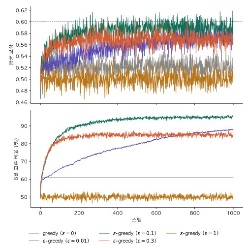

k-armed bandit은 강화학습에서 가장 단순한 형태의 문제다. k개의 선택지 중 하나를 고르고 보상을 받는 일을 정해진 횟수만큼 반복하며, 받은 보상의 합을 최대화하는 게 목표다. 이 문제가 단순한 건 다음 조건들 덕분이다.

- **상태가 하나뿐이다.** 매번 같은 상황에서 고르고, 지금 고른 행동이 다음 상황을 바꾸지 않는다. 상황마다 다른 행동을 배울 필요가 없어서 nonassociative 설정이라고도 부른다.
- **보상이 바로 온다.** 행동 하나에 보상 하나가 곧장 붙으니, 이 보상이 어느 행동 덕분인지(credit assignment) 따질 일이 없다. 결과가 여러 스텝 뒤에야 드러나는 MDP(Markov Decision Process, 마르코프 결정 과정)와 가장 크게 다른 점이다.
- **보상 분포가 변하지 않는다(stationary).** 같은 선택지를 골라도 보상은 매번 다르게 나온다. 고정된 건 값이 아니라 그 값이 뽑히는 분포이고, 이 분포는 시간이 지나도, 에이전트가 무엇을 고르든 그대로다.

이렇게 걷어내도 남는 성질이 하나 있다. 고른 선택지의 보상만 관측된다는 점이다. 다른 선택지를 골랐으면 얼마를 받았을지는 알 수 없다. 이런 피드백을 evaluative feedback이라 하고, 정답을 알려주는 지도학습의 instructive feedback과 구분한다. 이 성질 때문에 지금 가장 좋아 보이는 선택지를 고를지(활용), 덜 알려진 선택지를 더 시도해 볼지(탐험)의 균형 문제가 생긴다. 밴딧은 다른 어려움이 모두 빠진 상태에서 이 문제만 따로 떼어 볼 수 있는 설정이다.

## 변형

위 조건 중 하나를 풀면 다른 문제가 된다.

| 문제 | 상태 | 행동→다음 상태 | 즉시 보상 | stationary |
|---|---|---|---|---|
| k-armed bandit | 하나 | X | O | O |
| contextual bandit | 여러 개 | X | O | O |
| nonstationary bandit | 하나 | X | O | X |
| adversarial bandit | 하나 | X | O | X (상대가 정함) |
| MDP | 여러 개 | O | X (지연 가능) | O |

조건 말고 가정을 바꾼 변형도 있다. 선택지 사이에 구조가 있어 한 선택지의 결과가 다른 선택지에 대한 정보가 되면 linear bandit 같은 문제가 되고, 보상 합 대신 최고의 선택지를 빨리 찾는 게 목표면 best-arm identification이 된다.

이 글은 가장 기본인 stationary k-armed bandit을 다룬다.

## 문제 정의

시점 $t = 1, 2, \dots, T$마다 선택지 하나를 고른다. 시점 $t$에 고른 행동을 $A_t$, 그 결과로 받은 보상을 $R_t$라고 쓴다. 둘 다 매번 달라질 수 있는 확률변수라 대문자로 쓴다. 목표는 $T$번 동안 받는 보상 합의 기댓값을 최대화하는 것이다.

$$
\max \ \mathbb{E}\left[\sum_{t=1}^{T} R_t\right]
$$

각 선택지에는 "고르면 평균적으로 이만큼 받는다"는 값이 있다. 이를 행동 $a$의 참 가치(true value)라 하고 $q(a)$로 쓴다. 많은 교재에서는 $q_*(a)$로 표기하는데, 같은 값이다.

$$
q(a) = \mathbb{E}[R_t \mid A_t = a]
$$

$\mathbb{E}$는 기댓값이다. 나올 수 있는 보상 값들을 각각의 확률로 가중해 평균낸 값으로, 같은 선택지를 무한히 반복해 고르면 받은 보상의 평균이 이 값에 수렴한다. $\mathbb{E}[R_t \mid A_t = a]$는 "$A_t = a$라는 조건에서 $R_t$의 기댓값"이라는 뜻이고, 줄여서 $\mathbb{E}[R_t \mid a]$로도 쓴다. 둘은 같은 식이다.

식에 $t$가 들어 있지만 $q(a)$는 $t$에 따라 변하지 않는다. 보상 분포가 고정돼 있다는 stationary 조건 덕분이다.

$q(a)$를 알면 문제는 끝난다. 가장 큰 선택지만 계속 고르면 된다. 에이전트는 이 값을 모르고, 지금까지 받은 보상으로 추정할 수밖에 없다. 시점 $t$에서의 추정값을 $Q_t(a)$라고 쓴다. 소문자 $q$는 환경이 정한 고정된 값이고, 대문자 $Q_t$는 무작위로 나온 보상으로 계산한 추정값이라 그 자체로 확률변수다. 목표는 $Q_t(a)$가 $q(a)$에 가까워지게 만드는 것이다.

추정값이 가장 큰 행동을 greedy 행동이라고 한다.

$$
A_t = \arg\max_a Q_t(a)
$$

greedy 행동을 고르면 지금 가진 지식을 쓰는 활용이고, 다른 행동을 고르면 그 행동의 추정값을 정확하게 만드는 탐험이다.

## 예제: 슬롯머신 두 대

슬롯머신 A와 B가 있다. 당기면 A는 확률 0.4, B는 확률 0.6으로 당첨되고, 당첨이면 보상 1, 아니면 0을 받는다. 보상이 0 아니면 1이라 기댓값이 곧 당첨 확률이다.

$$
q(A) = 0.4, \quad q(B) = 0.6
$$

정답은 B지만 에이전트는 이 값을 모른다. 알 수 있는 건 지금까지 당겨서 받은 보상뿐이다.

### 추정값 계산: 표본 평균

$Q_t(a)$를 구하는 가장 직관적인 방법은 지금까지 $a$를 골랐을 때 받은 보상의 평균을 내는 것이다.

$$
Q_t(a) = \frac{\text{시점 } t \text{ 이전에 } a \text{를 골라 받은 보상의 합}}{\text{시점 } t \text{ 이전에 } a \text{를 고른 횟수}}
$$

이를 표본 평균(sample average)이라 한다. 앞에서 본 기댓값의 성질대로, $a$를 고른 횟수가 늘어날수록 $Q_t(a)$는 $q(a)$에 수렴한다. 한 번도 고르지 않은 행동은 0 같은 초기값으로 둔다.

### 점진적 업데이트

표본 평균을 그대로 계산하려면 지금까지 받은 보상을 전부 들고 있어야 한다. 보상이 하나 들어올 때마다 이전 평균만으로 새 평균을 구할 수 있으면 더 편하다.

행동 하나만 떼어 놓고 보자. 이 행동을 $n$번째로 골라 받은 보상을 $R_n$, 그 전 $n-1$개 보상의 평균을 $Q_n$이라 하면 다음 추정값 $Q_{n+1}$은 $n$개 보상의 평균이다.

$$
\begin{aligned}
Q_{n+1} &= \frac{1}{n} \sum_{i=1}^{n} R_i \\
&= \frac{1}{n} \left( R_n + \sum_{i=1}^{n-1} R_i \right) \\
&= \frac{1}{n} \left( R_n + (n-1) Q_n \right) \\
&= Q_n + \frac{1}{n} \left( R_n - Q_n \right)
\end{aligned}
$$

셋째 줄은 $Q_n$이 앞 $n-1$개의 평균이라 $\sum_{i=1}^{n-1} R_i = (n-1) Q_n$인 것을 쓴 것이다. 이제 저장할 건 $Q_n$과 횟수 $n$뿐이고, 보상이 몇 개 쌓이든 한 번의 계산으로 갱신된다.

마지막 식은 다음 형태로 읽힌다.

$$
\text{새 추정값} = \text{이전 추정값} + \text{스텝 크기} \times (\text{목표} - \text{이전 추정값})
$$

- $R_n - Q_n$은 오차다. 방금 받은 보상이 지금 예측과 얼마나 다른지를 나타낸다. 예측보다 많이 받았으면 추정값을 올리고, 적게 받았으면 내린다.
- 오차를 전부 반영하지 않고 $1/n$만큼만 따라간다. 보상 하나는 노이즈가 섞인 샘플이라 그대로 믿으면 추정값이 매번 크게 흔들린다.
- 스텝 크기 $1/n$은 점점 작아진다. 처음 몇 개의 보상은 추정값을 크게 움직이고, 샘플이 쌓일수록 새 보상 하나의 영향은 줄어든다. $n=1$이면 $Q_2 = R_1$이 되어 초기값 $Q_1$은 첫 보상에서 바로 지워진다.

스텝 크기를 $1/n$ 대신 고정된 값 $\alpha$로 두면 최근 보상에 더 큰 비중을 주게 된다. 보상 분포가 변하는 nonstationary 문제에서 쓰는 방식이다. "목표 쪽으로 오차의 일부만큼 이동한다"는 이 형태는 이후 강화학습 알고리즘에서도 계속 나온다.

### greedy만 쓰면 생기는 일

매번 greedy 행동만 고르는 에이전트를 생각해 보자. 두 머신의 초기 추정값은 모두 0이고, 동점이면 무작위로 고른다. 첫 판에 A를 골라 당첨됐다고 하자.

| $t$ | $Q_t(A)$ | $Q_t(B)$ | 선택 | 보상 |
|---|---|---|---|---|
| 1 | 0 | 0 | A (동점, 무작위) | 1 |
| 2 | 1 | 0 | A | 0 |
| 3 | 0.5 | 0 | A | 1 |
| 4 | 0.67 | 0 | A | ... |

A는 한 번 당첨된 이상 평균이 0으로 떨어지지 않는다. $Q_t(B)$는 한 번도 갱신되지 않은 채 0에 머물고, 에이전트는 B를 영원히 고르지 않는다. B가 더 좋은 머신이라는 걸 확인할 기회 자체가 없다.

정리하면 greedy 에이전트는 처음으로 당첨을 준 머신에 고정된다. 동점일 때 둘 중 무작위로 고르므로, 먼저 당첨되는 쪽이 B일 확률은 $0.6 / (0.4 + 0.6) = 0.6$이다. 열 번 중 네 번은 나쁜 머신에 갇힌다.

### ε-greedy

해결책은 가끔 일부러 다른 선택을 하는 것이다. ε-greedy는 확률 $\varepsilon$으로 무작위 선택(탐험)을 하고, 나머지 $1 - \varepsilon$의 확률로 greedy 선택(활용)을 한다.

$$
A_t =
\begin{cases}
\text{무작위 행동} & \text{확률 } \varepsilon \\
\arg\max_a Q_t(a) & \text{확률 } 1 - \varepsilon
\end{cases}
$$

위 상황에서도 가끔은 B를 당기게 되고, 그러다 보면 $Q_t(B)$가 0.6 근처로 올라가 A를 앞지른다. 모든 행동을 계속 시도하므로 시간이 충분히 지나면 모든 $Q_t(a)$가 $q(a)$에 수렴한다.

대가도 있다. 최선의 머신을 찾은 뒤에도 $\varepsilon$ 비율로는 계속 무작위로 고른다. 무작위 선택의 절반은 B이므로, B를 고르는 비율의 상한은 $1 - \varepsilon/2$다.

### 시뮬레이션

$\varepsilon$를 0(greedy), 0.01, 0.1, 0.3, 1로 바꿔 가며 비교했다. $\varepsilon = 1$은 매번 무작위로 고르는 경우다. 한 번의 실행은 1000 스텝이다.

실행마다 결과가 크게 달라서 한 번의 실행으로는 비교할 수 없다. 설정마다 2000번 실행해 평균을 내고, 이 실험 전체를 시드를 바꿔 10번 반복했다. 아래 수치는 설정당 2만 번 실행의 평균이고, ± 뒤는 평균의 95% 신뢰구간이다.

```python
import numpy as np

def run(eps, p=(0.4, 0.6), steps=1000, rng=None):
    N = np.zeros(2)  # 머신별 선택 횟수
    Q = np.zeros(2)  # 추정값 Q_t(a)
    rewards, optimal = [], []
    for _ in range(steps):
        if rng.random() < eps:
            a = rng.integers(2)                           # 탐험: 무작위
        else:
            a = rng.choice(np.flatnonzero(Q == Q.max()))  # 활용: greedy (동점이면 무작위)
        r = float(rng.random() < p[a])                    # 확률 p[a]로 보상 1
        N[a] += 1
        Q[a] += (r - Q[a]) / N[a]                         # 점진적 업데이트
        rewards.append(r)
        optimal.append(a == 1)
    return rewards, optimal

for seed in range(10):
    rng = np.random.default_rng(seed)
    for eps in (0, 0.01, 0.1, 0.3, 1.0):
        out = [run(eps, rng=rng) for _ in range(2000)]
```



위는 스텝별 평균 보상, 아래는 최선의 머신 B를 고른 비율이다. 점선은 B만 계속 골랐을 때의 기대 보상 0.6이다. 그래프는 시드 하나(2000번 실행)의 평균이다.

| $\varepsilon$ | 1000 스텝 보상 합 | 마지막 100 스텝의 B 선택 비율 | 100 스텝 이후 B를 한 번도 안 고른 실행 |
|---|---|---|---|
| 0 (greedy) | 521.0 ± 1.4 | 60.5% | 39.5% |
| 0.01 | 557.5 ± 1.0 | 88.0% | 0.35% |
| 0.1 | **583.2 ± 0.3** | 94.9% | 0% |
| 0.3 | 567.2 ± 0.2 | 85.0% | 0% |
| 1 | 500.0 ± 0.2 | 50.0% | 0% |

신뢰구간이 서로 겹치지 않으므로 순위는 우연이 아니다. 시드 10개 사이의 편차도 보상 합 기준 표준편차 1.4 이하로 작았다.

- **$\varepsilon = 0$**: 39.5%가 A에 갇힌다. 결과가 약 600 아니면 약 400으로 갈린다.
- **$\varepsilon = 0.01$**: B를 늦게 찾는다. 5000 스텝이면 $\varepsilon = 0.1$을 앞지른다(98.0% vs 95.1%).
- **$\varepsilon = 0.1$**: 1000 스텝 기준 최고. 상한 95% 근처에 머문다.
- **$\varepsilon = 0.3$**: 빨리 찾지만 상한 85%에 묶인다.
- **$\varepsilon = 1$**: 배운 걸 안 쓴다. greedy보다 낮다.

탐험이 너무 적으면 좋은 선택지를 늦게 찾거나 아예 못 찾고, 너무 많으면 찾은 뒤에도 계속 손해를 본다. 적절한 $\varepsilon$은 전체 스텝 수에 따라 달라진다.

지금까지는 보상 분포가 변하지 않는다는 가정 위에 있었다. 다음 글에서는 이 가정을 풀어, 머신의 당첨 확률이 시간에 따라 바뀌는 nonstationary 문제를 다룬다.

## 참고

- Sutton, R. S., & Barto, A. G. (2018). *Reinforcement Learning: An Introduction* (2nd ed.). MIT Press.
