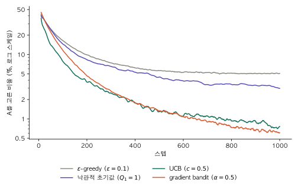

1편과 2편에서는 행동 선택을 ε-greedy로 고정하고 추정값의 갱신 방식을 다뤘다. 이 글은 행동 선택 방식 자체를 다룬다.

행동을 선택하는 규칙을 정책(policy)이라 하고 $\pi$로 쓴다. 정책은 각 행동을 선택할 확률로 표현한다.

$$
\pi_t(a) = \Pr(A_t = a)
$$

시점 $t$에 행동 $a$를 선택할 확률이며, 모든 행동에 대해 합하면 1이다. 추정값이 갱신되면 선택 확률도 바뀌므로 시점 $t$를 붙인다.

앞에서 다룬 방법들도 모두 정책이다. greedy는 추정값이 가장 큰 행동에 확률 1을 주는 정책이다. 행동이 $k$개일 때 ε-greedy는 greedy 행동에 $1 - \varepsilon + \varepsilon/k$, 나머지 행동에 각각 $\varepsilon/k$의 확률을 주는 정책이다.

ε-greedy의 탐험에는 두 가지 한계가 있다. 첫째, 탐험할 때 행동을 균등하게 무작위로 고른다. 충분히 시도해 추정값이 정확한 행동과 거의 시도하지 않은 행동을 구분하지 않는다. 둘째, 최적의 행동을 찾은 뒤에도 $\varepsilon$ 비율의 탐험이 계속된다. 1편에서 확인한 B 선택 비율의 상한 $1 - \varepsilon/2$가 그 결과다.

이 글에서는 이 한계를 다른 방식으로 해결하는 세 가지 방법을 살펴본다. 낙관적 초기값, UCB, gradient bandit이다. 실험 환경은 1편과 같은 슬롯머신 두 대(A는 0.4, B는 0.6, stationary)다.

## 낙관적 초기값

가장 단순한 방법은 추정값의 초기값 $Q_1$을 실제로 가능한 값보다 크게 두는 것이다. 이번 환경의 보상은 0 또는 1이므로 $Q_1 = 1$이면 두 머신 모두 실제 가치보다 높게 평가된 상태에서 시작한다.

이 상태에서 greedy만으로 행동을 고르면 다음과 같이 진행된다.

1. 먼저 선택된 머신은 보상이 0이 나올 때마다 추정값이 낮아진다. 참 가치가 1보다 작으므로 추정값은 점차 1 아래로 내려간다.
2. 선택되지 않은 머신은 여전히 1이므로 다음 greedy 행동이 된다.
3. 두 머신이 번갈아 선택되며 추정값이 각자의 참 가치 쪽으로 내려온다.

$\varepsilon$ 없이도 초반에 모든 행동이 시도되는 구조다. 기대보다 실망스러운 행동에서 다른 행동으로 넘어가는 방식이라고 볼 수 있다.

단, 추정값 갱신에 표본 평균을 쓰면 이 효과가 없다. 1편에서 본 것처럼 표본 평균은 첫 보상이 들어오는 시점에 $Q_1$의 영향이 사라진다. 초기값이 한동안 유지되려면 2편의 고정 스텝 크기가 필요하다. 가중치 $(1 - \alpha)^n$만큼 초기값이 남아 있는 동안 탐험이 유도된다. 아래 실험에서는 $\alpha = 0.1$을 사용했다.

초기값에 의한 탐험은 초반에 한정된다. 초기값의 영향이 사라진 뒤에는 이 방식의 탐험이 다시 일어나지 않으므로, 참 가치가 도중에 바뀌는 nonstationary 문제에는 적합하지 않다.

## UCB

ε-greedy의 첫째 한계는 탐험 대상을 무작위로 고른다는 점이었다. UCB(Upper Confidence Bound)는 추정값의 불확실성이 큰 행동을 우선 탐험한다.

$$
A_t = \arg\max_a \left[ Q_t(a) + c \sqrt{\frac{\ln t}{N_t(a)}} \right]
$$

$N_t(a)$는 시점 $t$ 이전에 행동 $a$를 선택한 횟수이고, $c > 0$은 탐험의 정도를 조절하는 상수다. $N_t(a) = 0$인 행동은 최댓값을 갖는 것으로 간주해 먼저 선택한다.

괄호 안의 두 항은 각각 다음을 나타낸다.

- **$Q_t(a)$**: 현재까지의 추정값. 활용에 해당한다.
- **$c \sqrt{\ln t / N_t(a)}$**: 추정값의 불확실성에 대한 보너스. 탐험에 해당한다.

보너스 항의 거동은 다음과 같다.

- $N_t(a)$가 커질수록 보너스가 줄어든다. 많이 시도한 행동은 추정값을 신뢰할 수 있으므로 추가 탐험의 필요성이 작다.
- 선택되지 않는 동안 $\ln t$는 계속 증가하므로 보너스가 서서히 커진다. 오래 시도하지 않은 행동은 결국 다시 선택된다.
- $\ln t$는 매우 느리게 증가하므로, 시간이 지날수록 탐험 빈도는 감소한다.

이 식은 참 가치가 높을 가능성이 있는 한 그 행동을 시도한다는 원칙으로 해석된다. 흔히 "불확실성 앞에서의 낙관(optimism in the face of uncertainty)"이라 부른다. $Q_t(a)$에 보너스를 더한 값은 참 가치 $q(a)$의 신뢰구간 상한 역할을 하며, UCB라는 이름도 여기서 나왔다. 보너스 항의 형태는 Hoeffding 부등식에서 유도된다(Auer et al. 2002).

ε-greedy와 비교하면 두 한계가 모두 해결된다. 탐험 대상은 불확실성에 따라 정해지고, 탐험 빈도는 시간이 지날수록 줄어든다.

## gradient bandit

앞의 방법들은 모두 행동 가치 $Q_t(a)$를 먼저 추정하고, 그 추정값으로부터 정책을 만든다. gradient bandit은 가치를 추정하지 않고 정책을 직접 표현한다. 행동별 선호도(preference) $H_t(a)$를 두고, softmax로 선택 확률을 정한다.

$$
\pi_t(a) = \frac{e^{H_t(a)}}{\sum_{b} e^{H_t(b)}}
$$

선호도의 절대적인 크기는 의미가 없고, 행동 간 상대적인 차이만 선택 확률에 영향을 준다. 모든 선호도의 초기값은 0이며, 따라서 처음에는 모든 행동이 같은 확률로 선택된다.

### 선호도 갱신

행동 $A_t$를 선택하고 보상 $R_t$를 받으면 모든 행동의 선호도를 다음과 같이 갱신한다.

$$
\begin{aligned}
H_{t+1}(A_t) &= H_t(A_t) + \alpha \left( R_t - \bar{R}_t \right) \left( 1 - \pi_t(A_t) \right) \\
H_{t+1}(a) &= H_t(a) - \alpha \left( R_t - \bar{R}_t \right) \pi_t(a) \qquad \text{for all } a \neq A_t
\end{aligned}
$$

$\bar{R}_t$는 시점 $t$ 이전까지 받은 보상의 평균이며, 기준선(baseline) 역할을 한다.

- 받은 보상이 기준선보다 높으면 $R_t - \bar{R}_t > 0$이다. 선택한 행동의 선호도는 올라가고 나머지 행동의 선호도는 내려간다. 다음에 같은 행동이 선택될 확률이 높아진다.
- 기준선보다 낮으면 반대로 선택한 행동의 확률이 낮아진다.
- 갱신 크기에는 $(1 - \pi_t(A_t))$가 곱해진다. 이미 선택 확률이 높은 행동은 선호도가 적게 변한다.

두 식은 지시 함수 $\mathbf{1}_{a = A_t}$(선택한 행동이면 1, 아니면 0)를 사용해 하나로 쓸 수 있다.

$$
H_{t+1}(a) = H_t(a) + \alpha \left( R_t - \bar{R}_t \right) \left( \mathbf{1}_{a = A_t} - \pi_t(a) \right)
$$

### 기대 보상에 대한 경사 상승

이 갱신 규칙은 임의로 정한 것이 아니라, 기대 보상 $\mathbb{E}[R_t]$를 선호도에 대해 최대화하는 경사 상승(gradient ascent)의 확률적 근사다.

기대 보상은 선택 확률로 가중한 참 가치의 합이다.

$$
\mathbb{E}[R_t] = \sum_x \pi_t(x) \, q(x)
$$

이를 $H_t(a)$로 미분한다. 확률의 합은 항상 1이므로 $\sum_x \partial \pi_t(x) / \partial H_t(a) = 0$이고, 따라서 행동에 의존하지 않는 임의의 상수 $B$를 빼도 기울기는 변하지 않는다.

$$
\frac{\partial \, \mathbb{E}[R_t]}{\partial H_t(a)} = \sum_x q(x) \frac{\partial \pi_t(x)}{\partial H_t(a)} = \sum_x \left( q(x) - B \right) \frac{\partial \pi_t(x)}{\partial H_t(a)}
$$

softmax의 미분은 $\partial \pi_t(x) / \partial H_t(a) = \pi_t(x) \left( \mathbf{1}_{a = x} - \pi_t(a) \right)$이다. 이를 대입하면

$$
\frac{\partial \, \mathbb{E}[R_t]}{\partial H_t(a)} = \sum_x \pi_t(x) \left( q(x) - B \right) \left( \mathbf{1}_{a = x} - \pi_t(a) \right) = \mathbb{E}\left[ \left( q(A_t) - B \right) \left( \mathbf{1}_{a = A_t} - \pi_t(a) \right) \right]
$$

이다. $\pi_t(x)$로 가중한 합이 곧 $A_t$에 대한 기댓값이기 때문이다. $\mathbb{E}[R_t \mid A_t] = q(A_t)$이므로 $q(A_t)$를 실제로 받은 보상 $R_t$로 바꿔도 기댓값은 같다. $B$로 $\bar{R}_t$를 쓰면

$$
\frac{\partial \, \mathbb{E}[R_t]}{\partial H_t(a)} = \mathbb{E}\left[ \left( R_t - \bar{R}_t \right) \left( \mathbf{1}_{a = A_t} - \pi_t(a) \right) \right]
$$

가 된다. 매 스텝 기댓값 안의 값 하나를 샘플로 얻어 $\alpha$만큼 이동하는 것이 위의 갱신 규칙이다. $\bar{R}_t$에 현재 보상 $R_t$를 포함하지 않는 것도 이 때문이다. 기준선이 선택한 행동에 의존하면 위의 유도가 성립하지 않는다.

### 기준선의 역할

유도 과정에서 본 것처럼 기준선은 기울기의 기댓값을 바꾸지 않는다. 기준선이 바꾸는 것은 샘플 하나하나의 분산이다. 기준선 없이 $R_t$를 그대로 쓰면, 보상이 0 이상인 환경에서는 어떤 행동을 선택하든 그 행동의 선호도가 내려가지 않는다. 평균적으로는 올바른 방향으로 수렴하지만 갱신이 불안정해진다. 기준선을 빼면 평균보다 좋은 결과만 선호도를 올린다.

행동 가치 대신 행동 선택 확률을 직접 학습하고, 보상에서 기준선을 뺀 값으로 경사를 추정하는 이 구조는 이후 강화학습의 policy gradient 방법에서 다시 등장한다.

## 비교

### 파라미터 선택

네 방법은 각각 탐험을 조절하는 파라미터를 갖는다. 먼저 시드 0에서 2000번 실행해 파라미터별 1000 스텝 보상 합을 비교했다.

| 방법 | 파라미터 | 보상 합 |
|---|---|---|
| ε-greedy | $\varepsilon$ = 0.01 / 0.05 / **0.1** / 0.2 | 560.7 / 583.1 / **583.2** / 576.4 |
| 낙관적 초기값 ($\alpha = 0.1$) | $Q_1$ = 0.6 / **1** / 2 / 5 | 587.3 / **585.6** / 584.2 / 582.3 |
| UCB | $c$ = 0.25 / **0.5** / 1 / 2 | 582.2 / **593.6** / 583.0 / 562.7 |
| gradient bandit | $\alpha$ = 0.05 / 0.1 / 0.2 / **0.5** / 1 | 563.3 / 577.0 / 586.1 / **592.0** / 590.0 |

ε-greedy는 1편과 비교하기 위해 $\varepsilon = 0.1$을 사용했다. 낙관적 초기값은 보상의 최댓값인 $Q_1 = 1$을 사용했다. $Q_1 = 0.6$은 B의 참 가치와 같아 낙관적이라 보기 어렵다. UCB와 gradient bandit은 보상 합이 가장 높은 값을 선택했다. 모든 방법에서 파라미터가 너무 작거나 크면 성능이 떨어진다.

### 결과

파라미터를 고른 시드 0을 제외하고, 시드 1~10에서 각 2000번, 설정당 2만 번 실행했다.

그래프는 차선의 머신 A를 고른 비율이다(로그 스케일, 10 스텝 이동평균). B 선택 비율은 네 방법 모두 90% 이상에서 겹쳐 차이가 잘 보이지 않으므로, 반대로 잘못 고른 비율을 로그 스케일로 나타냈다. 낮을수록 좋다.

| | 1000 스텝 보상 합 | 처음 100 스텝 B 선택 비율 | 마지막 100 스텝 B 선택 비율 |
|---|---|---|---|
| ε-greedy ($\varepsilon = 0.1$) | 582.8 ± 0.3 | 74.1% | 94.9% |
| 낙관적 초기값 ($Q_1 = 1$) | 585.9 ± 0.3 | 75.1% | 96.8% |
| UCB ($c = 0.5$) | **593.4 ± 0.2** | **83.3%** | 99.2% |
| gradient bandit ($\alpha = 0.5$) | 591.7 ± 0.2 | 76.4% | **99.4%** |

± 뒤는 95% 신뢰구간이다.

- **ε-greedy**: 상한 95%에 머문다. 최적의 머신을 찾은 뒤에도 무작위 탐험이 계속되기 때문이다.
- **낙관적 초기값**: $\varepsilon$ 없이도 ε-greedy보다 높다. 초기 탐험 이후의 탐험은 고정 $\alpha$로 인한 추정값의 변동에서 발생한다.
- **UCB**: 초반 100 스텝의 B 선택 비율이 가장 높다. 불확실성이 큰 행동을 우선 탐험하므로 적은 시도로 최적의 머신을 식별한다. 보상 합도 가장 높다.
- **gradient bandit**: 초반은 UCB보다 느리지만, 선택 확률이 B 쪽으로 계속 집중되어 마지막 100 스텝에서는 UCB와 비슷한 수준에 도달한다.

이번 환경은 머신이 두 대이고 보상 분포가 고정된 단순한 설정이다. 머신이 많아지거나 보상이 변하는 환경에서는 방법 간 순위가 달라질 수 있다. 예를 들어 UCB의 $\ln t$ 항은 시간이 지날수록 탐험을 줄이므로, 2편과 같은 nonstationary 문제에는 그대로 적용하기 어렵다.

## 참고

- Sutton, R. S., & Barto, A. G. (2018). *Reinforcement Learning: An Introduction* (2nd ed.). MIT Press.
- Auer, P., Cesa-Bianchi, N., & Fischer, P. (2002). Finite-time Analysis of the Multiarmed Bandit Problem. *Machine Learning*, 47, 235–256.
