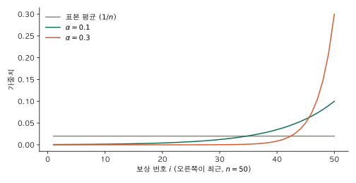
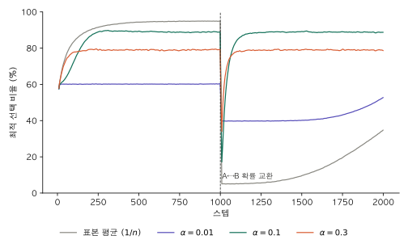
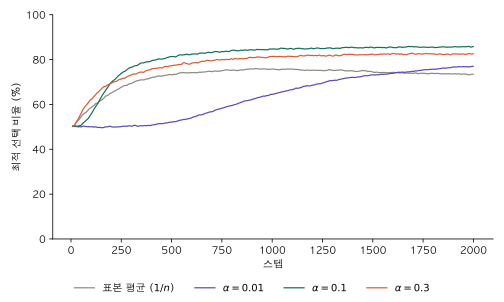

1편에서는 각 슬롯머신의 평균 보상 $q(a)$가 끝까지 고정돼 있었다. 이 글은 그 평균이 시간에 따라 이동하는 경우를 다룬다. 이를 nonstationary 문제라 하고, 참 가치에도 시점을 붙여 $q_t(a)$로 쓴다.

## 표본 평균의 문제

1편의 점진적 업데이트 식은 다음과 같다.

$$
Q_{n+1} = Q_n + \frac{1}{n} \left( R_n - Q_n \right)
$$

이 식은 정의상 표본 평균과 같다. 즉 지금까지 받은 보상 $R_1, \dots, R_n$에 모두 $1/n$이라는 같은 가중치를 준다.

$$
Q_{n+1} = \frac{1}{n} \sum_{i=1}^{n} R_i
$$

stationary 문제에서는 이 방식이 적절하다. 모든 보상이 같은 분포에서 나오므로 시점에 따라 가중치를 달리할 근거가 없다. 반면 평균이 이동하는 경우에는 문제가 된다. 1000번째 보상은 현재 상태를 반영하지만, 추정값에 미치는 영향은 첫 번째 보상과 동일한 $1/1000$이다. 결과적으로 참 가치가 변해도 추정값은 과거 보상의 영향으로 거의 갱신되지 않는다.

nonstationary 문제에서 추정값에 요구되는 핵심 성질은 참 가치의 이동을 추적하는 것이다. 정확한 수렴보다 변화에 대한 추적이 우선한다.

## 고정 스텝 크기 α

이를 해결하는 방법은 스텝 크기 $1/n$을 고정값 $\alpha \in (0, 1]$로 대체하는 것이다.

$$
Q_{n+1} = Q_n + \alpha \left( R_n - Q_n \right)
$$

1편에서 본 "새 추정값 = 이전 추정값 + 스텝 크기 × 오차" 형태 그대로다. 여기서 $\alpha$는 경사하강법의 learning rate와 같은 역할을 한다. 오차를 얼마나 크게 반영할지 정한다.

### 각 보상의 가중치

$\alpha$가 과거 보상에 부여하는 가중치는 식을 전개하면 확인할 수 있다. 먼저 괄호를 풀면

$$
Q_{n+1} = \alpha R_n + (1 - \alpha) Q_n
$$

이다. 새 추정값은 최근 보상과 이전 추정값을 $\alpha : (1-\alpha)$의 비율로 결합한 값이다. $Q_n$에 같은 식을 계속 대입한다.

$$
\begin{aligned}
Q_{n+1} &= \alpha R_n + (1 - \alpha) Q_n \\
&= \alpha R_n + (1 - \alpha) \left[ \alpha R_{n-1} + (1 - \alpha) Q_{n-1} \right] \\
&= \alpha R_n + \alpha (1 - \alpha) R_{n-1} + (1 - \alpha)^2 Q_{n-1} \\
&= \alpha R_n + \alpha (1 - \alpha) R_{n-1} + \alpha (1 - \alpha)^2 R_{n-2} + \cdots + \alpha (1 - \alpha)^{n-1} R_1 + (1 - \alpha)^n Q_1 \\
&= (1 - \alpha)^n Q_1 + \sum_{i=1}^{n} \alpha (1 - \alpha)^{n-i} R_i
\end{aligned}
$$

보상 $R_i$의 가중치는 $\alpha (1 - \alpha)^{n-i}$다. $R_i$는 $(n - i)$번 전에 받은 보상이다. 한 번 과거로 갈 때마다 가중치에 $(1 - \alpha)$가 곱해지므로, 가중치는 과거로 갈수록 지수적으로 줄어든다. 그래서 이 추정값을 지수 가중 평균(exponential recency-weighted average)이라 부른다.

$\alpha = 0.1$이면 다음과 같다.

| $(n - i)$번 전 보상 | 0 (방금) | 1 | 2 | 9 | 49 |
|---|---|---|---|---|---|
| 가중치 | 0.1 | 0.09 | 0.081 | 0.039 | 0.0006 |



표본 평균은 모든 보상에 $1/50 = 0.02$로 평평한 가중치를 준다. 고정 $\alpha$는 최근 보상에 가중치를 집중시키며, $\alpha$가 클수록 그 집중도가 높아진다.

가중치를 모두 더하면 1이다.

$$
(1 - \alpha)^n + \sum_{i=1}^{n} \alpha (1 - \alpha)^{n-i} = (1 - \alpha)^n + \alpha \cdot \frac{1 - (1 - \alpha)^n}{\alpha} = 1
$$

둘째 항은 첫째항 $\alpha$, 공비 $(1 - \alpha)$, 항 $n$개인 등비수열의 합이다. 합이 1이므로 $Q_{n+1}$은 여전히 보상들의 가중 평균이다. 차이는 가중치의 분배 방식에 있다.

### α의 크기가 정하는 것

가중치 식에서 $\alpha$의 역할을 읽을 수 있다.

- **$\alpha$가 크면** 최근 보상 몇 개가 추정값을 거의 결정한다. 변화에 빠르게 반응하지만, 개별 보상의 노이즈에 따라 추정값의 분산이 커진다.
- **$\alpha$가 작으면** 많은 보상을 고르게 평균낸다. 추정값은 안정적이지만 변화에 대한 반응이 느리다.
- **$\alpha = 1$이면** $Q_{n+1} = R_n$이다. 가장 최근 보상만을 반영한다.

초기값의 가중치 $(1 - \alpha)^n$에도 주목할 필요가 있다. 표본 평균에서는 첫 보상이 들어오는 시점에 $Q_1$의 영향이 사라진다. 반면 고정 $\alpha$에서는 이 가중치가 감소할 뿐 0이 되지 않는다. $\alpha = 0.01$이면 100번을 당긴 뒤에도 $0.99^{100} \approx 0.37$이 초기값에 남는다. 초기값이 0이면 추정값은 그만큼 0 방향으로 편향된다. 이 편향(bias)이 실제로 성능에 미치는 영향은 아래 실험에서 확인한다.

### 수렴하지 않는다는 것

고정 $\alpha$에서는 추정값이 참 가치에 수렴하지 않는다. 최근 보상에 지속적으로 큰 가중치를 부여하므로, 평균이 고정돼 있어도 새 보상이 들어올 때마다 추정값이 변동한다. 스텝 크기 $\alpha_n$이 수렴을 보장하려면 다음 두 조건이 필요하다(확률적 근사 이론의 표준 조건이다).

$$
\sum_{n=1}^{\infty} \alpha_n = \infty, \qquad \sum_{n=1}^{\infty} \alpha_n^2 < \infty
$$

첫째 조건은 스텝의 누적 합이 충분히 커서 초기값과 노이즈의 영향을 극복할 수 있어야 함을, 둘째 조건은 스텝이 충분히 빠르게 감소해 추정값의 변동이 소멸해야 함을 의미한다. $1/n$은 둘 다 만족한다. 고정 $\alpha$는 둘째 조건을 만족하지 않는다. nonstationary 문제에서는 이 성질이 오히려 요구된다. 추정값이 수렴해 고정되면 이후의 변화를 반영할 수 없기 때문이다.

## 당첨 확률이 갑자기 뒤바뀌는 경우

1편의 슬롯머신 두 대를 그대로 쓴다. 처음 1000 스텝은 A가 0.4, B가 0.6이고, 1001번째 스텝부터 두 확률을 맞바꾼다. 즉 최적의 머신이 B에서 A로 바뀐다.

행동 선택은 모두 $\varepsilon = 0.1$인 ε-greedy로 같게 두고, 추정값 업데이트 방식만 바꿨다. 표본 평균($1/n$)과 $\alpha = 0.01, 0.1, 0.3$이다. 설정마다 2000번 실행을 시드 10개로 반복해, 설정당 2만 번 실행의 평균을 냈다. 실행 2000개를 배열로 한꺼번에 계산하도록 1편 코드를 바꿨다.

```python
import numpy as np

def run(alpha, eps=0.1, steps=2000, switch=1000, runs=2000, rng=None):
    """alpha=None이면 표본 평균(1/n), 숫자면 고정 스텝 크기."""
    p = np.tile([0.4, 0.6], (runs, 1))  # 실행마다 [A, B]의 당첨 확률
    Q = np.zeros((runs, 2))
    N = np.zeros((runs, 2))
    idx = np.arange(runs)
    rewards = np.zeros((runs, steps))
    optimal = np.zeros((runs, steps), dtype=bool)
    for t in range(steps):
        if t == switch:
            p = p[:, ::-1].copy()                           # A, B 확률 교환
        greedy = np.where(Q[:, 0] == Q[:, 1], rng.integers(2, size=runs), Q.argmax(1))
        explore = rng.random(runs) < eps
        a = np.where(explore, rng.integers(2, size=runs), greedy)
        r = (rng.random(runs) < p[idx, a]).astype(float)
        N[idx, a] += 1
        step = 1 / N[idx, a] if alpha is None else alpha
        Q[idx, a] += step * (r - Q[idx, a])
        rewards[:, t] = r
        optimal[:, t] = a == p.argmax(1)
    return rewards, optimal

for seed in range(10):
    rng = np.random.default_rng(seed)
    for alpha in (None, 0.01, 0.1, 0.3):
        rewards, optimal = run(alpha, rng=rng)
```



그래프는 매 스텝 그 시점의 최선의 머신을 고른 비율이다(10 스텝 이동평균).

| | 교환 전 보상 합 | 교환 후 보상 합 | 교환 직전 100 스텝 최적 비율 | 마지막 100 스텝 최적 비율 |
|---|---|---|---|---|
| 표본 평균 | **582.8 ± 0.3** | 426.8 ± 0.5 | 94.9% | 31.7% |
| $\alpha = 0.01$ | 520.1 ± 1.2 | 484.1 ± 1.2 | 60.2% | 50.4% |
| $\alpha = 0.1$ | 571.5 ± 0.3 | **572.1 ± 0.3** | 88.9% | 88.7% |
| $\alpha = 0.3$ | 556.3 ± 0.3 | 555.6 ± 0.3 | 79.2% | 78.9% |

보상 합은 각 1000 스텝 구간의 합이고, ± 뒤는 95% 신뢰구간이다.

- **표본 평균**: 교환 전에는 가장 좋다. 교환 후에는 B의 추정값이 이미 수백 개 보상의 평균이므로 거의 갱신되지 않는다. 1000 스텝이 지나도 최적 비율이 31.7%에 머문다.
- **$\alpha = 0.1$**: 교환 후 약 60 스텝 만에 최적 비율 80%를 회복한다. 교환 전후 성능이 거의 같다. 대가로 교환 전에는 표본 평균보다 낮다(88.9% vs 94.9%). 추정값의 변동으로 인해 간혹 차선의 머신이 greedy 행동으로 선택되기 때문이다.
- **$\alpha = 0.3$**: 반응 속도는 가장 빠르지만, 추정값의 변동이 커서 79% 수준에 머문다.
- **$\alpha = 0.01$**: 교환 전부터 60% 수준에 고정된다. 초기값 0의 가중치가 오래 유지되어, 많이 선택된 머신일수록 추정값이 0에서 더 멀어진다. 그 결과 초기에 더 많이 선택된 머신이 greedy 행동으로 고착된다. 1편 greedy의 60%와 같은 양상이다.

## 당첨 확률이 서서히 변하는 경우

두 머신의 당첨 확률을 모두 0.5에서 시작해, 매 스텝 평균 0, 표준편차 0.01인 정규분포 값을 더한다(random walk). 확률은 $[0, 1]$ 범위로 제한한다. 두 확률이 독립적으로 이동하므로 최적의 머신은 특정 시점 없이 수시로 바뀔 수 있다. 나머지 조건은 앞 실험과 같다. 2000 스텝, $\varepsilon = 0.1$, 설정당 2만 번 실행이다.

```python
p = np.full((runs, 2), 0.5)                                       # 두 머신 모두 0.5에서 출발
for t in range(steps):
    p = np.clip(p + rng.normal(0, 0.01, size=(runs, 2)), 0, 1)   # 매 스텝 조금씩 이동
    ...
```

`run`의 나머지 부분은 앞 실험과 동일하다.



| | 2000 스텝 보상 합 | 마지막 500 스텝 최적 비율 |
|---|---|---|
| 표본 평균 | 1178.3 ± 4.3 | 73.9% |
| $\alpha = 0.01$ | 1122.4 ± 4.1 | 75.2% |
| $\alpha = 0.1$ | **1220.2 ± 4.2** | 85.6% |
| $\alpha = 0.3$ | 1208.1 ± 4.2 | 82.5% |

초반에는 두 확률이 모두 0.5 근처라 어느 머신을 골라도 차이가 작고, 모든 방법의 최적 비율이 50% 근처에서 출발한다. 시간이 지나며 두 확률의 차이가 벌어지면서 방법 간 차이가 드러난다. 신뢰구간이 앞 실험보다 넓은 것은 실행마다 확률의 이동 경로가 달라 환경 자체의 편차가 크기 때문이다.

- **표본 평균**: 750 스텝 전후로 약 75%에서 정체되고 이후 소폭 하락한다. 누적된 보상이 많아질수록 새로운 변화를 반영하지 못한다.
- **$\alpha = 0.1$**: 보상 합과 최적 비율 모두 가장 높다.
- **$\alpha = 0.3$**: $\alpha = 0.1$과 비슷한 추이를 보이나, 추정값의 변동으로 인해 약간 낮다.
- **$\alpha = 0.01$**: 초반 500 스텝가량 50%에 머문다. 앞 실험과 같은 초기값 편향의 영향이다. 이후 꾸준히 개선되지만 누적 보상은 가장 낮다.

두 실험 모두에서 $\alpha$는 변화에 대한 반응 속도와 추정값의 안정성 사이의 trade-off를 결정했다. 1편의 $\varepsilon$처럼, 적절한 값은 환경이 얼마나 빨리 변하는지에 따라 달라진다.

다음 글에서는 상태를 도입해, 행동이 다음 상태에 영향을 주는 MDP를 다룬다.

## 참고

- Sutton, R. S., & Barto, A. G. (2018). *Reinforcement Learning: An Introduction* (2nd ed.). MIT Press.
