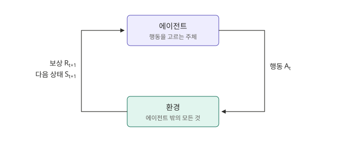
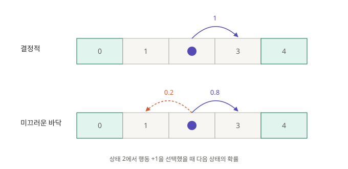

1편과 2편의 밴딧 문제에는 상태가 하나뿐이었다. 이 글은 상태가 여러 개이고 행동이 다음 상태에 영향을 주는 문제, 즉 1편 변형 표의 마지막 줄인 MDP(Markov Decision Process, 마르코프 결정 과정)를 다룬다.

## 예제: 1차원 격자 세계

이 글에서는 다음 두 세계를 예제로 사용한다.


규칙은 다음과 같다.

- 칸 다섯 개가 일렬로 놓여 있고, 에이전트는 가운데 칸(2번)에서 시작한다.
- 매 스텝 왼쪽 또는 오른쪽으로 한 칸 이동한다.
- 칸에 들어가면 그 칸에 적힌 보상을 받는다.
- 양 끝 칸(0번, 4번)에 도착하면 종료된다.

월드 1에서는 오른쪽으로 두 번 이동하면 +1, 왼쪽으로 두 번 이동하면 −1을 받는다. 최선의 선택이 분명하다.

월드 2는 다르다. 왼쪽으로 가면 0, +1을 받아 합이 +1이다. 오른쪽으로 가면 −1, +6을 받아 합이 +5다. 첫 이동의 보상만 비교하면 왼쪽(0)이 오른쪽(−1)보다 낫지만, 끝까지 받는 보상의 합은 오른쪽이 크다.

## 에이전트와 환경

강화학습 문제는 두 주체로 구성된다.

- **에이전트(agent)**: 행동을 선택하는 주체다. 격자 세계에서는 칸 위의 점이다.
- **환경(environment)**: 에이전트를 제외한 모든 것이다. 에이전트의 행동을 받아 보상과 다음 상황을 돌려준다. 격자 세계에서는 칸의 배치와 보상, 이동 규칙이다.

둘 사이에 오가는 정보는 세 가지다.

- **상태(state) $S_t$**: 시점 $t$에 에이전트가 처한 상황이다. 가능한 상태의 집합을 $\mathcal{S}$로 쓴다. 격자 세계에서는 에이전트의 위치이므로 $\mathcal{S} = \{0, 1, 2, 3, 4\}$다.
- **행동(action) $A_t$**: 상태를 보고 에이전트가 선택하는 것이다. 가능한 행동의 집합을 $\mathcal{A}$로 쓴다. 격자 세계에서는 왼쪽 이동을 $-1$, 오른쪽 이동을 $+1$로 두어 $\mathcal{A} = \{-1, +1\}$이다. 이렇게 두면 이동 후 위치는 $S_t + A_t$로 쓸 수 있다.
- **보상(reward) $R_{t+1}$**: 행동의 결과로 환경이 돌려주는 숫자다. 격자 세계에서는 들어간 칸에 적힌 값이다.



에이전트는 상태 $S_t$를 보고 행동 $A_t$를 선택한다. 환경은 그 결과로 보상 $R_{t+1}$과 다음 상태 $S_{t+1}$을 돌려준다. 보상에 $t+1$을 붙이는 것은 $A_t$의 결과가 다음 시점에 주어진다는 의미의 표기 관례다. 1편과 2편에서는 $A_t$에 대한 보상을 $R_t$로 썼지만, MDP에서는 보상이 다음 상태 $S_{t+1}$과 함께 주어진다는 점을 반영해 $R_{t+1}$로 쓴다. 시점도 $t = 0$부터 센다.

월드 2에서 오른쪽으로 두 번 이동하는 과정을 이 표기로 쓰면 다음과 같다.

| $t$ | $S_t$ | $A_t$ | $R_{t+1}$ |
|---|---|---|---|
| 0 | 2 | $+1$ | −1 |
| 1 | 3 | $+1$ | +6 |
| 2 | 4 (종료) | | |

## 밴딧과 무엇이 다른가

밴딧에서는 어떤 행동을 해도 같은 상태로 돌아왔다. MDP에서는 행동이 보상뿐 아니라 다음 상태도 결정한다. 이 차이에서 두 가지가 달라진다.

- **보상이 지연될 수 있다.** 월드 2에서 오른쪽 이동은 당장 −1을 주지만, +6을 받을 수 있는 위치로 이동시킨다. 따라서 목표는 이번 보상이 아니라 앞으로 받을 보상의 합이 된다.
- **시간 순서가 의미를 갖는다.** 밴딧에서 $t$는 몇 번째 선택인지를 세는 번호였다. 환경은 이전 선택과 무관하게 매 스텝 같은 상태를 제시하므로, 환경의 입장에서 각 스텝은 서로 독립이다. MDP에서는 $S_{t+1}$이 $S_t$와 $A_t$로 정해지므로, 지금의 선택이 이후의 모든 상황을 바꾼다. 상호작용은 시간 순서를 가진 하나의 흐름이 된다.

$$
S_0, A_0, R_1, S_1, A_1, R_2, S_2, A_2, R_3, \dots
$$

이 흐름을 궤적(trajectory)이라 한다.

## 마르코프 성질

궤적을 따라가다 보면 자연스러운 질문이 생긴다. 다음 상태 $S_{t+1}$은 무엇에 따라 정해지는가.

이를 확률로 쓰려면 조건부 확률이 필요하다. $\Pr(X \mid Y)$는 $Y$가 일어났다는 것을 알 때 $X$가 일어날 확률이며, 두 사건이 함께 일어날 확률을 조건의 확률로 나눈 값으로 정의된다.

$$
\Pr(X \mid Y) = \frac{\Pr(X, Y)}{\Pr(Y)}
$$

가장 일반적으로는 다음 상태가 지금까지의 궤적 전체에 의존할 수 있다. 처음부터 현재까지의 상태와 행동을 모두 조건으로 두면 다음과 같다.

$$
\Pr(S_{t+1} = s' \mid S_0, A_0, S_1, A_1, \dots, S_t, A_t)
$$

이 형태는 다루기 어렵다. 조건이 시간이 지날수록 길어지고, 같은 상태라도 거쳐 온 경로마다 다른 확률을 가질 수 있다.

MDP는 여기에 가정 하나를 둔다. 다음 상태는 현재 상태와 행동에만 의존한다.

$$
\Pr(S_{t+1} = s' \mid S_0, A_0, S_1, A_1, \dots, S_t, A_t) = \Pr(S_{t+1} = s' \mid S_t, A_t)
$$

과거 기록을 추가로 알아도 다음 상태를 예측하는 데 도움이 되지 않는다는 뜻이다. 보상에도 같은 가정이 적용된다. 이를 마르코프 성질(Markov property)이라 하고, 이 성질을 만족하는 의사결정 문제가 MDP다.

과거가 무의미하다는 뜻은 아니다. 필요한 과거 정보가 이미 현재 상태 안에 담겨 있다는 뜻이다. 격자 세계에서는 에이전트가 어떤 경로로 위치 3에 왔든, 위치 3에서 오른쪽으로 가면 위치 4에 도착한다. 위치만으로 다음 상태가 정해지므로 마르코프 성질을 만족한다.

마르코프 성질은 상태를 어떻게 정의하느냐에 달려 있다. 날아가는 공을 찍은 사진 한 장을 상태로 쓰면, 공의 위치는 알 수 있지만 속도는 알 수 없다. 다음 순간 공의 위치를 예측하려면 이전 사진이 필요하므로 마르코프 성질이 깨진다. 사진 여러 장을 묶어 하나의 상태로 쓰면 속도 정보가 상태에 포함되어 다시 마르코프 성질을 만족한다.

이 가정 덕분에 현재 상태 하나만 보면 된다. 이후에 다룰 가치 함수와 벨만 방정식도 이 가정 위에서 성립한다.

## 상태 전이 확률

마르코프 성질 덕분에 환경의 동작은 현재 상태와 행동만으로 기술할 수 있다. 환경이 하는 일은 현재 상태와 행동을 받아 다음 상태와 보상을 정하는 것이다. 이 섹션에서는 다음 상태를, 다음 섹션에서는 보상을 정의한다.

상태 $s$에서 행동 $a$를 했을 때 다음 상태가 $s'$일 확률을 상태 전이 확률(state-transition probability)이라 한다. 앞의 마르코프 성질의 우변을 시점과 무관한 함수로 쓴 것이다.

$$
p(s' \mid s, a) = \Pr(S_{t+1} = s' \mid S_t = s, A_t = a)
$$

확률이므로 가능한 모든 다음 상태에 대해 합하면 1이다.

$$
\sum_{s'} p(s' \mid s, a) = 1 \qquad \text{for all } s, a
$$

전이 확률은 소문자로 쓴다. 1편의 $q$와 마찬가지로 환경이 정해 둔 고정된 값이기 때문이다.

### 격자 세계의 전이 확률

앞의 격자 세계는 이동이 항상 의도대로 된다. 종료 칸이 아닌 상태 $s \in \{1, 2, 3\}$에서 행동 $a \in \{-1, +1\}$을 하면 반드시 $s + a$에 도착한다.

$$
p(s' \mid s, a) =
\begin{cases}
1 & s' = s + a \\
0 & \text{otherwise}
\end{cases}
$$

예를 들어 $p(3 \mid 2, +1) = 1$, $p(1 \mid 2, +1) = 0$이다.

이처럼 다음 상태가 하나로 정해지는 환경을 결정적(deterministic)이라 한다. 이때는 전이를 확률 대신 함수로 써도 된다. 격자 세계라면 $f(s, a) = s + a$다.

일반적인 MDP는 확률적(stochastic)이다. 예를 들어 바닥이 미끄러워 의도한 방향으로 확률 0.8로 이동하고, 확률 0.2로 반대 방향으로 미끄러진다고 하자.

$$
p(s' \mid s, a) =
\begin{cases}
0.8 & s' = s + a \\
0.2 & s' = s - a \\
0 & \text{otherwise}
\end{cases}
$$

예를 들어 $p(3 \mid 2, +1) = 0.8$, $p(1 \mid 2, +1) = 0.2$이다.



행동 $+1$에 대한 전이 확률을 모든 상태에 대해 표로 쓰면 다음과 같다. 행은 현재 상태 $s$, 열은 다음 상태 $s'$이다.

| $p(s' \mid s, +1)$ | $s'=0$ | $s'=1$ | $s'=2$ | $s'=3$ | $s'=4$ |
|---|---|---|---|---|---|
| $s = 1$ | 0.2 | 0 | 0.8 | 0 | 0 |
| $s = 2$ | 0 | 0.2 | 0 | 0.8 | 0 |
| $s = 3$ | 0 | 0 | 0.2 | 0 | 0.8 |

각 행의 합은 1이다. 행동 $-1$의 표는 방향만 반대다. 종료 칸 0과 4에서는 더 이상 행동하지 않으므로 표에 없다.

같은 행동을 반복해도 궤적은 여러 가지가 나온다. 월드 2의 위치 2에서 $+1$을 두 번 선택하면 다음과 같다.

| 궤적 | 확률 | 받는 보상 |
|---|---|---|
| $2 \to 3 \to 4$ | $0.8 \times 0.8 = 0.64$ | $-1, +6$ |
| $2 \to 3 \to 2$ | $0.8 \times 0.2 = 0.16$ | $-1, 0$ |
| $2 \to 1 \to 2$ | $0.2 \times 0.8 = 0.16$ | $0, 0$ |
| $2 \to 1 \to 0$ | $0.2 \times 0.2 = 0.04$ | $0, +1$ |

궤적의 확률은 각 스텝의 전이 확률을 곱해 구한다. 곱할 수 있는 것은 마르코프 성질 덕분이다. 두 번째 스텝의 전이 확률이 첫 번째 스텝에서 어디서 왔는지와 무관하게 현재 위치만으로 정해진다. 네 확률의 합은 1이다.

같은 상태에서 같은 행동을 해도 다음 상태가 달라질 수 있다. 결정적인 환경은 확률이 0 또는 1뿐인 특수한 경우다.

## 보상 함수

### 도착한 칸으로 정해지는 보상

격자 세계의 보상은 들어간 칸에 적힌 값이다. 월드 2에서 각 칸의 값은 다음과 같다. 시작 칸인 2번에는 값이 없으므로 0으로 둔다.

| $s'$ | 0 | 1 | 2 | 3 | 4 |
|---|---|---|---|---|---|
| 들어갈 때 받는 보상 | +1 | 0 | 0 | −1 | +6 |

보상이 현재 상태와 행동뿐 아니라 도착한 상태 $s'$에 따라 정해지므로, 보상 함수를 세 인자로 쓰는 것이 자연스럽다.

$$
r(s, a, s') = \mathbb{E}[R_{t+1} \mid S_t = s, A_t = a, S_{t+1} = s']
$$

격자 세계에서는 $r(s, a, s')$가 칸 $s'$의 값이며, 무작위성이 없다.

### 기대 보상

행동을 고르는 시점에는 어느 칸에 도착할지 모른다. 그래서 도착 상태에 대해 기댓값을 취한 두 인자 형태를 주로 쓴다.

$$
r(s, a) = \mathbb{E}[R_{t+1} \mid S_t = s, A_t = a] = \sum_{s'} p(s' \mid s, a) \, r(s, a, s')
$$

상태 $s$에서 행동 $a$를 했을 때의 기대 보상이다. 도착 가능한 각 상태의 보상을 그 상태에 도착할 확률로 가중해 더한다. 밴딧의 $q(a) = \mathbb{E}[R_t \mid A_t = a]$와 형태가 같으며, 상태가 하나뿐이면 $r(s, a)$는 $q(a)$가 된다.

월드 2에서 계산하면 다음과 같다.

| | 결정적 | 미끄러운 바닥 |
|---|---|---|
| $r(2, +1)$ | $-1$ | $0.8 \times (-1) + 0.2 \times 0 = -0.8$ |
| $r(3, +1)$ | $+6$ | $0.8 \times 6 + 0.2 \times 0 = 4.8$ |

보상 규칙은 그대로인데 전이 확률이 바뀌면 기대 보상도 바뀐다. 보상 규칙 $r(s, a, s')$가 결정적이어도, 전이가 확률적이면 받는 보상 $R_{t+1}$은 무작위가 된다.

### 보상 자체가 무작위인 경우

보상 규칙 자체가 무작위일 수도 있다. 1편의 슬롯머신처럼 같은 칸에 들어가도 보상이 매번 다른 경우다. 예를 들어 4번 칸에 들어가면 확률 0.5로 +12, 확률 0.5로 0을 준다고 하자. 이때 $r(3, +1, 4) = 0.5 \times 12 + 0.5 \times 0 = 6$으로, 항상 +6을 주는 경우와 기대 보상이 같다.

강화학습의 목표는 앞으로 받을 보상 합의 기댓값을 최대화하는 것이다. 기댓값은 합에 대해 선형이므로 보상 합의 기댓값은 각 보상의 기댓값의 합과 같다.

$$
\mathbb{E}[R_1 + R_2 + \cdots] = \mathbb{E}[R_1] + \mathbb{E}[R_2] + \cdots
$$

따라서 보상이 어떤 이유로 무작위이든, 기대 보상만 알면 목표를 계산할 수 있다. 위 예에서 +12 또는 0을 주는 칸과 항상 +6을 주는 칸은 같은 칸으로 취급된다. 보상 함수를 분포가 아니라 기댓값으로 정의하는 이유다. 대신 보상의 편차, 즉 위험은 고려되지 않는다.

### 합친 형태

다음 상태와 보상을 하나의 확률로 묶어 쓰기도 한다.

$$
p(s', r \mid s, a) = \Pr(S_{t+1} = s', R_{t+1} = r \mid S_t = s, A_t = a)
$$

보상의 분포까지 담은 일반형이며, 환경의 동작(dynamics)을 완전히 정의한다. 앞의 두 함수는 여기서 얻을 수 있다. 보상에 대해 합하면 $p(s' \mid s, a)$이고, 보상의 기댓값을 취하면 $r(s, a)$다. 교재에 따라 이 형태를 기본으로 쓰기도 한다. 격자 세계처럼 보상이 다음 상태로 결정되는 환경에서는 두 방식이 같은 내용이다.

## 정책

전이 확률과 보상 함수는 환경이 정한다. 에이전트가 정하는 것은 각 상태에서 어떤 행동을 할지다. 이 규칙을 정책(policy)이라 하고 $\pi$로 쓴다.

$$
\pi(a \mid s) = \Pr(A_t = a \mid S_t = s)
$$

상태 $s$에서 행동 $a$를 선택할 확률이다. 조건에 상태가 들어간다는 점이 밴딧과 다르다. 밴딧에는 상태가 하나뿐이었으므로 정책은 행동에 대한 확률 분포 하나였다. MDP에서는 상태마다 행동 분포가 따로 있다. 확률이므로 각 상태에서 모든 행동에 대해 합하면 1이다.

$$
\sum_{a} \pi(a \mid s) = 1 \qquad \text{for all } s
$$

상태마다 행동 하나를 확률 1로 고르는 정책을 결정적 정책(deterministic policy)이라 하고, 함수 $a = \pi(s)$로 쓰기도 한다. 그렇지 않은 정책, 즉 한 상태에서 여러 행동에 양의 확률을 주는 정책을 확률적 정책(stochastic policy)이라 한다. 결정적 정책은 확률적 정책에서 확률이 0 또는 1뿐인 특수한 경우다.

확률적 정책은 탐험에 필요하다. 결정적 정책은 같은 상태에서 항상 같은 행동만 하므로, 다른 행동의 결과를 알 기회가 없다. 1편의 greedy가 나쁜 머신에 고착된 것과 같은 문제다.

월드 2에서 가능한 정책 몇 가지를 표로 쓰면 다음과 같다.

| 정책 | $\pi(+1 \mid s)$ | $\pi(-1 \mid s)$ | 종류 | 설명 |
|---|---|---|---|---|
| $\pi_{\text{right}}$ | 1 | 0 | 결정적 | 모든 상태에서 오른쪽 |
| $\pi_{\text{left}}$ | 0 | 1 | 결정적 | 모든 상태에서 왼쪽 |
| $\pi_{\text{random}}$ | 0.5 | 0.5 | 확률적 | 모든 상태에서 무작위 |

세 정책 모두 상태와 무관하게 같은 분포를 쓰지만, 일반적으로는 상태마다 다르게 정할 수 있다. 예를 들어 "위치 1에서는 왼쪽, 위치 2와 3에서는 오른쪽"도 하나의 결정적 정책이다.

### 정책과 환경이 함께 궤적을 만든다

궤적의 각 스텝에서 행동은 정책이 고르고, 다음 상태는 환경이 정한다. 시작 상태 $s_0$가 주어졌을 때 두 스텝짜리 궤적 $s_0, a_0, s_1, a_1, s_2$가 나올 확률을 구해 보자.

확률의 곱셈 규칙(chain rule)에 따르면, 여러 사건이 순서대로 일어날 확률은 각 사건의 확률을 그 전까지 일어난 모든 사건을 조건으로 두고 곱한 것이다.

$$
\begin{aligned}
&\Pr(A_0 = a_0, S_1 = s_1, A_1 = a_1, S_2 = s_2 \mid S_0 = s_0) \\
&= \Pr(a_0 \mid s_0) \cdot \Pr(s_1 \mid s_0, a_0) \cdot \Pr(a_1 \mid s_0, a_0, s_1) \cdot \Pr(s_2 \mid s_0, a_0, s_1, a_1)
\end{aligned}
$$

여기서 두 가지 가정으로 조건을 줄인다.

- **행동**: 정책은 현재 상태만 보고 행동을 고른다. 정책을 $\pi(a \mid s)$로 정의한 것이 이 가정이다. 따라서 $\Pr(a_1 \mid s_0, a_0, s_1) = \pi(a_1 \mid s_1)$이다.
- **다음 상태**: 마르코프 성질에 따라 $\Pr(s_2 \mid s_0, a_0, s_1, a_1) = p(s_2 \mid s_1, a_1)$이다.

정리하면 다음과 같다.

$$
\Pr(A_0 = a_0, S_1 = s_1, A_1 = a_1, S_2 = s_2 \mid S_0 = s_0) = \pi(a_0 \mid s_0) \, p(s_1 \mid s_0, a_0) \, \pi(a_1 \mid s_1) \, p(s_2 \mid s_1, a_1)
$$

각 항은 궤적의 한 단계에 대응한다. 에이전트가 정하는 항과 환경이 정하는 항이 번갈아 곱해진다.

| 순서 | 사건 | 정하는 주체 | 곱하는 확률 |
|---|---|---|---|
| 1 | 행동 $a_0$ 선택 | 에이전트 | $\pi(a_0 \mid s_0)$ |
| 2 | 상태 $s_1$ 도착 | 환경 | $p(s_1 \mid s_0, a_0)$ |
| 3 | 행동 $a_1$ 선택 | 에이전트 | $\pi(a_1 \mid s_1)$ |
| 4 | 상태 $s_2$ 도착 | 환경 | $p(s_2 \mid s_1, a_1)$ |

미끄러운 바닥의 월드 2에서 위치 2에서 시작해 $2 \to 3 \to 4$ 궤적이 나올 확률을 정책별로 계산하면 다음과 같다.

**$\pi_{\text{right}}$를 따르는 경우.** 행동은 항상 $+1$이다.

| 스텝 | 정책 확률 | 전이 확률 | 곱 |
|---|---|---|---|
| $2 \to 3$ | $\pi(+1 \mid 2) = 1$ | $p(3 \mid 2, +1) = 0.8$ | 0.8 |
| $3 \to 4$ | $\pi(+1 \mid 3) = 1$ | $p(4 \mid 3, +1) = 0.8$ | 0.8 |

궤적의 확률은 $0.8 \times 0.8 = 0.64$다.

**$\pi_{\text{random}}$을 따르는 경우.** 행동도 무작위이므로, 한 칸 오른쪽으로 이동하는 경우가 두 가지다.

| 경우 | 정책 확률 | 전이 확률 | 곱 |
|---|---|---|---|
| $+1$을 골라 의도대로 이동 | $\pi(+1 \mid s) = 0.5$ | $p(s+1 \mid s, +1) = 0.8$ | 0.4 |
| $-1$을 골랐지만 미끄러져 이동 | $\pi(-1 \mid s) = 0.5$ | $p(s+1 \mid s, -1) = 0.2$ | 0.1 |
| 합 | | | 0.5 |

$2 \to 3$과 $3 \to 4$ 모두 확률 0.5이므로 궤적의 확률은 $0.5 \times 0.5 = 0.25$다.

같은 환경이라도 정책에 따라 궤적의 분포가 달라지고, 받는 보상도 달라진다. 강화학습의 목표는 보상을 가장 많이 받는 정책을 찾는 것이다. 무엇을 "가장 많이"로 볼지는 다음 섹션에서 정의한다.

## 실험: 정책 비교

지금까지 정의한 요소로 두 월드를 직접 실행해 본다. 전이는 결정적인 경우와 미끄러운 바닥(확률 0.2로 반대 방향) 두 가지, 정책은 $\pi_{\text{right}}$, $\pi_{\text{left}}$, $\pi_{\text{random}}$ 세 가지다. 에이전트는 위치 2에서 시작해 종료 칸에 도착할 때까지 움직이며, 조합마다 10만 번 실행했다.

```python
import numpy as np

WORLDS = {                                  # 칸에 들어갈 때 받는 보상
    1: {0: -1, 1: 0, 2: 0, 3: 0, 4: 1},
    2: {0: 1, 1: 0, 2: 0, 3: -1, 4: 6},
}
POLICIES = {
    "right":  lambda s, rng: +1,
    "left":   lambda s, rng: -1,
    "random": lambda s, rng: rng.choice([-1, +1]),
}

def episode(reward, policy, slip, rng, start=2):
    s, total, steps = start, 0, 0
    while s not in (0, 4):
        a = policy(s, rng)       # 정책이 행동을 고른다
        if rng.random() < slip:  # 환경: 확률 slip으로 반대 방향
            a = -a
        s = s + a                # 다음 상태
        total += reward[s]       # 보상
        steps += 1
    return total, steps
```

± 뒤는 95% 신뢰구간이다. 결정적 전이에서 $\pi_{\text{right}}$와 $\pi_{\text{left}}$는 매번 같은 궤적을 만들므로 편차가 없다.

### 월드 1

| 전이 | 정책 | 종료까지 받은 보상 합 | 평균 스텝 수 | 4번 칸에서 종료 | $2 \to 3 \to 4$ 비율 |
|---|---|---|---|---|---|
| 결정적 | $\pi_{\text{right}}$ | **1.00** | 2.00 | 100% | 1.00 |
| 결정적 | $\pi_{\text{left}}$ | −1.00 | 2.00 | 0% | 0 |
| 결정적 | $\pi_{\text{random}}$ | 0.00 ± 0.01 | 4.00 | 49.9% | 0.25 |
| 미끄러운 바닥 | $\pi_{\text{right}}$ | **0.88 ± 0.00** | 2.94 | 94.1% | 0.64 |
| 미끄러운 바닥 | $\pi_{\text{left}}$ | −0.88 ± 0.00 | 2.94 | 5.8% | 0.04 |
| 미끄러운 바닥 | $\pi_{\text{random}}$ | 0.00 ± 0.01 | 3.99 | 50.0% | 0.25 |

- 양 끝의 보상이 대칭이므로 $\pi_{\text{right}}$와 $\pi_{\text{left}}$는 부호만 반대이고, $\pi_{\text{random}}$의 평균은 0이다.
- 중간 칸의 보상이 모두 0이므로 보상 합은 어느 끝에서 종료하느냐로만 정해진다. 미끄러운 바닥에서 $\pi_{\text{right}}$의 0.88은 $0.941 \times 1 + 0.059 \times (-1)$과 같다.

### 월드 2

| 전이 | 정책 | 종료까지 받은 보상 합 | 평균 스텝 수 | 4번 칸에서 종료 | $2 \to 3 \to 4$ 비율 |
|---|---|---|---|---|---|
| 결정적 | $\pi_{\text{right}}$ | **5.00** | 2.00 | 100% | 1.00 |
| 결정적 | $\pi_{\text{left}}$ | 1.00 | 2.00 | 0% | 0 |
| 결정적 | $\pi_{\text{random}}$ | 2.50 ± 0.01 | 3.99 | 50.0% | 0.25 |
| 미끄러운 바닥 | $\pi_{\text{right}}$ | **4.53 ± 0.01** | 2.95 | 94.1% | 0.64 |
| 미끄러운 바닥 | $\pi_{\text{left}}$ | 1.00 ± 0.01 | 2.95 | 5.8% | 0.04 |
| 미끄러운 바닥 | $\pi_{\text{random}}$ | 2.49 ± 0.01 | 3.99 | 49.8% | 0.25 |

- 첫 스텝의 −1을 감수하는 $\pi_{\text{right}}$가 $\pi_{\text{left}}$보다 약 4.5배 많은 보상을 받는다.
- 미끄러운 바닥에서 $\pi_{\text{right}}$의 보상 합은 5에서 4.53으로 줄어든다. 0번 칸으로 밀려나는 경우와, 3번 칸을 여러 번 지나며 −1을 반복해 받는 경우가 생기기 때문이다.

## 다음 글

이 글에서는 MDP를 구성하는 요소를 정의했다. 상태와 행동, 전이 확률, 보상 함수, 정책이다. 실험에서는 "종료까지 받은 보상의 합"으로 정책을 비교했지만, 끝이 없는 과제에서는 이 합이 무한히 커질 수 있다. 다음 글에서는 일회성 과제와 지속적 과제를 구분하고, 수익(return)과 가치 함수, 최적 정책을 정의한다.

## 참고

- Sutton, R. S., & Barto, A. G. (2018). *Reinforcement Learning: An Introduction* (2nd ed.). MIT Press.
