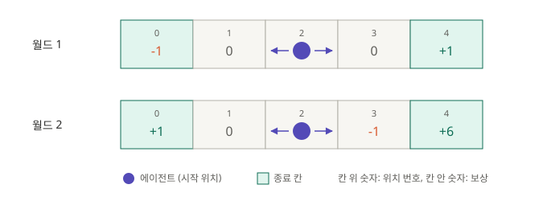
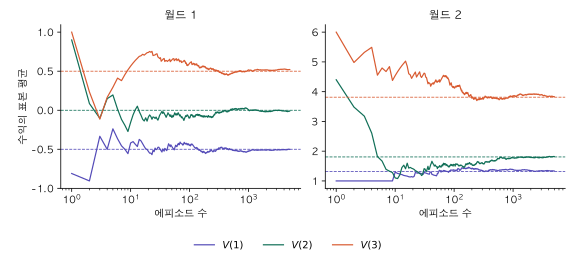
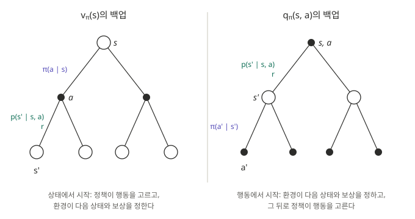

3편에서 정의한 MDP의 구성 요소 중 전이 확률 $p$와 보상 함수 $r$은 환경이 정하고, 정책 $\pi$는 에이전트가 정한다. MDP를 푼다는 것은 주어진 환경에서 가장 좋은 정책, 즉 최적 정책(optimal policy)을 찾는 것이다.

그러려면 먼저 "가장 좋은 정책"이 무엇인지 정의해야 한다. 정책끼리 비교할 기준이 있어야 한다는 뜻이다. 3편의 실험에서는 종료까지 받은 보상의 합의 평균을 기준으로 썼다. 이 글은 이 기준을 정식으로 세우는 과정이다.

1. 과제가 끝나지 않으면 보상의 합이 무한해진다. 이를 해결하는 수익(return)을 정의한다.
2. 수익은 무작위이고 시작 상태에 따라 다르다. 수익의 기댓값을 상태별로 정리한 가치 함수(value function)를 정의한다.
3. 가치 함수로 정책 간 순서를 정하고, 그 순서에서 가장 앞선 정책으로 최적 정책을 정의한다.

## 격자 세계 다시 보기

이 글에서도 3편의 격자 세계를 예제로 쓴다.



| 요소 | 정의 |
|---|---|
| 상태 | $\mathcal{S} = \{0, 1, 2, 3, 4\}$. 에이전트의 위치이며, 2에서 시작한다. |
| 종료 상태 | 0과 4. 도착하면 에피소드가 끝난다. |
| 행동 | $\mathcal{A} = \{-1, +1\}$. 왼쪽과 오른쪽 이동이다. |
| 전이 확률 | 결정적: $s' = s + a$. 미끄러운 바닥: 확률 0.8로 $s + a$, 0.2로 $s - a$. |
| 보상 | 들어간 칸의 값. 월드 1은 $(-1, 0, 0, 0, +1)$, 월드 2는 $(+1, 0, 0, -1, +6)$. |
| 정책 | $\pi_{\text{right}}$(항상 $+1$), $\pi_{\text{left}}$(항상 $-1$), $\pi_{\text{random}}$(반반). |

3편의 실험에서 종료까지 받은 보상 합의 평균은 다음과 같았다.

| | $\pi_{\text{right}}$ | $\pi_{\text{left}}$ | $\pi_{\text{random}}$ |
|---|---|---|---|
| 월드 1, 결정적 | 1.00 | −1.00 | 0.00 |
| 월드 1, 미끄러운 바닥 | 0.88 | −0.88 | 0.00 |
| 월드 2, 결정적 | 5.00 | 1.00 | 2.50 |
| 월드 2, 미끄러운 바닥 | 4.53 | 1.00 | 2.49 |

## 일회성 과제와 지속적 과제

### 일회성 과제

3편의 격자 세계는 에이전트가 양 끝 칸에 도착하면 끝난다. 이처럼 종료 상태가 있어 상호작용이 유한한 길이로 끊기는 과제를 일회성 과제(episodic task)라 한다. 시작부터 종료까지의 한 번의 상호작용을 에피소드(episode)라 하고, 종료 시점을 $T$로 쓴다.

$$
S_0, A_0, R_1, S_1, A_1, R_2, \dots, S_{T-1}, A_{T-1}, R_T, S_T
$$

$S_T$는 종료 상태다. 도착하면 에피소드가 끝나는 상태를 종료 상태(terminal state)라 한다. 종료 상태에서는 행동을 선택하지 않으며, 이후 받는 보상은 0이다. 어떤 상태를 종료 상태로 둘지는 문제를 정의할 때 정한다. 격자 세계에서는 양 끝 칸 0과 4를 종료 상태로 정했다.

에피소드가 끝나면 다음 에피소드는 다시 시작 상태에서 출발하며, 이전 에피소드의 결과와 무관하다. 게임 한 판, 미로 탈출 한 번이 일회성 과제의 예다.

$T$는 고정된 값이 아니다. 3편의 실험에서 미끄러운 바닥의 $\pi_{\text{right}}$는 평균 2.94 스텝이 걸렸지만, 에피소드마다 2 스텝일 수도 20 스텝일 수도 있었다. $T$는 에피소드마다 달라지는 확률변수다.

### 지속적 과제

종료 상태 없이 상호작용이 끝없이 이어지는 과제도 있다. 이를 지속적 과제(continuing task)라 한다. 실내 온도를 계속 조절하는 제어기나, 쉬지 않고 요청을 분배하는 서버 부하 분산이 예다. 이 경우 $T = \infty$다.

### 보상의 합이 무한해지는 문제

지속적 과제에서는 보상을 단순히 더하는 방식이 성립하지 않는다. 월드 2에서 양 끝 칸이 종료 상태가 아니라 벽이라고 하자. 끝 칸에 들어가면 보상을 받고, 끝 칸에서 바깥쪽으로 이동하려 하면 제자리에 머물며 보상을 다시 받는다. 두 결정적 정책을 비교하면 다음과 같다.

| 정책 | 궤적 | 받는 보상 | 보상의 합 |
|---|---|---|---|
| $\pi_{\text{right}}$ | $2 \to 3 \to 4 \to 4 \to \cdots$ | $-1, +6, +6, \dots$ | $\infty$ |
| $\pi_{\text{left}}$ | $2 \to 1 \to 0 \to 0 \to \cdots$ | $0, +1, +1, \dots$ | $\infty$ |

$\pi_{\text{right}}$가 매 스텝 6배 많은 보상을 받는데도, 보상의 합으로는 둘 다 무한대라 비교할 수 없다. 끝없는 과제에서도 정책을 비교할 수 있는 기준이 필요하다. 다음 섹션의 할인된 수익이 이 문제를 해결한다.

## 수익

### 일회성 과제의 수익

시점 $t$ 이후에 받는 보상의 합을 수익(return)이라 하고 $G_t$로 쓴다. 일회성 과제에서는 종료 시점 $T$까지의 보상을 더한다.

$$
G_t = R_{t+1} + R_{t+2} + \cdots + R_T
$$

$G_t$에는 시점 $t$ 이후의 보상만 들어간다. 이미 받은 보상은 지금의 선택으로 바꿀 수 없으므로, 앞으로의 행동을 판단하는 기준에서 제외한다. 3편 실험의 "종료까지 받은 보상의 합"은 시작 시점의 수익 $G_0$다.

### 할인된 수익

지속적 과제에서는 위 합이 무한해질 수 있다. 이를 막기 위해 먼 미래의 보상일수록 작은 가중치를 준다.

$$
G_t = R_{t+1} + \gamma R_{t+2} + \gamma^2 R_{t+3} + \cdots = \sum_{k=0}^{\infty} \gamma^k R_{t+k+1}
$$

$\gamma \in [0, 1]$을 할인율(discount factor)이라 한다. $k$ 스텝 뒤의 보상에는 $\gamma^k$가 곱해진다. 지금 받는 보상 1과 $k$ 스텝 뒤에 받는 보상 1의 가치를 다르게 본다는 뜻이다.

$\gamma < 1$이면 수익은 유한하다. 모든 보상의 절댓값이 $R_{\max}$ 이하라면 등비급수의 합에 의해 다음이 성립한다.

$$
|G_t| \le \sum_{k=0}^{\infty} \gamma^k R_{\max} = \frac{R_{\max}}{1 - \gamma}
$$

앞의 벽이 있는 월드 2에 적용하면 두 정책을 비교할 수 있게 된다.

| 정책 | 할인된 수익 $G_0$ | $\gamma = 0.9$ |
|---|---|---|
| $\pi_{\text{right}}$ | $-1 + 6\gamma + 6\gamma^2 + \cdots = -1 + \dfrac{6\gamma}{1 - \gamma}$ | 53 |
| $\pi_{\text{left}}$ | $0 + \gamma + \gamma^2 + \cdots = \dfrac{\gamma}{1 - \gamma}$ | 9 |

두 정책 모두 수익이 유한하고, $\pi_{\text{right}}$가 더 좋다는 비교가 가능해진다.

### 할인율이 바꾸는 것

$\gamma$는 미래를 얼마나 중시하는지를 정한다.

- **$\gamma = 0$**: $G_t = R_{t+1}$이다. 바로 다음 보상만 고려한다.
- **$\gamma$가 1에 가까우면**: 먼 미래의 보상도 거의 같은 비중으로 고려한다.
- **$\gamma = 1$**: 할인하지 않는다. 일회성 과제에서만 수익이 유한하게 보장된다.

$\gamma$에 따라 더 좋은 정책이 바뀔 수도 있다. 원래의 월드 2(결정적, 양 끝 종료)에서 위치 2부터의 수익은 다음과 같다.

$$
G_0^{\text{right}} = -1 + 6\gamma, \qquad G_0^{\text{left}} = 0 + \gamma
$$

| $\gamma$ | 0 | 0.1 | 0.2 | 0.5 | 0.9 | 1 |
|---|---|---|---|---|---|---|
| $\pi_{\text{right}}$ | −1 | −0.4 | 0.2 | 2 | 4.4 | 5 |
| $\pi_{\text{left}}$ | 0 | 0.1 | 0.2 | 0.5 | 0.9 | 1 |
| 더 좋은 정책 | left | left | 같음 | right | right | right |

$-1 + 6\gamma > \gamma$, 즉 $\gamma > 0.2$일 때 $\pi_{\text{right}}$가 낫다. $\gamma$가 작으면 첫 스텝의 −1이 두 번째 스텝의 +6보다 크게 반영되어, 당장 손해를 보지 않는 $\pi_{\text{left}}$가 낫다. 월드 1에서는 이런 역전이 없다. 위치 2부터의 수익은 $G_0^{\text{right}} = 0 + \gamma \cdot 1 = \gamma$, $G_0^{\text{left}} = 0 + \gamma \cdot (-1) = -\gamma$이므로, $\gamma > 0$이면 항상 $\pi_{\text{right}}$가 낫다. 좋은 쪽으로 가는 길에 손해가 없기 때문이다. 할인율이 결과를 바꾸는 것은 월드 2처럼 당장의 손해와 나중의 이득이 맞바뀌는 환경이다. 같은 환경이라도 할인율은 최적 정책을 바꿀 수 있는 문제 정의의 일부다.

### 수익의 재귀 구조

할인된 수익에서 첫 항을 떼어 내면 나머지는 다음 시점의 수익이다.

$$
\begin{aligned}
G_t &= R_{t+1} + \gamma R_{t+2} + \gamma^2 R_{t+3} + \cdots \\
&= R_{t+1} + \gamma \left( R_{t+2} + \gamma R_{t+3} + \cdots \right) \\
&= R_{t+1} + \gamma G_{t+1}
\end{aligned}
$$

지금의 수익은 바로 다음 보상과, 다음 시점 수익을 할인한 값의 합이다. 월드 2에서 $\pi_{\text{right}}$를 따르면 $G_1 = 6$이고, $G_0 = -1 + \gamma \cdot 6$이다. 이 관계는 이후 가치 함수의 벨만 방정식으로 이어진다.

일회성 과제에서도 같은 식을 쓸 수 있다. 종료 이후의 보상을 모두 0으로 두면 $G_T = 0$이고, 일회성 과제와 지속적 과제를 하나의 식으로 다룰 수 있다.

## 상태 가치 함수

### 수익의 기댓값

수익 $G_t$는 그대로 정책의 비교 기준으로 쓰기 어렵다. 두 가지 이유가 있다.

- **무작위다.** 미끄러운 바닥이나 확률적 정책에서는 같은 정책을 따라도 에피소드마다 궤적이 달라지고, 수익도 달라진다.
- **시작 상태에 따라 다르다.** 같은 정책이라도 위치 1에서 시작할 때와 위치 3에서 시작할 때의 수익은 다르다.

그래서 상태마다 수익의 기댓값을 구한다. 상태 $s$에서 시작해 정책 $\pi$를 따를 때 얻는 수익의 기댓값을 상태 가치 함수(state-value function)라 하고 $v_\pi(s)$로 쓴다.

$$
v_\pi(s) = \mathbb{E}_\pi[G_t \mid S_t = s] = \mathbb{E}_\pi\left[ \sum_{k=0}^{\infty} \gamma^k R_{t+k+1} \,\middle|\, S_t = s \right]
$$

$\mathbb{E}_\pi$의 첨자 $\pi$는 행동을 정책 $\pi$에 따라 고른다는 뜻이다. 다음 상태와 보상은 환경의 $p$와 $r$을 따른다. 기댓값은 이 두 가지 무작위성, 즉 정책의 행동 선택과 환경의 전이를 모두 평균낸다.

- 소문자 $v$로 쓰는 것은 환경과 정책이 정해지면 값이 하나로 정해지기 때문이다. 시리즈의 표기 규칙대로 추정값은 대문자 $V$로 구분한다.
- 종료 상태의 가치는 0이다. 종료 이후에는 받을 보상이 없다.
- 마르코프 성질 덕분에 $v_\pi(s)$는 시점 $t$와 무관하다. 어떤 경로로 $s$에 왔든, $s$ 이후의 수익 분포는 같다.

### 결정적인 경우: 직접 계산

전이와 정책이 모두 결정적이면 궤적이 하나로 정해지므로, 수익을 그대로 더하면 된다. $\gamma = 0.9$로 계산한다.

$\pi_{\text{right}}$를 따르면 각 위치에서 오른쪽 끝까지 이동한다.

| 상태 | 궤적 | 월드 1 $v_{\pi_{\text{right}}}(s)$ | 월드 2 $v_{\pi_{\text{right}}}(s)$ |
|---|---|---|---|
| 3 | $3 \to 4$ | $1$ | $6$ |
| 2 | $2 \to 3 \to 4$ | $0 + \gamma = 0.9$ | $-1 + 6\gamma = 4.4$ |
| 1 | $1 \to 2 \to 3 \to 4$ | $0 + 0 + \gamma^2 = 0.81$ | $0 - \gamma + 6\gamma^2 = 3.96$ |

$\pi_{\text{left}}$를 따르면 왼쪽 끝까지 이동한다.

| 상태 | 궤적 | 월드 1 $v_{\pi_{\text{left}}}(s)$ | 월드 2 $v_{\pi_{\text{left}}}(s)$ |
|---|---|---|---|
| 1 | $1 \to 0$ | $-1$ | $1$ |
| 2 | $2 \to 1 \to 0$ | $-\gamma = -0.9$ | $\gamma = 0.9$ |
| 3 | $3 \to 2 \to 1 \to 0$ | $-\gamma^2 = -0.81$ | $\gamma^2 = 0.81$ |

월드 1에서는 가치가 종료 칸까지의 거리만으로 정해진다. 중간 보상이 모두 0이므로 끝 칸의 보상 $\pm 1$에 도착까지의 할인 $\gamma^{k}$가 곱해질 뿐이다. 월드 2에서는 도중의 −1이 더해져 $\pi_{\text{right}}$의 가치가 거리 순서대로 줄지 않는다. 두 월드 모두 모든 상태에서 $v_{\pi_{\text{right}}}(s) > v_{\pi_{\text{left}}}(s)$다.

### 확률적인 경우: 표본 평균으로 추정

미끄러운 바닥이나 $\pi_{\text{random}}$에서는 궤적이 여러 갈래라 직접 더할 수 없다. 대신 각 상태에서 에피소드를 여러 번 실행해 수익의 평균을 낸다. 1편의 표본 평균과 같은 방식이다. 실행 횟수가 늘어나면 평균은 $v_\pi(s)$에 수렴한다.

```python
def episode_return(start, policy, slip, gamma, reward, rng):
    s, G, discount = start, 0.0, 1.0
    while s not in (0, 4):
        a = policy(s, rng)
        if rng.random() < slip:
            a = -a
        s = s + a
        G += discount * reward[s]   # k 스텝 뒤의 보상에 gamma^k를 곱한다
        discount *= gamma
    return G
```

$\gamma = 0.9$에서 상태마다 10만 번 실행한 결과다.

| 월드 | 전이 | 정책 | 위치 1에서 시작 $v_\pi(1)$ | 위치 2에서 시작 $v_\pi(2)$ | 위치 3에서 시작 $v_\pi(3)$ |
|---|---|---|---|---|---|
| 1 | 결정적 | $\pi_{\text{right}}$ | 0.81 | 0.90 | 1.00 |
| 1 | 결정적 | $\pi_{\text{left}}$ | −1.00 | −0.90 | −0.81 |
| 1 | 결정적 | $\pi_{\text{random}}$ | −0.50 | 0.00 | 0.50 |
| 1 | 미끄러운 바닥 | $\pi_{\text{right}}$ | 0.33 | 0.73 | 0.93 |
| 1 | 미끄러운 바닥 | $\pi_{\text{left}}$ | −0.93 | −0.73 | −0.32 |
| 1 | 미끄러운 바닥 | $\pi_{\text{random}}$ | −0.49 | 0.00 | 0.50 |
| 2 | 결정적 | $\pi_{\text{right}}$ | 3.96 | 4.40 | 6.00 |
| 2 | 결정적 | $\pi_{\text{left}}$ | 1.00 | 0.90 | 0.81 |
| 2 | 결정적 | $\pi_{\text{random}}$ | 1.32 | 1.81 | 3.81 |
| 2 | 미끄러운 바닥 | $\pi_{\text{right}}$ | 2.82 | 3.63 | 5.45 |
| 2 | 미끄러운 바닥 | $\pi_{\text{left}}$ | 0.94 | 0.80 | 1.78 |
| 2 | 미끄러운 바닥 | $\pi_{\text{random}}$ | 1.32 | 1.81 | 3.83 |

95% 신뢰구간은 모두 ±0.02 이내다. 결정적 정책과 결정적 전이의 조합은 궤적이 하나뿐이므로 앞의 직접 계산과 정확히 일치한다.

표본 평균이 실제로 $v_\pi$에 수렴하는지 보기 위해, 미끄러운 바닥에서 $\pi_{\text{random}}$을 따를 때 에피소드 수에 따른 평균의 변화를 그렸다. 점선은 전이 확률로부터 정확히 계산한 $v_\pi$다.



처음 수십 에피소드 동안은 평균이 크게 흔들리고, 수천 에피소드가 지나면 점선에 붙는다. 월드 2의 $V(3)$처럼 수익의 편차가 큰 상태일수록 수렴이 느리다. +6과 +1 중 어느 끝에 도착하느냐에 따라 수익이 크게 갈리기 때문이다.

- **$v_\pi$는 상태마다 다르다.** 월드 1의 $\pi_{\text{random}}$은 대칭이라 가운데 위치 2의 가치가 0이고, +1에 가까운 위치 3은 0.5, −1에 가까운 위치 1은 −0.5다.
- **환경이 바뀌면 가치도 바뀐다.** 미끄러운 바닥에서 월드 1의 $\pi_{\text{right}}$는 $v(1)$이 0.81에서 0.33으로 크게 줄어든다. 가장 먼 위치 1에서는 미끄러져 −1 칸에 떨어질 위험이 크다. 월드 2의 $\pi_{\text{left}}$는 $v(3)$가 0.81에서 1.78로 오히려 커진다. 위치 3에서 왼쪽으로 가려다 미끄러지면 4번 칸의 +6을 받기 때문이다.
- **모든 경우에서 $\pi_{\text{right}}$의 가치가 가장 높다.**

## 행동 가치 함수

### 정의

상태 가치 $v_\pi(s)$는 첫 행동부터 정책 $\pi$가 고른다. 여기서 첫 행동만 $a$로 고정하고, 그다음부터 $\pi$를 따를 때의 수익 기댓값을 행동 가치 함수(action-value function)라 하고 $q_\pi(s, a)$로 쓴다.

$$
q_\pi(s, a) = \mathbb{E}_\pi[G_t \mid S_t = s, A_t = a]
$$

$v_\pi(s)$는 상태 $s$에서 정책이 각 행동을 고를 확률로 $q_\pi(s, a)$를 평균낸 값이다.

$$
v_\pi(s) = \sum_a \pi(a \mid s) \, q_\pi(s, a)
$$

1편의 $q(a)$는 행동 $a$의 기대 보상이었다. 상태가 하나뿐이고 $\gamma = 0$이면 $q_\pi(s, a)$는 1편의 $q(a)$가 된다. MDP의 $q_\pi$는 여기에 행동 이후의 미래 수익까지 포함하며, 그 미래는 정책에 따라 달라지므로 첨자 $\pi$가 붙는다.

### 상태 가치로 계산하기

$q_\pi(s, a)$는 $v_\pi$로부터 계산할 수 있다. 수익의 재귀 구조 $G_t = R_{t+1} + \gamma G_{t+1}$에 따르면, 행동 $a$를 한 뒤의 수익은 바로 받는 보상과 도착한 상태에서의 수익을 할인한 값의 합이다. 도착한 상태 $s'$ 이후로는 정책 $\pi$를 따르므로 그 기댓값은 $v_\pi(s')$다.

$$
q_\pi(s, a) = \sum_{s'} p(s' \mid s, a) \left[ r(s, a, s') + \gamma \, v_\pi(s') \right]
$$

결정적인 격자 세계에서는 도착 상태가 $s' = s + a$ 하나이므로 다음과 같이 단순해진다.

$$
q_\pi(s, a) = r(s, a, s + a) + \gamma \, v_\pi(s + a)
$$

### 백업 다이어그램

$v_\pi$와 $q_\pi$의 관계는 백업 다이어그램(backup diagram)으로 그리면 한눈에 보인다. 빈 원은 상태, 검은 점은 상태에서 행동을 고른 상태-행동 쌍이다. 위에서 아래로 가는 선은 시간의 흐름이고, 가치는 아래(미래)에서 위(현재)로 모아 계산한다. 아래의 값을 위로 올려 보낸다는 의미에서 백업이라 부른다.



- **왼쪽, $v_\pi(s)$**: 상태 $s$에서 정책이 확률 $\pi(a \mid s)$로 행동을 고르고, 환경이 확률 $p(s' \mid s, a)$로 다음 상태 $s'$과 보상 $r$을 정한다. 첫 단계만 보면 $v_\pi(s) = \sum_a \pi(a \mid s)\, q_\pi(s, a)$이다.
- **오른쪽, $q_\pi(s, a)$**: 행동이 이미 정해진 상태-행동 쌍에서 시작한다. 환경이 다음 상태와 보상을 정하고, 그 뒤로 정책이 행동을 고른다. 첫 단계만 보면 $q_\pi(s, a) = \sum_{s'} p(s' \mid s, a)\,[r(s, a, s') + \gamma\, v_\pi(s')]$이다.

두 다이어그램은 같은 나무를 다른 층에서 자른 것이다. 상태 층과 행동 층이 번갈아 나오며, 상태 층에서 행동 층으로 갈 때는 정책 $\pi$가, 행동 층에서 상태 층으로 갈 때는 환경 $p$가 관여한다. 격자 세계에서는 행동이 $\pm 1$ 두 개이고, 미끄러운 바닥이면 행동마다 도착 가능한 상태가 $s + a$와 $s - a$ 두 개라 위 그림과 같은 모양이 된다.

### 예: 위치 2에서의 행동 가치

결정적 전이, $\gamma = 0.9$에서 앞서 구한 상태 가치를 이용해 위치 2의 행동 가치를 계산한다. 먼저 월드 2다.

| 정책 | $q_\pi(2, +1)$ | $q_\pi(2, -1)$ |
|---|---|---|
| $\pi_{\text{right}}$ | $-1 + 0.9 \times v_{\pi_{\text{right}}}(3) = -1 + 0.9 \times 6 = 4.4$ | $0 + 0.9 \times v_{\pi_{\text{right}}}(1) = 0.9 \times 3.96 = 3.56$ |
| $\pi_{\text{left}}$ | $-1 + 0.9 \times v_{\pi_{\text{left}}}(3) = -1 + 0.9 \times 0.81 = -0.27$ | $0 + 0.9 \times v_{\pi_{\text{left}}}(1) = 0.9 \times 1 = 0.9$ |

$\pi_{\text{right}}$에서는 정책이 고르는 행동 $+1$의 가치가 더 높다. $q_{\pi_{\text{right}}}(2, +1) = v_{\pi_{\text{right}}}(2) = 4.4$이고, 다른 행동을 해도 나아지지 않는다.

$\pi_{\text{left}}$에서는 결과가 직관과 다르다. 위치 2에서 한 번만 $+1$을 하면 가치가 $-0.27$로, 원래 행동 $-1$의 0.9보다 낮다. 오른쪽으로 한 칸 이동해도 위치 3부터는 다시 $\pi_{\text{left}}$를 따라 왼쪽으로 돌아오므로, −1만 받고 +6에는 도달하지 못한다. 모든 상태에서 $\pi_{\text{right}}$가 더 좋은 정책인데도, $\pi_{\text{left}}$에서 한 상태의 행동만 바꾸면 오히려 나빠진다. 더 좋은 정책으로 가려면 위치 3의 행동도 함께 바꿔야 한다.

월드 1에서 같은 계산을 하면 결과가 다르다.

| 정책 | $q_\pi(2, +1)$ | $q_\pi(2, -1)$ |
|---|---|---|
| $\pi_{\text{right}}$ | $0 + 0.9 \times v_{\pi_{\text{right}}}(3) = 0.9 \times 1 = 0.9$ | $0 + 0.9 \times v_{\pi_{\text{right}}}(1) = 0.9 \times 0.81 = 0.73$ |
| $\pi_{\text{left}}$ | $0 + 0.9 \times v_{\pi_{\text{left}}}(3) = 0.9 \times (-0.81) = -0.73$ | $0 + 0.9 \times v_{\pi_{\text{left}}}(1) = 0.9 \times (-1) = -0.9$ |

월드 1의 $\pi_{\text{left}}$에서는 위치 2의 행동만 $+1$로 바꿔도 $-0.9$에서 $-0.73$으로 나아진다. 오른쪽으로 한 칸 가면 위치 3에서 다시 왼쪽으로 돌아오지만, 도중에 손해가 없고 −1 칸에 도착하는 시점이 늦어져 할인이 더 되기 때문이다. 같은 $\pi_{\text{left}}$라도 월드 2에서는 한 상태만 바꾸면 나빠지고, 월드 1에서는 나아진다.

### 행동 가치가 필요한 이유

$q_\pi$가 있으면 각 상태에서 행동끼리 바로 비교할 수 있다.

$$
\arg\max_a q_\pi(s, a)
$$

$v_\pi$만 있으면 같은 비교를 위해 각 행동 뒤에 어느 상태로 갈지, 즉 전이 확률 $p$를 알아야 한다. 위 계산식에서 $p$가 필요했던 것과 같다. 환경의 $p$를 모르는 상황에서 $q_\pi$를 직접 추정하는 방법이 많은 이유다.

가치 함수는 지금까지 두 방법으로 구했다. 결정적인 경우는 직접 더했고, 확률적인 경우는 표본 평균으로 추정했다. 표본 평균은 에피소드를 많이 실행해야 하고 결과에 오차가 남는다. 전이 확률과 보상 함수를 알고 있다면 $v_\pi$와 $q_\pi$를 정확히 계산할 수 있으며, 그 방법이 벨만 방정식이다.

## 최적 정책

### 정책의 우열

상태 가치 함수가 있으면 정책끼리 비교할 수 있다. 모든 상태에서 $\pi$의 가치가 $\pi'$의 가치 이상이면 $\pi$가 $\pi'$보다 좋거나 같다고 한다.

$$
\pi \ge \pi' \iff v_\pi(s) \ge v_{\pi'}(s) \quad \text{for all } s \in \mathcal{S}
$$

한 상태가 아니라 모든 상태에서 비교하는 이유는, 시작 상태에 따라 우열이 달라지는 정책 쌍이 있기 때문이다. 이런 쌍은 어느 쪽이 좋다고 말할 수 없다.

### 최적 정책과 최적 상태 가치 함수

다른 모든 정책보다 좋거나 같은 정책을 최적 정책이라 하고 $\pi_*$로 쓴다. 그 상태 가치를 최적 상태 가치 함수라 하고 $v_*$로 쓴다.

$$
v_*(s) = \max_\pi v_\pi(s) \quad \text{for all } s \in \mathcal{S}
$$

두 정의는 별개다. $\pi_*$는 모든 정책보다 좋거나 같은 정책이고, $v_*$는 상태마다 따로 최댓값을 취한 함수다. 상태마다 최댓값을 내는 정책이 서로 다를 수도 있으므로, 모든 상태에서 동시에 최댓값을 내는 정책이 있다는 보장은 정의에서 나오지 않는다. 유한한 MDP에서는 그런 정책이 항상 존재한다는 것이 증명되어 있고, 따라서 다음이 성립한다.

$$
\pi \text{가 최적 정책} \iff v_\pi(s) = v_*(s) \quad \text{for all } s
$$

최적 정책은 여러 개일 수 있다. 두 행동의 가치가 같은 상태가 있으면 어느 쪽을 골라도 최적이다. 그러나 $v_*$는 하나이며, 모든 최적 정책이 같은 $v_*$를 가진다.

최적 정책 중에는 결정적 정책도 항상 있다. 확률적 정책의 가치는 행동 가치의 평균이고 평균은 최댓값을 넘지 못하기 때문이다.

$$
v_\pi(s) = \sum_a \pi(a \mid s) \, q_\pi(s, a) \le \max_a q_\pi(s, a)
$$

따라서 결정적 정책만 비교해도 최적 정책을 찾을 수 있다. 결정적 정책은 상태마다 행동 하나를 정하는 규칙이며, 같은 상태에 여러 번 와도 같은 행동을 한다. 격자 세계에서 종료 상태로 정한 0과 4에서는 행동하지 않으므로, 행동을 정해야 하는 상태는 1, 2, 3뿐이다. 각각 두 행동 중 하나를 고르므로 결정적 정책은 에피소드 길이와 무관하게 $2^3 = 8$개이며, 두 월드와 두 전이 방식에서 모두 같다. 8개를 모두 평가하면 $\gamma = 0.9$에서 두 월드 모두 $\pi_{\text{right}}$가 모든 상태에서 가장 높다. 즉 $\pi_* = \pi_{\text{right}}$이고, $v_*$는 앞의 상태 가치 표의 $\pi_{\text{right}}$ 행과 같다.

| | $v_*(1)$ | $v_*(2)$ | $v_*(3)$ |
|---|---|---|---|
| 월드 1, 결정적 | 0.81 | 0.90 | 1.00 |
| 월드 2, 결정적 | 3.96 | 4.40 | 6.00 |

### 최적 행동 가치 함수

행동 가치에 대해서도 같은 정의를 한다. 모든 정책의 행동 가치 중 최댓값을 최적 행동 가치 함수라 하고 $q_*$로 쓴다.

$$
q_*(s, a) = \max_\pi q_\pi(s, a)
$$

상태 $s$에서 행동 $a$를 한 번 하고, 그 뒤로 최적 정책을 따를 때의 수익 기댓값이다. $q_*$를 알면 최적 정책을 바로 얻는다. 각 상태에서 $q_*$가 가장 큰 행동을 고르면 된다.

$$
\pi_*(s) = \arg\max_a q_*(s, a), \qquad v_*(s) = \max_a q_*(s, a)
$$

결정적 전이, $\gamma = 0.9$, 위치 2에서 계산하면 다음과 같다. $q_*(s, a) = r(s, a, s + a) + \gamma \, v_*(s + a)$로, 앞의 행동 가치 계산에서 $v_\pi$ 자리에 $v_*$를 넣은 것이다.

| | $q_*(2, +1)$ | $q_*(2, -1)$ | $\pi_*(2)$ |
|---|---|---|---|
| 월드 1 | $0 + 0.9 \times 1 = 0.9$ | $0 + 0.9 \times 0.81 = 0.73$ | $+1$ |
| 월드 2 | $-1 + 0.9 \times 6 = 4.4$ | $0 + 0.9 \times 3.96 = 3.56$ | $+1$ |

$v_*$만으로는 이 비교를 하려면 각 행동 뒤의 상태를 알아야 하지만, $q_*$는 행동별 값을 이미 담고 있다.

### 다음 글

격자 세계는 결정적 정책이 8개뿐이라 모두 평가할 수 있었다. 일반적으로 결정적 정책의 수는 $|\mathcal{A}|^{|\mathcal{S}|}$로 상태 수에 따라 지수적으로 늘어난다. 모든 정책을 평가하지 않고 $v_\pi$와 $v_*$를 구하려면 가치 함수가 만족하는 재귀 관계, 즉 벨만 방정식이 필요하다. 다음 글에서 다룬다.
