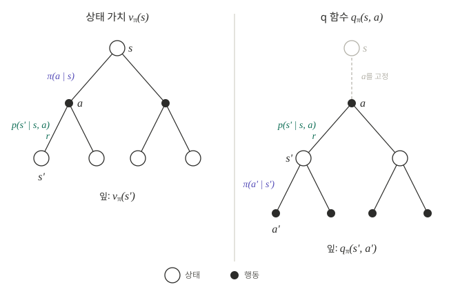

5편에서는 정책이 주어졌을 때 벨만 방정식으로 그 정책의 상태 가치 $v_\pi$를 구했다. 이 글의 목표는 정책을 평가하는 데서 나아가 최적 정책을 찾는 것이다. 이를 위해 행동 가치 $q_\pi$의 벨만 방정식을 정리하고, 최적 가치가 만족하는 벨만 최적 방정식을 정의한다.

## q 함수

4편에서 정의한 행동 가치는 상태 $s$에서 행동 $a$를 먼저 한 번 하고, 이후 정책 $\pi$를 따를 때 얻는 수익의 기댓값이다.

$$
q_\pi(s, a) = \mathbb{E}_\pi[G_t \mid S_t = s, A_t = a]
$$

상태와 행동을 입력으로 받는 이 함수를 q 함수(Q-function)라 부른다. 이 글에서도 행동 가치를 q 함수라 부른다.

상태 가치 $v_\pi(s)$와의 차이는 첫 행동을 누가 정하느냐다. $v_\pi$는 첫 행동도 정책이 고르고, q 함수는 첫 행동을 인자 $a$로 고정한다. 최적 정책을 찾는 일은 각 상태에서 어떤 행동을 할지 정하는 일이므로, 행동별 가치를 직접 담은 q 함수가 중심이 된다.

### 상태 가치와 q 함수의 백업 다이어그램

두 함수를 백업 다이어그램으로 나란히 그리면 차이가 드러난다. 빈 원은 상태, 검은 점은 행동이다. 가치는 아래의 잎에서 위의 뿌리로 모아 계산한다. q 함수는 상태 $s$에서 행동 $a$가 이미 정해진 상태에서 시작하므로, 뿌리가 상태가 아니라 행동 $a$다.

| | 상태 가치 $v_\pi(s)$ | q 함수 $q_\pi(s, a)$ |
|---|---|---|
| 뿌리 | 상태 $s$ | 행동 $a$ (상태 $s$에서 고정) |
| 첫 번째 분기 | 정책이 행동을 고른다 ($\pi$) | 환경이 다음 상태와 보상을 정한다 ($p$, $r$) |
| 두 번째 분기 | 환경이 다음 상태와 보상을 정한다 ($p$, $r$) | 정책이 행동을 고른다 ($\pi$) |
| 잎 | 다음 상태 $s'$, 가치 $v_\pi(s')$ | 다음 행동 $a'$, 가치 $q_\pi(s', a')$ |

두 다이어그램은 같은 나무를 다른 층에서 자른 것이다. 상태 가치는 상태에서 시작해 다음 상태에서 끝나고, q 함수는 행동에서 시작해 다음 행동에서 끝난다. 이 차이는 다음 섹션의 벨만 방정식에서 정책의 평균 $\sum_a \pi$와 환경의 평균 $\sum_{s'} p$가 나오는 순서가 서로 반대인 것으로 드러난다.

## q 함수의 벨만 방정식

q 함수도 $v_\pi$와 같이 재귀 관계를 만족한다. 행동 $a$를 한 뒤의 수익은 다음 보상과, 도착한 상태 $s'$에서 시작하는 수익으로 나뉜다. 도착한 상태 이후로는 정책 $\pi$를 따르므로, 그 수익의 기댓값은 $v_\pi(s')$다.

$$
q_\pi(s, a) = \sum_{s'} p(s' \mid s, a) \left[ r(s, a, s') + \gamma \, v_\pi(s') \right]
$$

$v_\pi(s')$는 상태 $s'$에서 정책이 고를 행동들의 q 함수를 평균낸 값, 즉 $\sum_{a'} \pi(a' \mid s') \, q_\pi(s', a')$이다. 이를 대입하면 q 함수만으로 된 식을 얻는다.

$$
q_\pi(s, a) = \sum_{s'} p(s' \mid s, a) \left[ r(s, a, s') + \gamma \sum_{a'} \pi(a' \mid s') \, q_\pi(s', a') \right]
$$

좌변은 상태-행동 쌍 $(s, a)$의 가치이고, 우변에는 다음 상태-행동 쌍 $(s', a')$의 가치가 있다. $v_\pi$의 벨만 방정식이 한 상태의 가치를 다음 상태들의 가치로 표현했듯, 이 식은 한 행동의 가치를 다음 행동들의 가치로 표현한다.
